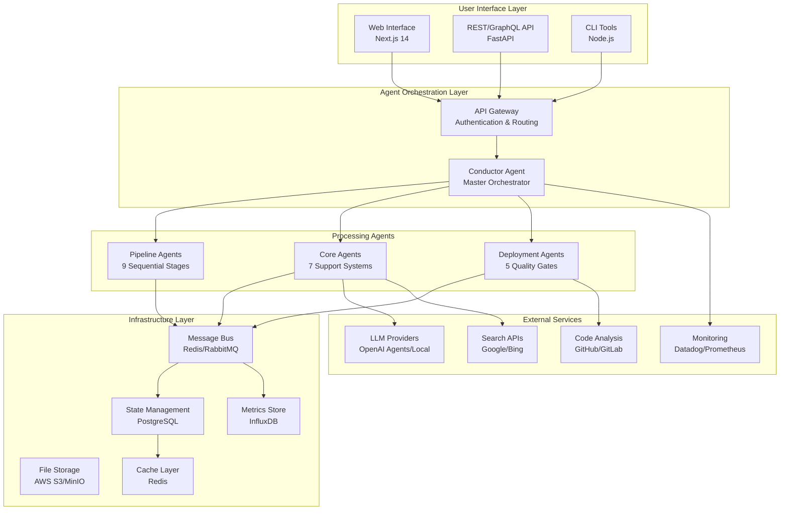
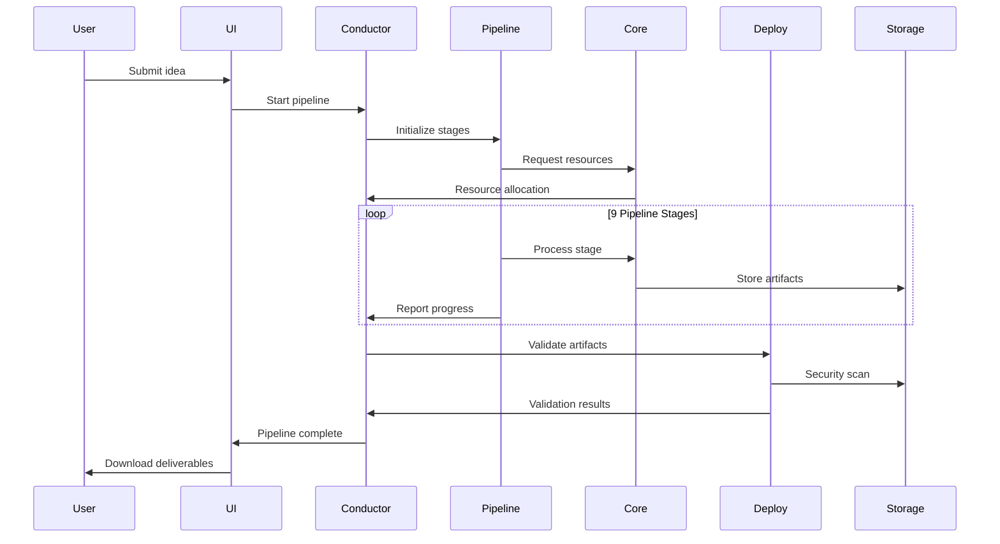
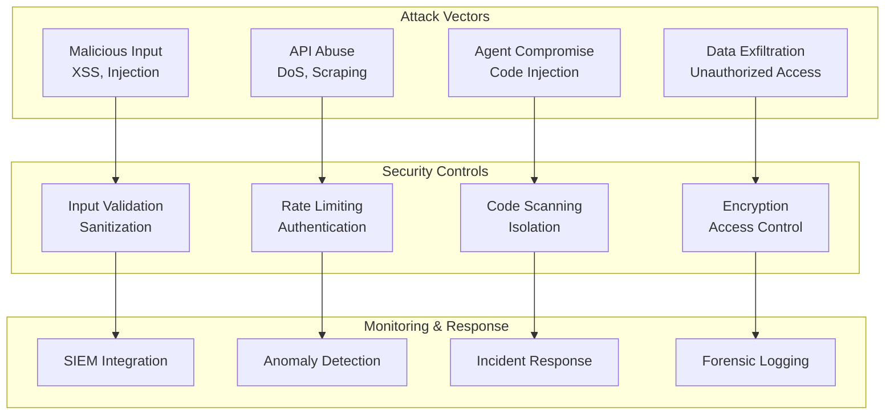
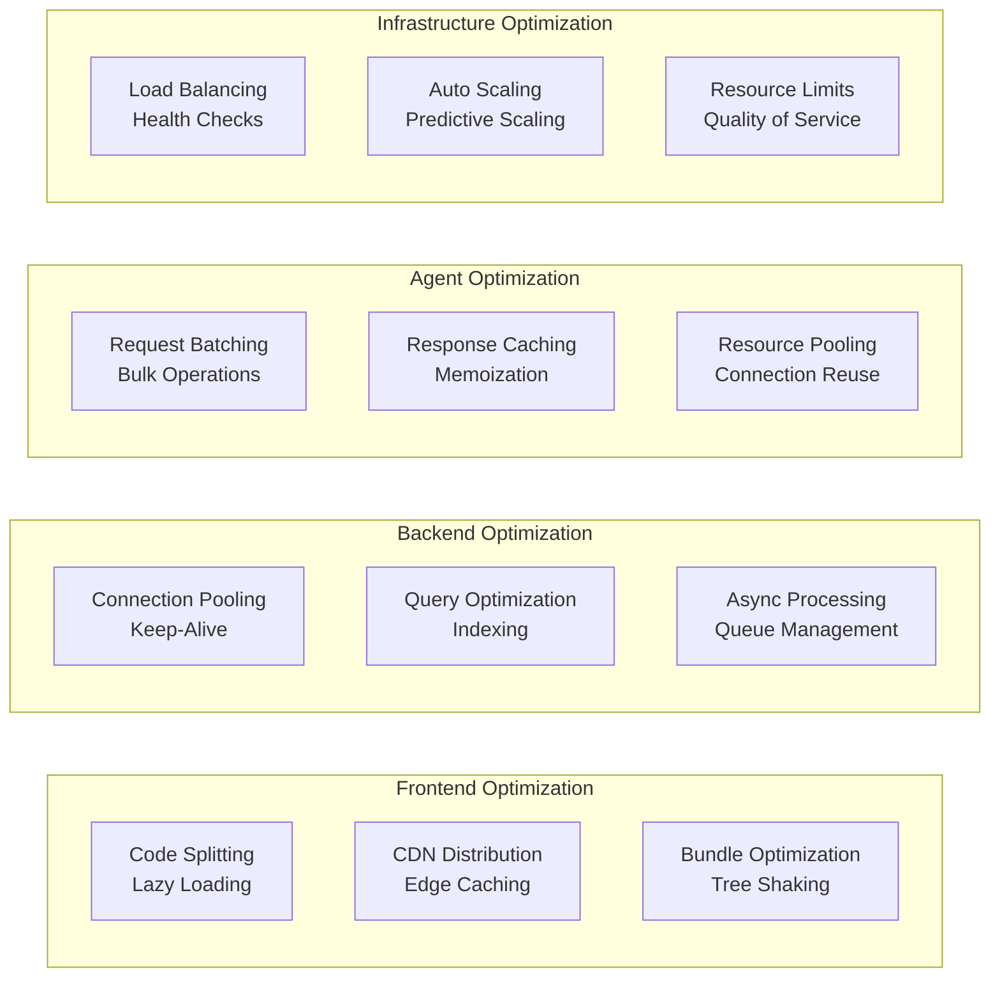
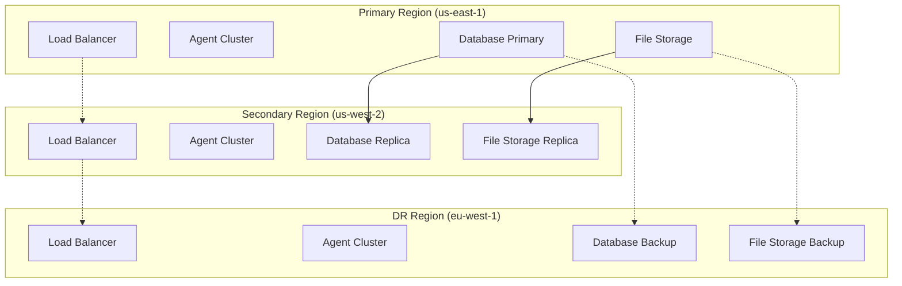

# 🏗️ Launchloom System Architecture

**Version**: 2.0.0  
**Last Updated**: December 2024  
**Status**: 🟢 Production Ready

## 📋 Overview

The Launchloom platform is architected as a sophisticated multi-agent system that transforms raw startup ideas into production-ready deliverables through coordinated agent collaboration, secure processing pipelines, and scalable infrastructure.

## 🌐 High-Level Architecture



## 🎯 Agent System Design

### Three-Tier Agent Architecture

#### 1. Pipeline Agents (Sequential Processing)
```typescript
const PIPELINE_STAGES = [
  'normalize',      // Input sanitization & validation
  'research',       // Market & competitor analysis  
  'feasibility',    // Technical assessment
  'market-moat',    // Business analysis
  'risk',          // Risk assessment
  'ux',            // User experience design
  'scaffold',      // Code structure generation
  'apis',          // API design & specification
  'export'         // Deliverable packaging
];
```

#### 2. Core Agents (Orchestration & Intelligence)
```typescript
const CORE_AGENTS = {
  conductor: {
    role: 'Master orchestrator',
    responsibilities: ['workflow', 'budgets', 'gates', 'recovery']
  },
  librarian: {
    role: 'Knowledge management',
    responsibilities: ['caching', 'search', 'documentation', 'history']
  },
  market_analyst: {
    role: 'Business intelligence', 
    responsibilities: ['tam_sam_som', 'pricing', 'timing', 'competition']
  },
  tech_architect: {
    role: 'Technical design',
    responsibilities: ['architecture', 'data_models', 'stack_choice', 'adrs']
  },
  ux_synthesizer: {
    role: 'Design coordination',
    responsibilities: ['wireframes', 'journeys', 'design_systems', 'patterns']
  },
  scaffolder: {
    role: 'Code generation',
    responsibilities: ['templates', 'boilerplate', 'structure', 'conventions']
  },
  learningloop: {
    role: 'Continuous improvement',
    responsibilities: ['feedback', 'optimization', 'analytics', 'adaptation']
  }
};
```

#### 3. Deployment Agents (Quality Assurance)
```typescript
const DEPLOYMENT_AGENTS = {
  security: {
    phase: 'Pre-deployment validation',
    checks: ['xss', 'injection', 'dependencies', 'compliance']
  },
  architecture: {
    phase: 'Design review',
    checks: ['scalability', 'maintainability', 'patterns', 'standards']
  },
  testing: {
    phase: 'Quality assurance',
    checks: ['unit_tests', 'coverage', 'integration', 'e2e']
  },
  performance: {
    phase: 'Runtime optimization',
    checks: ['benchmarks', 'profiling', 'scaling', 'monitoring']
  },
  quality: {
    phase: 'Code standards',
    checks: ['linting', 'formatting', 'complexity', 'documentation']
  }
};
```

## 🔄 Data Flow Architecture

### Execution Pipeline


### Message Flow Patterns
```typescript
// Sequential processing pattern
interface SequentialFlow {
  pattern: 'pipeline';
  stages: Agent[];
  handoff: 'synchronous';
  errorHandling: 'fail_fast' | 'skip_stage' | 'retry';
}

// Parallel processing pattern  
interface ParallelFlow {
  pattern: 'fan_out_fan_in';
  agents: Agent[];
  coordination: 'barrier' | 'quorum' | 'first_success';
  aggregation: 'merge' | 'best_result' | 'weighted';
}

// Query-response pattern
interface QueryResponse {
  pattern: 'request_reply';
  timeout: number;
  retries: number;
  fallback?: 'cache' | 'default' | 'error';
}
```

## 🛡️ Security Architecture

### Defense in Depth
```yaml
security_layers:
  1_perimeter:
    - WAF (Web Application Firewall)
    - DDoS protection
    - Rate limiting
    - Geographic blocking
    
  2_authentication:
    - OAuth 2.0 / OpenID Connect
    - JWT token validation
    - Multi-factor authentication
    - Session management
    
  3_authorization:
    - Role-based access control (RBAC)
    - Agent-to-agent authentication
    - Resource-level permissions
    - Audit logging
    
  4_data_protection:
    - Encryption at rest (AES-256)
    - Encryption in transit (TLS 1.3)
    - PII detection and masking
    - Data retention policies
    
  5_application:
    - Input sanitization
    - Output encoding
    - Prompt injection protection
    - Dependency scanning
    
  6_infrastructure:
    - Network segmentation
    - Container security
    - Secret management
    - Vulnerability scanning
```

### Threat Model


## 🚀 Deployment Architecture

### Container Orchestration (Kubernetes)
```yaml
# deployment-architecture.yml
apiVersion: apps/v1
kind: Deployment
metadata:
  name: i2s-conductor
spec:
  replicas: 3
  selector:
    matchLabels:
      app: conductor
  template:
    metadata:
      labels:
        app: conductor
        tier: core-agent
    spec:
      containers:
      - name: conductor
        image: i2s/conductor:2.1.0
        resources:
          limits:
            cpu: "2"
            memory: "4Gi"
          requests:
            cpu: "1"
            memory: "2Gi"
        env:
        - name: MESSAGE_BUS_URL
          value: "redis://redis-cluster:6379"
        - name: STATE_STORE_URL
          valueFrom:
            secretKeyRef:
              name: database-credentials
              key: connection-string
---
apiVersion: v1
kind: Service
metadata:
  name: conductor-service
spec:
  selector:
    app: conductor
  ports:
  - protocol: TCP
    port: 8080
    targetPort: 8080
  type: ClusterIP
```

### Service Mesh (Istio)
```yaml
# service-mesh.yml
apiVersion: networking.istio.io/v1beta1
kind: VirtualService
metadata:
  name: i2s-routing
spec:
  http:
  - match:
    - uri:
        prefix: "/api/pipeline/"
    route:
    - destination:
        host: pipeline-service
    fault:
      delay:
        fixedDelay: 100ms
        percentage:
          value: 0.1
  - match:
    - uri:
        prefix: "/api/agents/"
    route:
    - destination:
        host: agent-gateway
    retries:
      attempts: 3
      perTryTimeout: 30s
```

## 📊 Scalability Design

### Horizontal Scaling Strategy
```typescript
interface ScalingConfig {
  agents: {
    pipeline: {
      minReplicas: 2;
      maxReplicas: 20;
      targetCPU: 70;
      scaleUpDelay: '2m';
      scaleDownDelay: '5m';
    };
    core: {
      minReplicas: 3;
      maxReplicas: 10;
      targetMemory: 80;
      customMetrics: ['queue_depth', 'response_time'];
    };
    deployment: {
      minReplicas: 1;
      maxReplicas: 15;
      triggers: ['security_scan_queue', 'test_execution_queue'];
    };
  };
  
  infrastructure: {
    messagebus: {
      type: 'redis_cluster';
      nodes: 6;
      sharding: 'consistent_hashing';
    };
    database: {
      type: 'postgresql_cluster';
      readReplicas: 3;
      partitioning: 'by_execution_id';
    };
  };
}
```

### Performance Optimization


## 🔍 Observability Architecture

### Monitoring Stack
```yaml
observability:
  metrics:
    collection: prometheus
    storage: victoria-metrics
    visualization: grafana
    alerting: alertmanager
    
  logging:
    collection: fluentd
    storage: elasticsearch
    visualization: kibana
    analysis: logstash
    
  tracing:
    collection: jaeger
    sampling: probabilistic(1%)
    storage: cassandra
    analysis: jaeger-ui
    
  profiling:
    collection: pprof
    continuous: pyspy
    analysis: flame-graphs
    storage: object-store
```

### SLI/SLO Framework
```typescript
interface ServiceLevelIndicators {
  availability: {
    measurement: 'uptime_percentage';
    target: '99.9%';
    window: '30d';
  };
  
  latency: {
    measurement: 'p95_response_time';
    target: '<2s';
    window: '5m';
  };
  
  throughput: {
    measurement: 'successful_pipelines_per_hour';
    target: '>100/hr';
    window: '1h';
  };
  
  quality: {
    measurement: 'successful_completion_rate';
    target: '>95%';
    window: '24h';
  };
  
  cost: {
    measurement: 'cost_per_successful_pipeline';
    target: '<$5.00';
    window: '7d';
  };
}
```

## 🔄 Disaster Recovery & Business Continuity

### Backup Strategy
```yaml
backup_strategy:
  databases:
    postgresql:
      frequency: continuous_wal_streaming
      retention: 30d
      encryption: aes256
      offsite: true
      
  file_storage:
    s3:
      versioning: enabled
      cross_region_replication: true
      lifecycle_policy: 90d_ia_365d_glacier
      
  configuration:
    kubernetes:
      backup: velero
      frequency: daily
      retention: 14d
      
recovery_objectives:
  rto: 15m  # Recovery Time Objective
  rpo: 1h   # Recovery Point Objective
  mttr: 30m # Mean Time To Repair
```

### Multi-Region Deployment


## 📚 Technology Stack

### Frontend Stack
```yaml
frontend:
  framework: Next.js 14 (App Router)
  language: TypeScript 5.4+
  styling: Tailwind CSS 3.4+
  components: shadcn/ui
  state: React hooks (useState, useMemo)
  validation: Zod
  forms: React Hook Form
  animations: Framer Motion
  testing: Jest + React Testing Library
```

### Backend Stack  
```yaml
backend:
  api: FastAPI (Python)
  agents: Node.js + TypeScript
  message_bus: Redis Cluster + RabbitMQ
  database: PostgreSQL 15+
  cache: Redis 7+
  file_storage: AWS S3 / MinIO
  monitoring: Prometheus + Grafana
  logging: ELK Stack
  orchestration: Kubernetes
  service_mesh: Istio
```

### AI/ML Stack
```yaml
ai_ml:
  llm_providers:
    - OpenAI GPT-4
    - OpenAI Agents SDK
    - Local Models (Ollama)
  
  frameworks:
    - LangChain (orchestration)
    - LangSmith (observability)
    - Semantic Kernel (agents)
  
  vector_databases:
    - Pinecone
    - Weaviate
    - Chroma
```

## 🔧 Development Architecture

### Local Development Environment
```bash
# Start development stack
docker-compose -f docker/dev-stack.yml up -d

# Services started:
# - Next.js development server (3000)
# - FastAPI development server (8000) 
# - Redis (6379)
# - PostgreSQL (5432)
# - MinIO (9000)
# - Prometheus (9090)
# - Grafana (3001)
```

### CI/CD Pipeline
```yaml
# .github/workflows/deploy.yml
name: Deploy Launchloom Platform
on:
  push:
    branches: [main, develop]
    
jobs:
  test:
    runs-on: ubuntu-latest
    steps:
      - uses: actions/checkout@v3
      - name: Run Tests
        run: |
          npm run test
          npm run test:agents
          npm run test:integration
          
  security:
    runs-on: ubuntu-latest
    steps:
      - uses: actions/checkout@v3
      - name: Security Scan
        uses: securecodewarrior/github-action-add-sarif@v1
        
  build:
    needs: [test, security]
    runs-on: ubuntu-latest
    steps:
      - name: Build Images
        run: |
          docker build -t i2s/frontend:${GITHUB_SHA} ./frontend
          docker build -t i2s/backend:${GITHUB_SHA} ./backend
          docker build -t i2s/agents:${GITHUB_SHA} ./agents
          
  deploy:
    needs: build
    runs-on: ubuntu-latest
    steps:
      - name: Deploy to Kubernetes
        run: |
          kubectl apply -f k8s/
          kubectl set image deployment/frontend frontend=i2s/frontend:${GITHUB_SHA}
          kubectl rollout status deployment/frontend
```

## 📈 Future Architecture Considerations

### Roadmap Items
- **Federated Learning**: Distributed model training across deployments
- **Edge Computing**: Regional agent deployment for reduced latency
- **Blockchain Integration**: Immutable audit trails and smart contracts
- **Quantum-Safe Cryptography**: Post-quantum encryption preparation
- **AI Agent Marketplace**: Third-party agent integration platform

---

**Architecture Team**: architecture@i2s.studio  
**Technical Lead**: tech-lead@i2s.studio  
**Documentation**: Updated December 2024
