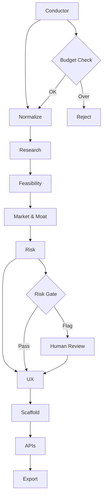
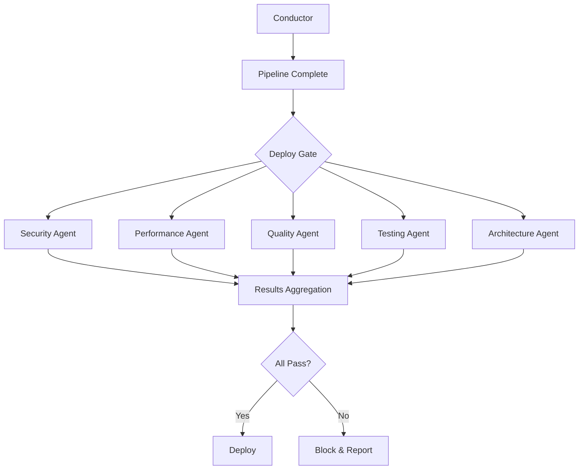

# 🎭 Conductor Agent

**Agent Type**: Core System  
**Role**: Master Orchestrator  
**Status**: 🟢 Active  
**Version**: 2.1.0

## 📋 Overview

The Conductor Agent serves as the master orchestrator of the I2S ecosystem, managing workflow execution, resource allocation, budget control, and quality gates across all pipeline and deployment agents.

## 🎯 Primary Responsibilities

- **Workflow Orchestration**: Coordinate sequential and parallel agent execution
- **Resource Management**: Allocate compute, memory, and API tokens
- **Budget Control**: Monitor and enforce spending limits across operations
- **Quality Gates**: Implement approval checkpoints for critical decisions
- **Error Recovery**: Handle failures and implement retry strategies
- **Performance Monitoring**: Track system-wide metrics and health

## ⚙️ Configuration

```yaml
# conductor-agent.yml
agent:
  name: conductor
  version: 2.1.0
  priority: 1  # Highest priority
  
orchestration:
  maxConcurrentPipelines: 10
  defaultTimeout: 900s  # 15 minutes
  enableParallelExecution: true
  
budgets:
  tokens:
    daily: 1000000
    perPipeline: 250000
    emergency: 100000
  time:
    maxPipelineMinutes: 15
    maxAgentMinutes: 5
  cost:
    dailyBudgetUSD: 500
    alertThresholdUSD: 400
    
gates:
  required:
    - risk_review         # Before scaffold generation
    - security_check      # Before deployment
    - human_approval      # For regulated domains
  optional:
    - performance_review  # For high-load estimates
    - compliance_check    # For enterprise accounts
    
monitoring:
  healthCheckInterval: 30s
  metricsRetentionDays: 30
  alertingEnabled: true
```

## 🔄 Orchestration Patterns

### Sequential Pipeline Flow


### Parallel Deployment Agents


## 📊 State Management

### Execution State
```typescript
interface ExecutionState {
  id: string;
  status: 'pending' | 'running' | 'paused' | 'completed' | 'failed';
  pipeline: {
    currentStage: number;
    completedStages: string[];
    nextStages: string[];
  };
  resources: {
    tokensUsed: number;
    timeElapsed: number;
    costAccrued: number;
  };
  gates: {
    pending: GateCheck[];
    completed: GateResult[];
  };
  errors: ErrorLog[];
  metadata: {
    createdAt: string;
    updatedAt: string;
    priority: number;
  };
}

interface GateCheck {
  type: string;
  required: boolean;
  timeout: number;
  reviewer?: string;
  context: Record<string, any>;
}
```

### Resource Tracking
```typescript
interface ResourceUsage {
  tokens: {
    budget: number;
    used: number;
    remaining: number;
    byAgent: Record<string, number>;
  };
  time: {
    started: string;
    elapsed: number;
    remaining: number;
    byStage: Record<string, number>;
  };
  cost: {
    budgetUSD: number;
    accruedUSD: number;
    estimatedUSD: number;
    breakdown: CostBreakdown[];
  };
}
```

## 🎛️ API Operations

### Start Pipeline
```bash
POST /api/conductor/pipeline/start
{
  "ideaId": "idea_7f8e9d0a",
  "priority": "normal",
  "options": {
    "skipGates": false,
    "maxCost": 50.00,
    "timeout": 900
  }
}
```

### Monitor Execution
```bash
GET /api/conductor/execution/{executionId}
```

```json
{
  "id": "exec_a1b2c3d4",
  "status": "running",
  "progress": {
    "currentStage": "feasibility",
    "completed": 3,
    "total": 9,
    "percentage": 33
  },
  "resources": {
    "tokensUsed": 45000,
    "timeElapsed": 180,
    "costAccrued": 12.50
  },
  "nextGate": {
    "type": "risk_review",
    "eta": "2024-12-05T19:15:00Z"
  }
}
```

### Approve Gate
```bash
POST /api/conductor/gates/{gateId}/approve
{
  "decision": "approve",
  "reviewer": "user_123",
  "notes": "Risk assessment acceptable for MVP scope",
  "conditions": []
}
```

## 🚨 Error Recovery

### Automatic Recovery
```typescript
interface RetryStrategy {
  maxRetries: number;
  backoffStrategy: 'linear' | 'exponential' | 'fixed';
  retryableErrors: string[];
  escalationThreshold: number;
}

const DEFAULT_RETRY_STRATEGY = {
  maxRetries: 3,
  backoffStrategy: 'exponential',
  retryableErrors: ['TIMEOUT', 'API_LIMIT', 'TEMPORARY_FAILURE'],
  escalationThreshold: 2
};
```

### Manual Intervention
```typescript
interface InterventionOptions {
  skipAgent: string;          // Skip problematic agent
  overrideBudget: number;     // Increase resource limits
  changeStrategy: string;     // Switch to alternate approach
  pauseExecution: boolean;    // Halt for investigation
}
```

## 📈 Performance Monitoring

### Key Metrics
- **Pipeline Success Rate**: % of pipelines completed successfully
- **Average Execution Time**: Mean time from start to completion
- **Resource Efficiency**: Token/cost utilization per successful pipeline
- **Gate Approval Rate**: % of gates approved on first review
- **Error Recovery Rate**: % of failures automatically resolved

### Alerting Rules
```yaml
alerts:
  highErrorRate:
    condition: error_rate > 5%
    duration: 5m
    action: notify_ops_team
    
  budgetExceeded:
    condition: daily_cost > budget * 0.8
    action: throttle_new_pipelines
    
  longRunningPipeline:
    condition: execution_time > 20m
    action: human_review_required
    
  agentFailure:
    condition: agent_down_count > 2
    action: emergency_failover
```

## 🔧 Development & Testing

### Local Development
```bash
# Start conductor in development mode
npm run dev:conductor

# Test orchestration flow
npm run test:orchestration -- --pipeline sample-idea.json

# Monitor local execution
npm run monitor:conductor -- --tail
```

### Integration Testing
```typescript
import { ConductorAgent } from '@i2s/agents/core';

const conductor = new ConductorAgent({
  config: './test-configs/conductor.yml',
  mode: 'test'
});

// Test pipeline execution
const execution = await conductor.startPipeline({
  ideaId: 'test_idea_001',
  skipGates: true,  // For testing
  mockAgents: true  // Use mock responses
});

expect(execution.status).toBe('completed');
expect(execution.resources.tokensUsed).toBeLessThan(100000);
```

## 🔐 Security Considerations

### Access Control
- **API Authentication**: JWT tokens with role-based access
- **Gate Approvals**: Multi-factor authentication for critical gates
- **Audit Logging**: Complete trail of all orchestration decisions
- **Resource Limits**: Hard caps to prevent abuse

### Data Protection
- **Encrypted Storage**: All execution state encrypted at rest
- **Network Security**: TLS for all inter-agent communication
- **Secret Management**: External secret store integration
- **Data Retention**: Automatic cleanup of expired executions

## 📚 Dependencies

### Internal Dependencies
- **Message Bus**: Redis/RabbitMQ for agent communication
- **State Store**: PostgreSQL for execution persistence
- **Metrics Store**: InfluxDB for time-series data
- **Cache Layer**: Redis for performance optimization

### External Dependencies
- **Cloud Provider APIs**: AWS/GCP/Azure for infrastructure
- **Monitoring**: Datadog/New Relic for observability
- **Alerting**: PagerDuty/Slack for notifications
- **Auth Provider**: Auth0/Okta for authentication

## 🔄 Related Agents

### Coordinates With
- **All Pipeline Agents**: Direct orchestration and monitoring
- **All Deployment Agents**: Parallel execution coordination  
- **LearningLoop Agent**: Performance feedback and optimization
- **Risk Compliance Agent**: Gate enforcement and audit trails

---

**Maintainer**: I2S Core Team  
**On-Call**: conductor-oncall@i2s.studio  
**Documentation**: Updated December 2024
