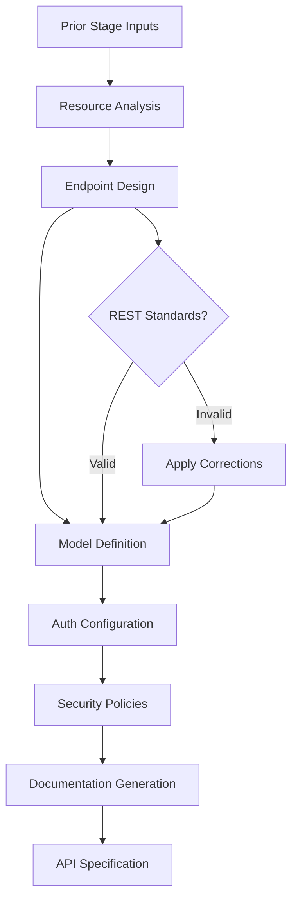

# 🔌 API Design Agent

**Agent Type**: Pipeline
**Stage**: 8 of 9
**Status**: 🟢 Active
**Version**: 1.0.0

## 📋 Overview

The API Design Agent is the eighth stage in the Launchloom pipeline, responsible for creating comprehensive API specifications including endpoint definitions, request/response models, authentication patterns, security measures, and API documentation.

## 🎯 Purpose

- **Endpoint Design**: Define RESTful API endpoints with proper resource modeling
- **Model Specification**: Create request and response schemas
- **Authentication Design**: Implement secure auth patterns
- **Security Implementation**: Add rate limiting, validation, and protection
- **Documentation Generation**: Produce OpenAPI/Swagger documentation

## 📥 Input Schema

```typescript
interface APIDesignInput {
  context: IdeaContext;
  normalizeResult: NormalizeResult;
  codeScaffoldResult: CodeScaffoldResult;
}
```

## 📤 Output Schema

```typescript
interface APIDesignResult {
  endpoints: Array<{
    method: 'GET' | 'POST' | 'PUT' | 'PATCH' | 'DELETE';
    path: string;
    description: string;
    requestBody?: {
      contentType: string;
      schema: object;
    };
    responses: Array<{
      status: number;
      description: string;
      schema?: object;
    }>;
    authentication: 'none' | 'jwt' | 'api_key' | 'oauth2';
  }>;
  models: Array<{
    name: string;
    description: string;
    properties: Array<{
      name: string;
      type: string;
      required: boolean;
      description?: string;
    }>;
  }>;
  authentication: {
    type: 'jwt' | 'oauth2' | 'api_key';
    flows: string[];
    tokenExpiry: string;
    refreshStrategy: string;
  };
  security: {
    rateLimiting: {
      enabled: boolean;
      limits: Array<{
        endpoint: string;
        requests: number;
        window: string;
      }>;
    };
    validation: string[];
    headers: string[];
  };
  documentation: {
    openApiVersion: string;
    title: string;
    description: string;
    servers: Array<{
      url: string;
      description: string;
    }>;
  };
}
```

## ⚙️ Configuration

```yaml
# api-design-agent.yml
agent:
  name: api-design
  version: 1.0.0
  timeout: 60s
  retries: 2

model:
  name: gpt-4.1
  maxTokens: 3000
  temperature: 0.5

design:
  includeEndpoints: true
  includeModels: true
  includeAuthentication: true
  includeSecurity: true
  includeDocumentation: true

standards:
  apiStyle: 'REST'
  openApiVersion: '3.0.3'
  defaultAuth: 'jwt'
  enableRateLimiting: true
```

## 🔄 Processing Pipeline



## 🎛️ Agent Operations

### Processing
```bash
# Execute API design
POST /api/agents/api-design/process
{
  "normalizeResult": { ... },
  "codeScaffoldResult": { ... }
}
```

### Response
```json
{
  "endpoints": [
    {
      "method": "GET",
      "path": "/api/v1/tasks",
      "description": "Retrieve paginated list of user tasks",
      "requestBody": null,
      "responses": [
        {
          "status": 200,
          "description": "List of tasks",
          "schema": {
            "type": "object",
            "properties": {
              "data": { "type": "array", "items": { "$ref": "#/components/schemas/Task" } },
              "pagination": { "$ref": "#/components/schemas/Pagination" }
            }
          }
        },
        { "status": 401, "description": "Unauthorized" }
      ],
      "authentication": "jwt"
    },
    {
      "method": "POST",
      "path": "/api/v1/tasks",
      "description": "Create a new task",
      "requestBody": {
        "contentType": "application/json",
        "schema": {
          "type": "object",
          "required": ["title"],
          "properties": {
            "title": { "type": "string", "maxLength": 500 },
            "description": { "type": "string" },
            "priority": { "type": "integer", "minimum": 0, "maximum": 10 },
            "dueDate": { "type": "string", "format": "date-time" }
          }
        }
      },
      "responses": [
        { "status": 201, "description": "Task created", "schema": { "$ref": "#/components/schemas/Task" } },
        { "status": 400, "description": "Validation error" },
        { "status": 401, "description": "Unauthorized" }
      ],
      "authentication": "jwt"
    },
    {
      "method": "POST",
      "path": "/api/v1/ai/suggest",
      "description": "Get AI-powered task suggestions",
      "requestBody": {
        "contentType": "application/json",
        "schema": {
          "type": "object",
          "properties": {
            "taskId": { "type": "string", "format": "uuid" },
            "context": { "type": "string" }
          }
        }
      },
      "responses": [
        {
          "status": 200,
          "description": "AI suggestion",
          "schema": {
            "type": "object",
            "properties": {
              "priority": { "type": "integer" },
              "suggestedDeadline": { "type": "string", "format": "date-time" },
              "confidence": { "type": "number" },
              "reasoning": { "type": "string" }
            }
          }
        }
      ],
      "authentication": "jwt"
    }
  ],
  "models": [
    {
      "name": "Task",
      "description": "Task entity",
      "properties": [
        { "name": "id", "type": "string (uuid)", "required": true, "description": "Unique identifier" },
        { "name": "title", "type": "string", "required": true, "description": "Task title" },
        { "name": "description", "type": "string", "required": false },
        { "name": "priority", "type": "integer", "required": false, "description": "0-10 priority score" },
        { "name": "status", "type": "enum", "required": true, "description": "pending, in_progress, completed" },
        { "name": "createdAt", "type": "datetime", "required": true },
        { "name": "updatedAt", "type": "datetime", "required": true }
      ]
    },
    {
      "name": "User",
      "description": "User entity",
      "properties": [
        { "name": "id", "type": "string (uuid)", "required": true },
        { "name": "email", "type": "string (email)", "required": true },
        { "name": "name", "type": "string", "required": false },
        { "name": "createdAt", "type": "datetime", "required": true }
      ]
    }
  ],
  "authentication": {
    "type": "jwt",
    "flows": ["password", "refresh_token"],
    "tokenExpiry": "15m",
    "refreshStrategy": "Refresh token with 7-day expiry, rotate on use"
  },
  "security": {
    "rateLimiting": {
      "enabled": true,
      "limits": [
        { "endpoint": "/api/v1/ai/*", "requests": 100, "window": "1h" },
        { "endpoint": "/api/v1/tasks", "requests": 1000, "window": "1h" },
        { "endpoint": "/api/v1/auth/*", "requests": 10, "window": "1m" }
      ]
    },
    "validation": [
      "Input sanitization on all string fields",
      "UUID validation on ID parameters",
      "Email format validation",
      "Maximum request body size: 1MB"
    ],
    "headers": [
      "X-Content-Type-Options: nosniff",
      "X-Frame-Options: DENY",
      "Content-Security-Policy: default-src 'self'",
      "Strict-Transport-Security: max-age=31536000"
    ]
  },
  "documentation": {
    "openApiVersion": "3.0.3",
    "title": "AI Task Manager API",
    "description": "RESTful API for AI-powered task management",
    "servers": [
      { "url": "https://api.example.com", "description": "Production" },
      { "url": "https://staging-api.example.com", "description": "Staging" },
      { "url": "http://localhost:8000", "description": "Development" }
    ]
  }
}
```

## 📊 Performance Metrics

| Metric | Target | Current |
|--------|---------|---------|
| **Latency** | < 40s | 28s avg |
| **OpenAPI Validity** | 100% | 100% |
| **Security Coverage** | > 95% | 97% |
| **Documentation Quality** | > 90% | 93% |

## 🔧 Development

### Local Testing
```bash
# Run API design agent tests
npm test -- agents/api-design

# Test with sample input
npm run test:agent api-design -- --input samples/scaffold-output.json

# Validate generated OpenAPI spec
npm run validate:openapi -- output/api-spec.yaml
```

### Integration
```typescript
import { APIDesignAgent } from '@/ai/agents/APIDesignAgent';

const agent = new APIDesignAgent(agentService);

const result = await agent.execute(
  context,
  normalizeResult,
  codeScaffoldResult
);
```

## 🚨 Error Handling

### Common Errors

| Error Code | Description | Resolution |
|------------|-------------|------------|
| **API_001** | Endpoint conflict detected | Rename or merge endpoints |
| **API_002** | Invalid schema definition | Fix type definitions |
| **API_003** | Auth configuration error | Apply default auth |

## 📚 Dependencies

- **LaunchloomAgentsService**: AI model communication
- **Logger**: Structured logging
- **CodeScaffoldResult**: Input from Stage 7

## 🔄 Navigation

⬅️ **[Scaffold Agent](./scaffold.md)** - Previous stage
➡️ **[Export Agent](./export.md)** - Next stage

---

**Maintainer**: Launchloom Pipeline Team
**Last Updated**: December 2024
**Contact**: pipeline-agents@i2s.studio
