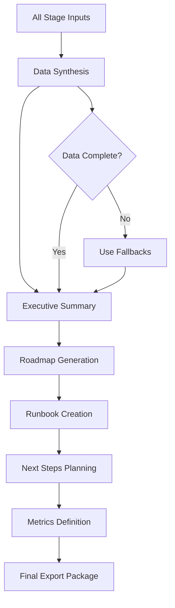

# 📦 Export Agent

**Agent Type**: Pipeline
**Stage**: 9 of 9
**Status**: 🟢 Active
**Version**: 1.0.0

## 📋 Overview

The Export Agent is the final stage in the Launchloom pipeline, responsible for synthesizing all analysis into actionable deliverables including executive summaries, implementation roadmaps, agent runbooks (YAML), next steps recommendations, and success metrics.

## 🎯 Purpose

- **Executive Summary**: Generate comprehensive project overview
- **Implementation Roadmap**: Create phased delivery plan
- **Agent Runbook**: Produce YAML configuration for agent orchestration
- **Next Steps**: Provide prioritized action items
- **Success Metrics**: Define KPIs and measurement strategies

## 📥 Input Schema

```typescript
interface ExportInput {
  context: IdeaContext;
  normalizeResult: NormalizeResult;
  researchResult: ResearchResult;
  feasibilityResult: FeasibilityResult;
  marketMoatResult: MarketMoatResult;
  riskResult: RiskAssessmentResult;
  codeScaffoldResult: CodeScaffoldResult;
}
```

## 📤 Output Schema

```typescript
interface ExportResult {
  summary: {
    title: string;
    description: string;
    keyFeatures: string[];
    targetMarket: string;
    businessModel: string;
  };
  roadmap: Array<{
    phase: string;
    duration: string;
    milestones: string[];
    deliverables: string[];
  }>;
  runbook: string;                   // YAML format
  nextSteps: {
    immediate: string[];             // Actions for next 7 days
    shortTerm: string[];             // Actions for 1 month
    longTerm: string[];              // Actions for 3+ months
  };
  metrics: {
    technical: Array<{
      metric: string;
      target: string;
      measurement: string;
    }>;
    business: Array<{
      metric: string;
      target: string;
      measurement: string;
    }>;
    user: Array<{
      metric: string;
      target: string;
      measurement: string;
    }>;
  };
}
```

## ⚙️ Configuration

```yaml
# export-agent.yml
agent:
  name: export
  version: 1.0.0
  timeout: 60s
  retries: 2

model:
  name: gpt-4.1-mini
  maxTokens: 2500
  temperature: 0.7

export:
  includeSummary: true
  includeRoadmap: true
  includeRunbook: true
  includeNextSteps: true
  includeMetrics: true

formats:
  runbook: 'yaml'
  documentation: 'markdown'
  metrics: 'structured'
```

## 🔄 Processing Pipeline



## 🎛️ Agent Operations

### Processing
```bash
# Execute export generation
POST /api/agents/export/process
{
  "normalizeResult": { ... },
  "researchResult": { ... },
  "feasibilityResult": { ... },
  "marketMoatResult": { ... },
  "riskResult": { ... },
  "codeScaffoldResult": { ... }
}
```

### Response
```json
{
  "summary": {
    "title": "AI Task Manager",
    "description": "An intelligent task management platform that uses AI to automatically prioritize tasks, suggest optimal schedules, and provide productivity insights for busy professionals.",
    "keyFeatures": [
      "AI-powered task prioritization",
      "Smart scheduling recommendations",
      "Productivity analytics dashboard",
      "Cross-platform synchronization"
    ],
    "targetMarket": "Tech-savvy professionals aged 25-45, particularly remote workers and entrepreneurs",
    "businessModel": "SaaS subscription with freemium tier, Pro ($9.99/mo) and Team ($19.99/user/mo) plans"
  },
  "roadmap": [
    {
      "phase": "Phase 1: Foundation",
      "duration": "4-6 weeks",
      "milestones": [
        "Technical architecture finalized",
        "Core backend APIs implemented",
        "Basic frontend scaffolding complete"
      ],
      "deliverables": [
        "Database schema and migrations",
        "Authentication system",
        "Task CRUD operations"
      ]
    },
    {
      "phase": "Phase 2: AI Integration",
      "duration": "3-4 weeks",
      "milestones": [
        "OpenAI integration complete",
        "Priority algorithm implemented",
        "Suggestion engine operational"
      ],
      "deliverables": [
        "AI recommendation service",
        "Priority scoring model",
        "User preference learning"
      ]
    },
    {
      "phase": "Phase 3: MVP Launch",
      "duration": "4-6 weeks",
      "milestones": [
        "Feature-complete MVP",
        "Beta testing completed",
        "Production deployment ready"
      ],
      "deliverables": [
        "Polished user interface",
        "Mobile responsive design",
        "Documentation and onboarding"
      ]
    }
  ],
  "runbook": "# AI Task Manager - Agent Runbook (v1.0)\n\nconductor:\n  goals: [\"orchestrate\", \"budget\", \"gate high-risk steps\"]\n  budgets:\n    tokens: 500000\n    time_minutes: 30\n    cost_usd: 10.0\n  gates: [\"risk_review\", \"spend_over_cap\", \"quality_threshold\"]\n\nnormalize_agent:\n  model: gpt-4.1-mini\n  max_tokens: 1000\n  outputs: [\"title\", \"one_liner\", \"problem\", \"audience\", \"value_proposition\"]\n\nresearch_agent:\n  model: gpt-4.1-mini\n  max_tokens: 3000\n  tools: [\"web_search\", \"competitor_scan\"]\n  outputs: [\"market_size\", \"competitors\", \"opportunities\", \"challenges\", \"prd\"]\n\nfeasibility_agent:\n  model: gpt-4.1-mini\n  max_tokens: 2000\n  outputs: [\"score\", \"technologies\", \"timeline\", \"resources\", \"risks\"]\n\nmarket_moat_agent:\n  model: gpt-4.1-mini\n  max_tokens: 2000\n  outputs: [\"desirability\", \"viability\", \"defensibility\", \"timing\", \"moat_strategies\"]\n\nrisk_agent:\n  model: gpt-4.1-mini\n  max_tokens: 2500\n  outputs: [\"technical_risks\", \"market_risks\", \"financial_risks\", \"regulatory_risks\", \"mitigation\"]\n\nux_design_agent:\n  model: gpt-4.1-mini\n  max_tokens: 2500\n  outputs: [\"user_journey\", \"key_flows\", \"wireframes\", \"principles\", \"accessibility\"]\n\ncode_scaffold_agent:\n  model: gpt-4.1\n  max_tokens: 3500\n  outputs: [\"tech_stack\", \"structure\", \"components\", \"database\", \"api_structure\"]\n\napi_design_agent:\n  model: gpt-4.1\n  max_tokens: 3000\n  outputs: [\"endpoints\", \"models\", \"authentication\", \"security\", \"documentation\"]\n\nexport_agent:\n  model: gpt-4.1-mini\n  max_tokens: 2500\n  outputs: [\"summary\", \"roadmap\", \"runbook\", \"next_steps\", \"metrics\"]\n\nquality_gates:\n  min_quality_score: 0.7\n  max_retries: 2\n  fallback_strategy: \"use_cached_or_default\"\n\nobservability:\n  metrics: [\"stage_duration\", \"token_usage\", \"cost\", \"quality_score\"]\n  alerts: [\"budget_exceeded\", \"stage_timeout\", \"quality_below_threshold\"]",
  "nextSteps": {
    "immediate": [
      "Validate core value proposition with 5-10 target users",
      "Set up development environment and CI/CD pipeline",
      "Create detailed technical specification document",
      "Establish project management tooling (GitHub Projects, Linear)"
    ],
    "shortTerm": [
      "Build MVP with core task management features",
      "Integrate OpenAI API with caching layer",
      "Implement user authentication and onboarding",
      "Launch private beta with 20-50 users"
    ],
    "longTerm": [
      "Scale infrastructure for production load",
      "Build integrations ecosystem (Slack, Calendar, etc.)",
      "Develop proprietary AI models for improved suggestions",
      "Expand to team collaboration features"
    ]
  },
  "metrics": {
    "technical": [
      {
        "metric": "API Response Time",
        "target": "< 200ms p95",
        "measurement": "APM monitoring (DataDog, New Relic)"
      },
      {
        "metric": "System Uptime",
        "target": "99.9%",
        "measurement": "Status page monitoring"
      },
      {
        "metric": "Test Coverage",
        "target": "> 80%",
        "measurement": "CI pipeline reports"
      }
    ],
    "business": [
      {
        "metric": "Monthly Recurring Revenue",
        "target": "$10K by month 6",
        "measurement": "Stripe dashboard"
      },
      {
        "metric": "Customer Acquisition Cost",
        "target": "< $50",
        "measurement": "Marketing analytics"
      },
      {
        "metric": "LTV/CAC Ratio",
        "target": "> 3",
        "measurement": "Cohort analysis"
      }
    ],
    "user": [
      {
        "metric": "Activation Rate",
        "target": "> 40% (complete first task)",
        "measurement": "Product analytics (Mixpanel, Amplitude)"
      },
      {
        "metric": "30-Day Retention",
        "target": "> 30%",
        "measurement": "Cohort analysis"
      },
      {
        "metric": "Net Promoter Score",
        "target": "> 50",
        "measurement": "In-app surveys"
      }
    ]
  }
}
```

## 📊 Performance Metrics

| Metric | Target | Current |
|--------|---------|---------|
| **Latency** | < 35s | 25s avg |
| **Export Completeness** | > 95% | 97% |
| **Runbook Validity** | 100% | 100% |
| **Metric Relevance** | > 90% | 92% |

## 🔧 Development

### Local Testing
```bash
# Run export agent tests
npm test -- agents/export

# Test with sample input
npm run test:agent export -- --input samples/all-stages-output.json

# Validate runbook YAML
npm run validate:yaml -- output/runbook.yml
```

### Integration
```typescript
import { ExportAgent } from '@/ai/agents/ExportAgent';

const agent = new ExportAgent(agentService);

const result = await agent.execute(
  context,
  normalizeResult,
  researchResult,
  feasibilityResult,
  marketMoatResult,
  riskResult,
  codeScaffoldResult
);
```

## 🚨 Error Handling

### Common Errors

| Error Code | Description | Resolution |
|------------|-------------|------------|
| **EXP_001** | Summary generation failed | Use normalized title/description |
| **EXP_002** | Roadmap incomplete | Apply template roadmap |
| **EXP_003** | Runbook YAML invalid | Use default runbook template |
| **EXP_004** | Metrics generation error | Apply standard SaaS metrics |

## 📚 Dependencies

- **LaunchloomAgentsService**: AI model communication
- **Logger**: Structured logging
- **All Prior Stage Results**: Complete pipeline data

## 🔄 Navigation

⬅️ **[API Design Agent](./apis.md)** - Previous stage
🏁 **Pipeline Complete** - Final stage

---

**Maintainer**: Launchloom Pipeline Team
**Last Updated**: December 2024
**Contact**: pipeline-agents@i2s.studio
