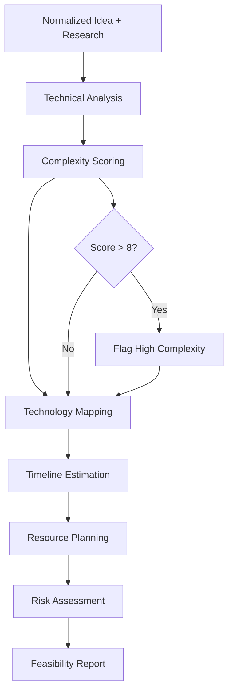

# 🔧 Feasibility Agent

**Agent Type**: Pipeline
**Stage**: 3 of 9
**Status**: 🟢 Active
**Version**: 1.0.0

## 📋 Overview

The Feasibility Agent is the third stage in the Launchloom pipeline, responsible for assessing the technical feasibility of implementing the startup idea, including complexity scoring, technology evaluation, and resource estimation.

## 🎯 Purpose

- **Complexity Assessment**: Score implementation difficulty (1-10)
- **Technology Evaluation**: Identify required technologies and their maturity
- **Timeline Estimation**: Provide MVP and full product timelines
- **Resource Planning**: Estimate team size and skill requirements
- **Risk Identification**: Flag technical risks and constraints

## 📥 Input Schema

```typescript
interface FeasibilityInput {
  context: IdeaContext;
  normalizeResult: NormalizeResult;
  researchResult: ResearchResult;
}
```

## 📤 Output Schema

```typescript
interface FeasibilityResult {
  score: number;                    // 1-10 complexity score
  assessment: string;               // Overall feasibility assessment
  technologies: Array<{
    name: string;
    category: 'frontend' | 'backend' | 'database' | 'infrastructure' | 'ai';
    maturity: 'emerging' | 'stable' | 'mature';
    complexity: 'low' | 'medium' | 'high';
  }>;
  timeline: {
    mvp: string;                    // MVP delivery estimate
    fullProduct: string;            // Full product estimate
    milestones: Array<{
      name: string;
      duration: string;
      dependencies: string[];
    }>;
  };
  resources: {
    teamSize: number;
    roles: Array<{
      title: string;
      count: number;
      skills: string[];
    }>;
    estimatedCost: string;
  };
  risks: Array<{
    risk: string;
    impact: 'low' | 'medium' | 'high';
    mitigation: string;
  }>;
}
```

## ⚙️ Configuration

```yaml
# feasibility-agent.yml
agent:
  name: feasibility
  version: 1.0.0
  timeout: 45s
  retries: 2

model:
  name: gpt-4.1-mini
  maxTokens: 2000
  temperature: 0.6

assessment:
  includeTimeline: true
  includeResources: true
  includeTechStack: true
  maxTechnologies: 10

scoring:
  factors:
    - technical_complexity
    - team_requirements
    - infrastructure_needs
    - integration_complexity
    - regulatory_requirements
```

## 🔄 Processing Pipeline



## 🎛️ Agent Operations

### Processing
```bash
# Execute feasibility analysis
POST /api/agents/feasibility/process
{
  "normalizeResult": { ... },
  "researchResult": { ... }
}
```

### Response
```json
{
  "score": 6,
  "assessment": "Moderately complex project with well-established technology options. Main challenges involve AI integration and real-time features.",
  "technologies": [
    {
      "name": "Next.js",
      "category": "frontend",
      "maturity": "mature",
      "complexity": "low"
    },
    {
      "name": "OpenAI API",
      "category": "ai",
      "maturity": "stable",
      "complexity": "medium"
    }
  ],
  "timeline": {
    "mvp": "8-10 weeks",
    "fullProduct": "4-6 months",
    "milestones": [
      {
        "name": "Core Backend",
        "duration": "3 weeks",
        "dependencies": []
      },
      {
        "name": "AI Integration",
        "duration": "2 weeks",
        "dependencies": ["Core Backend"]
      }
    ]
  },
  "resources": {
    "teamSize": 3,
    "roles": [
      {
        "title": "Full Stack Developer",
        "count": 2,
        "skills": ["TypeScript", "React", "Node.js"]
      },
      {
        "title": "ML Engineer",
        "count": 1,
        "skills": ["Python", "OpenAI", "ML Ops"]
      }
    ],
    "estimatedCost": "$150K-200K for MVP"
  },
  "risks": [
    {
      "risk": "AI API rate limits and costs",
      "impact": "medium",
      "mitigation": "Implement caching and request batching"
    }
  ]
}
```

## 📊 Performance Metrics

| Metric | Target | Current |
|--------|---------|---------|
| **Latency** | < 25s | 15s avg |
| **Accuracy** | > 85% | 88% |
| **Timeline Precision** | +/- 20% | +/- 18% |
| **Cost Estimate Accuracy** | +/- 25% | +/- 22% |

## 🔧 Development

### Local Testing
```bash
# Run feasibility agent tests
npm test -- agents/feasibility

# Test with sample input
npm run test:agent feasibility -- --input samples/research-output.json
```

### Integration
```typescript
import { FeasibilityAgent } from '@/ai/agents/FeasibilityAgent';

const agent = new FeasibilityAgent(agentService);

const result = await agent.execute(context, normalizeResult, researchResult);
```

## 🚨 Error Handling

### Common Errors

| Error Code | Description | Resolution |
|------------|-------------|------------|
| **FEA_001** | Technology not recognized | Map to closest known tech |
| **FEA_002** | Timeline estimation failed | Use default estimates |
| **FEA_003** | Resource calculation error | Apply standard multipliers |

## 📚 Dependencies

- **LaunchloomAgentsService**: AI model communication
- **Logger**: Structured logging
- **NormalizeResult**: Input from Stage 1
- **ResearchResult**: Input from Stage 2

## 🔄 Navigation

⬅️ **[Research Agent](./research.md)** - Previous stage
➡️ **[Market & Moat Agent](./market-moat.md)** - Next stage

---

**Maintainer**: Launchloom Pipeline Team
**Last Updated**: December 2024
**Contact**: pipeline-agents@i2s.studio
