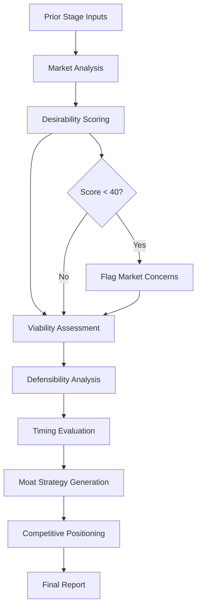

# 🏰 Market & Moat Agent

**Agent Type**: Pipeline
**Stage**: 4 of 9
**Status**: 🟢 Active
**Version**: 1.0.0

## 📋 Overview

The Market & Moat Agent is the fourth stage in the Launchloom pipeline, responsible for evaluating market positioning, competitive advantages, and building sustainable defensive strategies (moats) for the startup idea.

## 🎯 Purpose

- **Market Positioning**: Score desirability and market fit
- **Viability Assessment**: Evaluate business model sustainability
- **Defensibility Analysis**: Identify competitive moat opportunities
- **Timing Evaluation**: Assess market readiness and entry timing
- **Strategy Recommendations**: Provide moat-building strategies

## 📥 Input Schema

```typescript
interface MarketMoatInput {
  context: IdeaContext;
  normalizeResult: NormalizeResult;
  researchResult: ResearchResult;
  feasibilityResult: FeasibilityResult;
}
```

## 📤 Output Schema

```typescript
interface MarketMoatResult {
  desirability: number;              // 0-100 score
  viability: number;                 // 0-100 score
  defensibility: number;             // 0-100 score
  timing: number;                    // 0-100 score
  overallScore: number;              // Weighted average
  positioning: {
    segment: string;
    differentiation: string;
    targetPersona: string;
  };
  moatStrategies: Array<{
    type: 'network_effects' | 'switching_costs' | 'brand' | 'data' | 'scale' | 'technology';
    description: string;
    timeToImplement: string;
    strength: 'weak' | 'moderate' | 'strong';
  }>;
  competitiveAnalysis: {
    directCompetitors: string[];
    indirectCompetitors: string[];
    competitiveAdvantages: string[];
    vulnerabilities: string[];
  };
  recommendations: string[];
}
```

## ⚙️ Configuration

```yaml
# market-moat-agent.yml
agent:
  name: market-moat
  version: 1.0.0
  timeout: 45s
  retries: 2

model:
  name: gpt-4.1-mini
  maxTokens: 2000
  temperature: 0.7

scoring:
  weights:
    desirability: 0.30
    viability: 0.25
    defensibility: 0.25
    timing: 0.20

moatTypes:
  - network_effects
  - switching_costs
  - brand
  - data
  - scale
  - technology
```

## 🔄 Processing Pipeline



## 🎛️ Agent Operations

### Processing
```bash
# Execute market & moat analysis
POST /api/agents/market-moat/process
{
  "normalizeResult": { ... },
  "researchResult": { ... },
  "feasibilityResult": { ... }
}
```

### Response
```json
{
  "desirability": 78,
  "viability": 72,
  "defensibility": 65,
  "timing": 85,
  "overallScore": 75,
  "positioning": {
    "segment": "SMB productivity tools",
    "differentiation": "AI-first task prioritization",
    "targetPersona": "Tech-savvy professionals aged 25-45"
  },
  "moatStrategies": [
    {
      "type": "data",
      "description": "Build proprietary dataset of task completion patterns to improve AI recommendations",
      "timeToImplement": "6-12 months",
      "strength": "strong"
    },
    {
      "type": "switching_costs",
      "description": "Deep integrations with existing workflows and tools",
      "timeToImplement": "3-6 months",
      "strength": "moderate"
    }
  ],
  "competitiveAnalysis": {
    "directCompetitors": ["Todoist", "Asana", "ClickUp"],
    "indirectCompetitors": ["Notion", "Slack"],
    "competitiveAdvantages": [
      "AI-powered prioritization",
      "Automatic scheduling"
    ],
    "vulnerabilities": [
      "Established players have larger user bases",
      "Potential feature replication by incumbents"
    ]
  },
  "recommendations": [
    "Focus on AI differentiation before incumbents catch up",
    "Build integration ecosystem early",
    "Target underserved SMB segment"
  ]
}
```

## 📊 Performance Metrics

| Metric | Target | Current |
|--------|---------|---------|
| **Latency** | < 30s | 20s avg |
| **Score Consistency** | > 90% | 92% |
| **Strategy Quality** | > 80% | 85% |
| **Recommendation Relevance** | > 85% | 88% |

## 🔧 Development

### Local Testing
```bash
# Run market-moat agent tests
npm test -- agents/market-moat

# Test with sample input
npm run test:agent market-moat -- --input samples/feasibility-output.json
```

### Integration
```typescript
import { MarketMoatAgent } from '@/ai/agents/MarketMoatAgent';

const agent = new MarketMoatAgent(agentService);

const result = await agent.execute(
  context,
  normalizeResult,
  researchResult,
  feasibilityResult
);
```

## 🚨 Error Handling

### Common Errors

| Error Code | Description | Resolution |
|------------|-------------|------------|
| **MMT_001** | Market data insufficient | Use fallback analysis |
| **MMT_002** | Competitor mapping failed | Generate generic comparison |
| **MMT_003** | Score calculation error | Apply default weights |

## 📚 Dependencies

- **LaunchloomAgentsService**: AI model communication
- **Logger**: Structured logging
- **NormalizeResult**: Input from Stage 1
- **ResearchResult**: Input from Stage 2
- **FeasibilityResult**: Input from Stage 3

## 🔄 Navigation

⬅️ **[Feasibility Agent](./feasibility.md)** - Previous stage
➡️ **[Risk Agent](./risk.md)** - Next stage

---

**Maintainer**: Launchloom Pipeline Team
**Last Updated**: December 2024
**Contact**: pipeline-agents@i2s.studio
