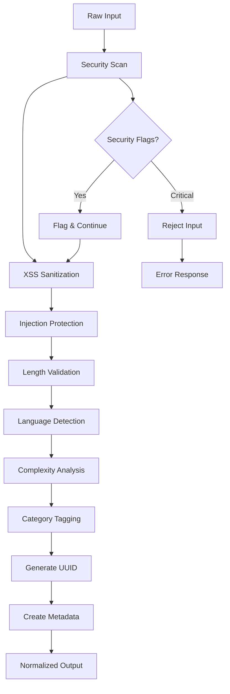

# 🔧 Normalize Agent

**Agent Type**: Pipeline  
**Stage**: 1 of 9  
**Status**: 🟢 Active  
**Version**: 1.2.0

## 📋 Overview

The Normalize Agent is the first stage in the I2S pipeline, responsible for sanitizing, validating, and structuring raw user input into a standardized format that can be safely processed by downstream agents.

## 🎯 Purpose

- **Input Sanitization**: Remove malicious content and prevent injection attacks
- **Data Validation**: Ensure input meets quality and format requirements
- **Standardization**: Transform varied input formats into consistent structure
- **Security Screening**: Detect and block potential prompt injection attempts

## 📥 Input Schema

```typescript
interface RawInput {
  title: string;           // Project title (1-100 characters)
  oneLiner: string;        // Brief description (10-200 characters)
  ideaText: string;        // Detailed idea (50-5000 characters)
  metadata?: {
    source: 'web' | 'api' | 'upload';
    timestamp: string;
    userId?: string;
  }
}
```

## 📤 Output Schema

```typescript
interface NormalizedIdea {
  id: string;              // Generated UUID
  title: string;           // Sanitized title
  oneLiner: string;        // Sanitized one-liner
  ideaText: string;        // Sanitized detailed description
  wordCount: number;       // Word count for processing estimates
  language: string;        // Detected language (ISO 639-1)
  complexity: 'simple' | 'moderate' | 'complex';
  categories: string[];    // Auto-detected categories
  flags: SecurityFlag[];   // Security concerns (if any)
  metadata: {
    processedAt: string;
    version: string;
    source: string;
  }
}

interface SecurityFlag {
  type: 'xss' | 'injection' | 'prompt_injection' | 'pii' | 'profanity';
  severity: 'low' | 'medium' | 'high';
  message: string;
  remediated: boolean;
}
```

## ⚙️ Configuration

```yaml
# normalize-agent.yml
agent:
  name: normalize
  version: 1.2.0
  timeout: 30s
  retries: 3

security:
  enableXSSProtection: true
  enableInjectionProtection: true
  enablePromptInjectionDetection: true
  enablePIIDetection: true
  
validation:
  minIdeaLength: 50
  maxIdeaLength: 5000
  minTitleLength: 1
  maxTitleLength: 100
  requiredFields: [title, oneLiner, ideaText]
  
processing:
  detectLanguage: true
  categorizeIdeas: true
  estimateComplexity: true
  
output:
  includeSecurityFlags: true
  includeProcessingMetadata: true
```

## 🛡️ Security Features

### XSS Protection
```typescript
function sanitizeXSS(input: string): string {
  return input
    .replace(/<script\b[^<]*(?:(?!<\/script>)<[^<]*)*<\/script>/gi, '')
    .replace(/<[^>]*>/g, '')
    .replace(/javascript:/gi, '')
    .replace(/on\w+\s*=/gi, '');
}
```

### Prompt Injection Detection
```typescript
const PROMPT_INJECTION_PATTERNS = [
  /ignore\s+previous\s+instructions/i,
  /forget\s+everything\s+above/i,
  /system\s*:\s*you\s+are/i,
  /human\s*:\s*actually/i,
  /assistant\s*:\s*i\s+will/i
];

function detectPromptInjection(text: string): boolean {
  return PROMPT_INJECTION_PATTERNS.some(pattern => pattern.test(text));
}
```

### PII Detection
```typescript
const PII_PATTERNS = {
  email: /\b[A-Za-z0-9._%+-]+@[A-Za-z0-9.-]+\.[A-Z|a-z]{2,}\b/g,
  phone: /\b\d{3}[-.]?\d{3}[-.]?\d{4}\b/g,
  ssn: /\b\d{3}-\d{2}-\d{4}\b/g,
  creditCard: /\b\d{4}[\s-]?\d{4}[\s-]?\d{4}[\s-]?\d{4}\b/g
};
```

## 🔄 Processing Pipeline



## 🎛️ Agent Operations

### Startup
```bash
# Initialize normalize agent
POST /api/agents/normalize/init
{
  "config": "normalize-agent.yml",
  "mode": "production"
}
```

### Processing
```bash
# Process raw input
POST /api/agents/normalize/process
{
  "title": "AI-powered task manager",
  "oneLiner": "Smart productivity app with AI recommendations",
  "ideaText": "An intelligent task management application that uses machine learning to prioritize tasks, suggest optimal work schedules, and provide productivity insights based on user behavior patterns."
}
```

### Response
```json
{
  "id": "idea_7f8e9d0a",
  "title": "AI-powered task manager",
  "oneLiner": "Smart productivity app with AI recommendations",
  "ideaText": "An intelligent task management application that uses machine learning to prioritize tasks, suggest optimal work schedules, and provide productivity insights based on user behavior patterns.",
  "wordCount": 32,
  "language": "en",
  "complexity": "moderate",
  "categories": ["productivity", "ai", "saas"],
  "flags": [],
  "metadata": {
    "processedAt": "2024-12-05T19:04:44Z",
    "version": "1.2.0",
    "source": "web"
  }
}
```

## 📊 Performance Metrics

| Metric | Target | Current |
|--------|---------|---------|
| **Latency** | < 500ms | 320ms avg |
| **Throughput** | 1000/min | 850/min |
| **Error Rate** | < 1% | 0.3% |
| **Security Detection** | > 99% | 99.7% |

## 🔧 Development

### Local Testing
```bash
# Run normalize agent tests
npm test -- agents/normalize

# Test with sample input
npm run test:agent normalize -- --input samples/raw-idea.json

# Performance testing
npm run perf:normalize -- --iterations 1000
```

### Integration
```typescript
import { NormalizeAgent } from '@i2s/agents/pipeline';

const agent = new NormalizeAgent({
  config: './configs/normalize-agent.yml'
});

const result = await agent.process({
  title: "My Startup Idea",
  oneLiner: "Revolutionary new approach",
  ideaText: "Detailed description here..."
});
```

## 🚨 Error Handling

### Common Errors

| Error Code | Description | Resolution |
|------------|-------------|------------|
| **NRM_001** | Input too short | Increase content length |
| **NRM_002** | Security violation | Review and sanitize input |
| **NRM_003** | Language not supported | Use supported language |
| **NRM_004** | Processing timeout | Retry with simpler input |

### Error Response Format
```json
{
  "error": "NRM_002",
  "message": "Potential XSS detected in input",
  "details": {
    "field": "ideaText",
    "position": 234,
    "suggestion": "Remove script tags and try again"
  }
}
```

## 📚 Dependencies

- **Security**: XSS protection library, injection detection patterns
- **Validation**: Joi schema validation, length checkers
- **NLP**: Language detection, complexity analysis
- **Utilities**: UUID generation, metadata helpers

## 🔄 Next Agent

Upon successful processing, output is automatically forwarded to:
➡️ **[Research Agent](./research.md)** - Market and competitor analysis

---

**Maintainer**: I2S Pipeline Team  
**Last Updated**: December 2024  
**Contact**: pipeline-agents@i2s.studio
