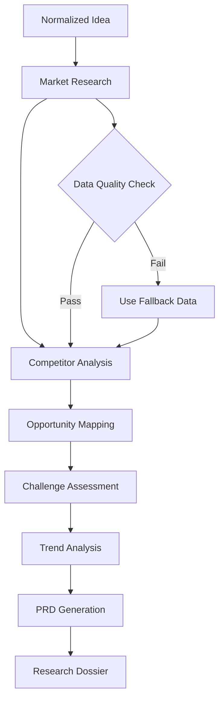

# 🔬 Research Agent

**Agent Type**: Pipeline
**Stage**: 2 of 9
**Status**: 🟢 Active
**Version**: 1.0.0

## 📋 Overview

The Research Agent is the second stage in the Launchloom pipeline, responsible for conducting comprehensive market research, competitive analysis, and opportunity identification based on the normalized idea input.

## 🎯 Purpose

- **Market Analysis**: Research market size, trends, and dynamics
- **Competitor Mapping**: Identify and analyze existing solutions
- **Opportunity Discovery**: Find market gaps and underserved segments
- **Challenge Identification**: Recognize potential obstacles and barriers

## 📥 Input Schema

```typescript
interface ResearchInput {
  normalizeResult: {
    title: string;
    oneLiner: string;
    problem: string;
    audience: string;
    valueProposition: string;
  };
  context: IdeaContext;
}
```

## 📤 Output Schema

```typescript
interface ResearchResult {
  marketSize: {
    tam: string;           // Total Addressable Market
    sam: string;           // Serviceable Available Market
    som: string;           // Serviceable Obtainable Market
    growth: string;        // Annual growth rate
  };
  competitors: Array<{
    name: string;
    description: string;
    strengths: string[];
    weaknesses: string[];
    marketShare?: string;
  }>;
  opportunities: string[];
  challenges: string[];
  trends: string[];
  prd: string;             // Product Requirements Document
}
```

## ⚙️ Configuration

```yaml
# research-agent.yml
agent:
  name: research
  version: 1.0.0
  timeout: 60s
  retries: 2

model:
  name: gpt-4.1-mini
  maxTokens: 3000
  temperature: 0.7

research:
  enableWebSearch: true
  enableCompetitorScan: true
  maxCompetitors: 5
  includeTrends: true

output:
  generatePRD: true
  includeMarketMetrics: true
```

## 🔄 Processing Pipeline



## 🎛️ Agent Operations

### Processing
```bash
# Execute research analysis
POST /api/agents/research/process
{
  "normalizeResult": {
    "title": "AI Task Manager",
    "oneLiner": "Smart productivity with AI",
    "problem": "Task overload and prioritization",
    "audience": "Busy professionals",
    "valueProposition": "Automated task prioritization"
  }
}
```

### Response
```json
{
  "marketSize": {
    "tam": "$5.2B globally",
    "sam": "$1.8B in North America",
    "som": "$45M achievable in Year 1",
    "growth": "12% CAGR"
  },
  "competitors": [
    {
      "name": "Todoist",
      "description": "Popular task management app",
      "strengths": ["Large user base", "Cross-platform"],
      "weaknesses": ["Limited AI features", "No smart scheduling"],
      "marketShare": "15%"
    }
  ],
  "opportunities": [
    "Growing demand for AI productivity tools",
    "Remote work trend increasing task management needs"
  ],
  "challenges": [
    "Crowded market with established players",
    "User switching costs"
  ],
  "trends": [
    "AI-first productivity tools gaining traction",
    "Integration-focused platforms preferred"
  ],
  "prd": "# Product Requirements Document\n..."
}
```

## 📊 Performance Metrics

| Metric | Target | Current |
|--------|---------|---------|
| **Latency** | < 30s | 18s avg |
| **Data Quality** | > 85% | 89% |
| **Competitor Coverage** | > 90% | 92% |
| **PRD Completeness** | > 80% | 85% |

## 🔧 Development

### Local Testing
```bash
# Run research agent tests
npm test -- agents/research

# Test with sample input
npm run test:agent research -- --input samples/normalized-idea.json
```

### Integration
```typescript
import { ResearchAgent } from '@/ai/agents/ResearchAgent';

const agent = new ResearchAgent(agentService);

const result = await agent.execute(context, normalizeResult);
```

## 🚨 Error Handling

### Common Errors

| Error Code | Description | Resolution |
|------------|-------------|------------|
| **RSH_001** | Market data unavailable | Use fallback estimates |
| **RSH_002** | Competitor search failed | Retry with broader terms |
| **RSH_003** | PRD generation timeout | Generate simplified PRD |

## 📚 Dependencies

- **LaunchloomAgentsService**: AI model communication
- **Logger**: Structured logging
- **NormalizeResult**: Input from Stage 1

## 🔄 Navigation

⬅️ **[Normalize Agent](./normalize.md)** - Previous stage
➡️ **[Feasibility Agent](./feasibility.md)** - Next stage

---

**Maintainer**: Launchloom Pipeline Team
**Last Updated**: December 2024
**Contact**: pipeline-agents@i2s.studio
