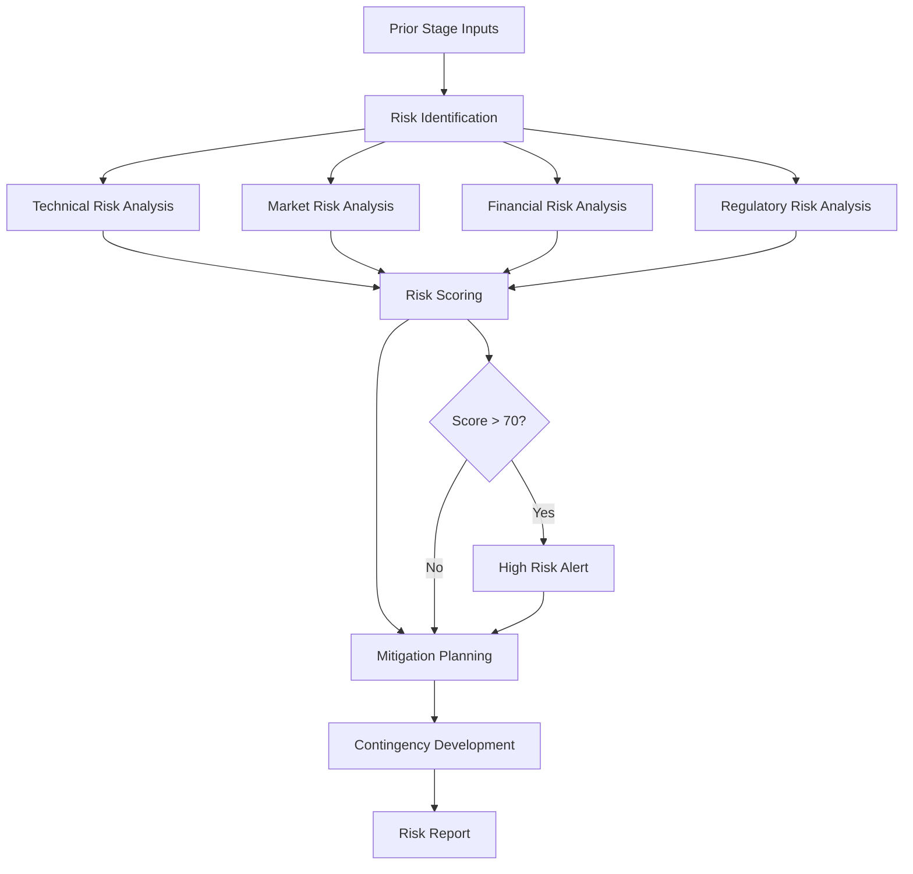

# ⚠️ Risk Agent

**Agent Type**: Pipeline
**Stage**: 5 of 9
**Status**: 🟢 Active
**Version**: 1.0.0

## 📋 Overview

The Risk Agent is the fifth stage in the Launchloom pipeline, responsible for comprehensive risk identification, assessment, and mitigation planning across technical, market, financial, and regulatory dimensions.

## 🎯 Purpose

- **Technical Risk Assessment**: Identify implementation and infrastructure risks
- **Market Risk Analysis**: Evaluate competitive and market-related risks
- **Financial Risk Evaluation**: Assess funding and cash flow risks
- **Regulatory Compliance**: Flag legal and compliance considerations
- **Mitigation Planning**: Develop actionable risk mitigation strategies

## 📥 Input Schema

```typescript
interface RiskInput {
  context: IdeaContext;
  normalizeResult: NormalizeResult;
  researchResult: ResearchResult;
  feasibilityResult: FeasibilityResult;
  marketMoatResult: MarketMoatResult;
}
```

## 📤 Output Schema

```typescript
interface RiskAssessmentResult {
  overallRiskScore: number;          // 0-100 (lower is better)
  technicalRisks: Array<{
    risk: string;
    probability: 'low' | 'medium' | 'high';
    impact: 'low' | 'medium' | 'high';
    description: string;
  }>;
  marketRisks: Array<{
    risk: string;
    probability: 'low' | 'medium' | 'high';
    impact: 'low' | 'medium' | 'high';
    description: string;
  }>;
  financialRisks: Array<{
    risk: string;
    probability: 'low' | 'medium' | 'high';
    impact: 'low' | 'medium' | 'high';
    description: string;
  }>;
  regulatoryRisks: Array<{
    risk: string;
    probability: 'low' | 'medium' | 'high';
    impact: 'low' | 'medium' | 'high';
    description: string;
  }>;
  mitigation: {
    immediate: string[];             // Actions for next 30 days
    shortTerm: string[];             // Actions for 1-3 months
    longTerm: string[];              // Actions for 3+ months
  };
  contingencyPlans: Array<{
    trigger: string;
    response: string;
    owner: string;
  }>;
}
```

## ⚙️ Configuration

```yaml
# risk-agent.yml
agent:
  name: risk
  version: 1.0.0
  timeout: 45s
  retries: 2

model:
  name: gpt-4.1-mini
  maxTokens: 2500
  temperature: 0.6

assessment:
  categories:
    - technical
    - market
    - financial
    - regulatory
  riskLevels:
    - low
    - medium
    - high
    - critical

thresholds:
  alertOnHighRisk: true
  maxAcceptableScore: 70
  requireMitigation: true
```

## 🔄 Processing Pipeline



## 🎛️ Agent Operations

### Processing
```bash
# Execute risk assessment
POST /api/agents/risk/process
{
  "normalizeResult": { ... },
  "researchResult": { ... },
  "feasibilityResult": { ... },
  "marketMoatResult": { ... }
}
```

### Response
```json
{
  "overallRiskScore": 45,
  "technicalRisks": [
    {
      "risk": "AI Model Dependency",
      "probability": "medium",
      "impact": "high",
      "description": "Heavy reliance on third-party AI APIs creates vendor lock-in and cost unpredictability"
    },
    {
      "risk": "Scaling Challenges",
      "probability": "low",
      "impact": "medium",
      "description": "Real-time AI processing may face latency issues at scale"
    }
  ],
  "marketRisks": [
    {
      "risk": "Competitive Response",
      "probability": "high",
      "impact": "medium",
      "description": "Established players may quickly replicate AI features"
    }
  ],
  "financialRisks": [
    {
      "risk": "API Cost Overruns",
      "probability": "medium",
      "impact": "medium",
      "description": "OpenAI API costs may exceed projections with user growth"
    }
  ],
  "regulatoryRisks": [
    {
      "risk": "Data Privacy Compliance",
      "probability": "low",
      "impact": "high",
      "description": "User data processing requires GDPR/CCPA compliance"
    }
  ],
  "mitigation": {
    "immediate": [
      "Set up API cost monitoring and alerts",
      "Document data processing for compliance",
      "Create technical architecture review process"
    ],
    "shortTerm": [
      "Implement caching to reduce API calls",
      "Develop fallback to local models",
      "Build competitive feature roadmap"
    ],
    "longTerm": [
      "Train proprietary models to reduce dependency",
      "Expand to multiple AI providers",
      "Establish compliance certification process"
    ]
  },
  "contingencyPlans": [
    {
      "trigger": "API costs exceed 150% of budget",
      "response": "Activate local model fallback, implement aggressive caching",
      "owner": "Engineering Lead"
    },
    {
      "trigger": "Major competitor launches similar feature",
      "response": "Accelerate differentiation roadmap, increase marketing spend",
      "owner": "Product Lead"
    }
  ]
}
```

## 📊 Performance Metrics

| Metric | Target | Current |
|--------|---------|---------|
| **Latency** | < 30s | 22s avg |
| **Risk Coverage** | > 95% | 97% |
| **Mitigation Quality** | > 85% | 88% |
| **False Positive Rate** | < 10% | 8% |

## 🔧 Development

### Local Testing
```bash
# Run risk agent tests
npm test -- agents/risk

# Test with sample input
npm run test:agent risk -- --input samples/market-moat-output.json
```

### Integration
```typescript
import { RiskAgent } from '@/ai/agents/RiskAgent';

const agent = new RiskAgent(agentService);

const result = await agent.execute(
  context,
  normalizeResult,
  researchResult,
  feasibilityResult,
  marketMoatResult
);
```

## 🚨 Error Handling

### Common Errors

| Error Code | Description | Resolution |
|------------|-------------|------------|
| **RSK_001** | Risk category analysis failed | Use template risks |
| **RSK_002** | Mitigation generation timeout | Apply standard mitigations |
| **RSK_003** | Score calculation error | Use conservative default |

## 📚 Dependencies

- **LaunchloomAgentsService**: AI model communication
- **Logger**: Structured logging
- **Results from Stages 1-4**: Cumulative pipeline data

## 🔄 Navigation

⬅️ **[Market & Moat Agent](./market-moat.md)** - Previous stage
➡️ **[UX Agent](./ux.md)** - Next stage

---

**Maintainer**: Launchloom Pipeline Team
**Last Updated**: December 2024
**Contact**: pipeline-agents@i2s.studio
