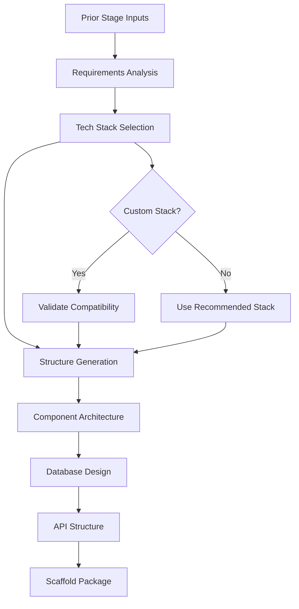

# 🏗️ Code Scaffold Agent

**Agent Type**: Pipeline
**Stage**: 7 of 9
**Status**: 🟢 Active
**Version**: 1.0.0

## 📋 Overview

The Code Scaffold Agent is the seventh stage in the Launchloom pipeline, responsible for generating comprehensive technical specifications including technology stack recommendations, project structure, component architecture, database design, and API structure.

## 🎯 Purpose

- **Tech Stack Selection**: Recommend optimal technologies for the project
- **Project Structure**: Generate folder and file organization
- **Component Architecture**: Define modular component design
- **Database Design**: Create schema and data model specifications
- **API Structure**: Define initial endpoint architecture

## 📥 Input Schema

```typescript
interface CodeScaffoldInput {
  context: IdeaContext;
  normalizeResult: NormalizeResult;
  researchResult: ResearchResult;
  feasibilityResult: FeasibilityResult;
  uxDesignResult: UXDesignResult;
}
```

## 📤 Output Schema

```typescript
interface CodeScaffoldResult {
  techStack: {
    frontend: string[];
    backend: string[];
    database: string[];
    infrastructure: string[];
    tools: string[];
  };
  structure: {
    directories: Array<{
      path: string;
      purpose: string;
    }>;
    keyFiles: Array<{
      path: string;
      purpose: string;
      template?: string;
    }>;
  };
  components: Array<{
    name: string;
    type: 'page' | 'layout' | 'feature' | 'ui' | 'util';
    props?: string[];
    dependencies?: string[];
  }>;
  database: {
    type: 'postgresql' | 'mysql' | 'mongodb' | 'sqlite';
    tables: Array<{
      name: string;
      columns: Array<{
        name: string;
        type: string;
        constraints?: string[];
      }>;
      indexes?: string[];
    }>;
    relationships: Array<{
      from: string;
      to: string;
      type: 'one-to-one' | 'one-to-many' | 'many-to-many';
    }>;
  };
  apiStructure: {
    baseUrl: string;
    version: string;
    endpoints: Array<{
      method: string;
      path: string;
      purpose: string;
    }>;
  };
}
```

## ⚙️ Configuration

```yaml
# code-scaffold-agent.yml
agent:
  name: code-scaffold
  version: 1.0.0
  timeout: 60s
  retries: 2

model:
  name: gpt-4.1
  maxTokens: 3500
  temperature: 0.5

generation:
  includeTechStack: true
  includeStructure: true
  includeComponents: true
  includeDatabase: true
  includeAPI: true

preferences:
  frontend: ['Next.js', 'React', 'TypeScript']
  backend: ['Node.js', 'FastAPI', 'Go']
  database: ['PostgreSQL', 'MongoDB']
```

## 🔄 Processing Pipeline



## 🎛️ Agent Operations

### Processing
```bash
# Execute code scaffolding
POST /api/agents/code-scaffold/process
{
  "normalizeResult": { ... },
  "researchResult": { ... },
  "feasibilityResult": { ... },
  "uxDesignResult": { ... }
}
```

### Response
```json
{
  "techStack": {
    "frontend": ["Next.js 14", "TypeScript", "Tailwind CSS", "shadcn/ui"],
    "backend": ["FastAPI", "Python 3.11", "Pydantic"],
    "database": ["PostgreSQL 15", "Redis"],
    "infrastructure": ["Vercel", "Railway", "AWS S3"],
    "tools": ["ESLint", "Prettier", "Jest", "Playwright"]
  },
  "structure": {
    "directories": [
      { "path": "src/app", "purpose": "Next.js App Router pages" },
      { "path": "src/components", "purpose": "Reusable React components" },
      { "path": "src/lib", "purpose": "Utility functions and helpers" },
      { "path": "src/hooks", "purpose": "Custom React hooks" },
      { "path": "src/services", "purpose": "API client and services" },
      { "path": "backend/api", "purpose": "FastAPI routes" },
      { "path": "backend/models", "purpose": "Database models" },
      { "path": "backend/services", "purpose": "Business logic" }
    ],
    "keyFiles": [
      { "path": "src/app/layout.tsx", "purpose": "Root layout with providers" },
      { "path": "src/app/page.tsx", "purpose": "Landing page" },
      { "path": "backend/main.py", "purpose": "FastAPI entry point" }
    ]
  },
  "components": [
    {
      "name": "TaskList",
      "type": "feature",
      "props": ["tasks", "onComplete", "onDelete"],
      "dependencies": ["TaskItem", "EmptyState"]
    },
    {
      "name": "AIRecommendation",
      "type": "feature",
      "props": ["suggestion", "onAccept", "onDismiss"],
      "dependencies": ["Card", "Button"]
    }
  ],
  "database": {
    "type": "postgresql",
    "tables": [
      {
        "name": "users",
        "columns": [
          { "name": "id", "type": "UUID", "constraints": ["PRIMARY KEY"] },
          { "name": "email", "type": "VARCHAR(255)", "constraints": ["UNIQUE", "NOT NULL"] },
          { "name": "created_at", "type": "TIMESTAMP", "constraints": ["DEFAULT NOW()"] }
        ],
        "indexes": ["idx_users_email"]
      },
      {
        "name": "tasks",
        "columns": [
          { "name": "id", "type": "UUID", "constraints": ["PRIMARY KEY"] },
          { "name": "user_id", "type": "UUID", "constraints": ["REFERENCES users(id)"] },
          { "name": "title", "type": "VARCHAR(500)", "constraints": ["NOT NULL"] },
          { "name": "priority", "type": "INTEGER", "constraints": ["DEFAULT 0"] },
          { "name": "due_date", "type": "TIMESTAMP" }
        ]
      }
    ],
    "relationships": [
      { "from": "users", "to": "tasks", "type": "one-to-many" }
    ]
  },
  "apiStructure": {
    "baseUrl": "/api/v1",
    "version": "1.0.0",
    "endpoints": [
      { "method": "GET", "path": "/tasks", "purpose": "List user tasks" },
      { "method": "POST", "path": "/tasks", "purpose": "Create new task" },
      { "method": "GET", "path": "/ai/suggest", "purpose": "Get AI recommendations" }
    ]
  }
}
```

## 📊 Performance Metrics

| Metric | Target | Current |
|--------|---------|---------|
| **Latency** | < 45s | 32s avg |
| **Stack Compatibility** | 100% | 100% |
| **Schema Validity** | > 98% | 99% |
| **Component Coverage** | > 90% | 92% |

## 🔧 Development

### Local Testing
```bash
# Run code scaffold agent tests
npm test -- agents/code-scaffold

# Test with sample input
npm run test:agent code-scaffold -- --input samples/ux-output.json
```

### Integration
```typescript
import { CodeScaffoldAgent } from '@/ai/agents/CodeScaffoldAgent';

const agent = new CodeScaffoldAgent(agentService);

const result = await agent.execute(
  context,
  normalizeResult,
  researchResult,
  feasibilityResult,
  uxDesignResult
);
```

## 🚨 Error Handling

### Common Errors

| Error Code | Description | Resolution |
|------------|-------------|------------|
| **CSF_001** | Tech stack incompatibility | Suggest alternatives |
| **CSF_002** | Schema generation failed | Use template schema |
| **CSF_003** | Component mapping error | Apply default components |

## 📚 Dependencies

- **LaunchloomAgentsService**: AI model communication
- **Logger**: Structured logging
- **Results from Stages 1-6**: Prior pipeline data

## 🔄 Navigation

⬅️ **[UX Agent](./ux.md)** - Previous stage
➡️ **[API Design Agent](./apis.md)** - Next stage

---

**Maintainer**: Launchloom Pipeline Team
**Last Updated**: December 2024
**Contact**: pipeline-agents@i2s.studio
