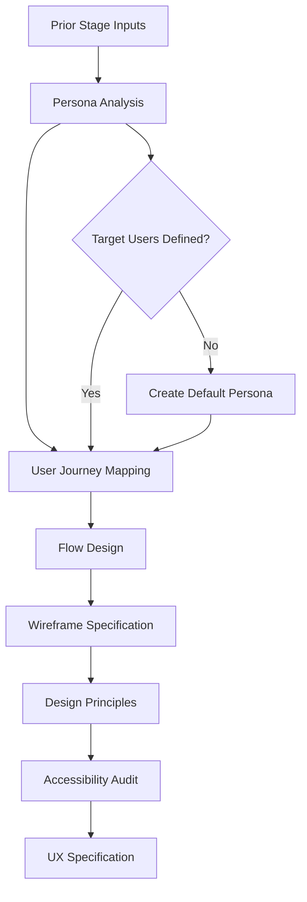

# 🎨 UX Design Agent

**Agent Type**: Pipeline
**Stage**: 6 of 9
**Status**: 🟢 Active
**Version**: 1.0.0

## 📋 Overview

The UX Design Agent is the sixth stage in the Launchloom pipeline, responsible for creating user experience specifications including user journeys, key flows, wireframe descriptions, design principles, and accessibility guidelines.

## 🎯 Purpose

- **User Journey Mapping**: Define end-to-end user experiences
- **Flow Design**: Create key interaction flows
- **Wireframe Specifications**: Generate detailed wireframe descriptions
- **Design Principles**: Establish UX/UI guidelines
- **Accessibility Planning**: Ensure inclusive design standards

## 📥 Input Schema

```typescript
interface UXDesignInput {
  context: IdeaContext;
  normalizeResult: NormalizeResult;
  researchResult: ResearchResult;
  feasibilityResult: FeasibilityResult;
}
```

## 📤 Output Schema

```typescript
interface UXDesignResult {
  userJourney: Array<{
    stage: string;
    touchpoints: string[];
    emotions: string;
    opportunities: string[];
  }>;
  keyFlows: Array<{
    name: string;
    steps: string[];
    happyPath: string;
    errorHandling: string;
  }>;
  wireframes: Array<{
    screen: string;
    purpose: string;
    components: string[];
    interactions: string[];
  }>;
  designPrinciples: Array<{
    principle: string;
    description: string;
    examples: string[];
  }>;
  accessibility: {
    wcagLevel: 'A' | 'AA' | 'AAA';
    guidelines: string[];
    considerations: string[];
  };
}
```

## ⚙️ Configuration

```yaml
# ux-design-agent.yml
agent:
  name: ux-design
  version: 1.0.0
  timeout: 45s
  retries: 2

model:
  name: gpt-4.1-mini
  maxTokens: 2500
  temperature: 0.7

design:
  includeUserJourney: true
  includeKeyFlows: true
  includeWireframes: true
  maxFlows: 5
  maxWireframes: 8

accessibility:
  defaultLevel: 'AA'
  includeGuidelines: true
  checkColorContrast: true
```

## 🔄 Processing Pipeline



## 🎛️ Agent Operations

### Processing
```bash
# Execute UX design analysis
POST /api/agents/ux-design/process
{
  "normalizeResult": { ... },
  "researchResult": { ... },
  "feasibilityResult": { ... }
}
```

### Response
```json
{
  "userJourney": [
    {
      "stage": "Awareness",
      "touchpoints": ["Landing page", "Product hunt", "Social media"],
      "emotions": "Curious, hopeful",
      "opportunities": ["Clear value proposition", "Social proof"]
    },
    {
      "stage": "Onboarding",
      "touchpoints": ["Sign up form", "Welcome wizard", "First task"],
      "emotions": "Excited, slightly anxious",
      "opportunities": ["Progressive disclosure", "Quick wins"]
    },
    {
      "stage": "Active Use",
      "touchpoints": ["Dashboard", "Task creation", "AI recommendations"],
      "emotions": "Productive, satisfied",
      "opportunities": ["Personalization", "Proactive suggestions"]
    }
  ],
  "keyFlows": [
    {
      "name": "Task Creation with AI",
      "steps": [
        "User clicks 'New Task'",
        "User enters task description",
        "AI suggests priority and deadline",
        "User confirms or adjusts",
        "Task added to list with smart scheduling"
      ],
      "happyPath": "User creates task with AI-suggested priority in under 10 seconds",
      "errorHandling": "Fallback to manual entry if AI unavailable"
    }
  ],
  "wireframes": [
    {
      "screen": "Dashboard",
      "purpose": "Central hub for task management and productivity insights",
      "components": [
        "Task list with priority indicators",
        "AI recommendation panel",
        "Progress metrics",
        "Quick add button"
      ],
      "interactions": [
        "Drag-drop task reordering",
        "Click to expand task details",
        "Swipe to complete on mobile"
      ]
    }
  ],
  "designPrinciples": [
    {
      "principle": "Progressive Disclosure",
      "description": "Show only essential information initially, reveal details on demand",
      "examples": [
        "Collapsed task details",
        "Advanced settings hidden by default"
      ]
    },
    {
      "principle": "AI Transparency",
      "description": "Make AI suggestions clear and adjustable",
      "examples": [
        "Confidence indicators on AI suggestions",
        "Explanation for priority recommendations"
      ]
    }
  ],
  "accessibility": {
    "wcagLevel": "AA",
    "guidelines": [
      "Minimum 4.5:1 color contrast ratio",
      "All interactive elements keyboard accessible",
      "Screen reader friendly labels",
      "Focus indicators on all controls"
    ],
    "considerations": [
      "Support reduced motion preference",
      "Provide text alternatives for icons",
      "Ensure touch targets are minimum 44x44px"
    ]
  }
}
```

## 📊 Performance Metrics

| Metric | Target | Current |
|--------|---------|---------|
| **Latency** | < 30s | 18s avg |
| **Flow Coverage** | > 90% | 92% |
| **Accessibility Compliance** | 100% | 100% |
| **Wireframe Completeness** | > 85% | 88% |

## 🔧 Development

### Local Testing
```bash
# Run UX design agent tests
npm test -- agents/ux-design

# Test with sample input
npm run test:agent ux-design -- --input samples/feasibility-output.json
```

### Integration
```typescript
import { UXDesignAgent } from '@/ai/agents/UXDesignAgent';

const agent = new UXDesignAgent(agentService);

const result = await agent.execute(
  context,
  normalizeResult,
  researchResult,
  feasibilityResult
);
```

## 🚨 Error Handling

### Common Errors

| Error Code | Description | Resolution |
|------------|-------------|------------|
| **UXD_001** | Flow generation failed | Use template flows |
| **UXD_002** | Wireframe incomplete | Apply default components |
| **UXD_003** | Accessibility check failed | Flag for manual review |

## 📚 Dependencies

- **LaunchloomAgentsService**: AI model communication
- **Logger**: Structured logging
- **Results from Stages 1-3**: Prior pipeline data

## 🔄 Navigation

⬅️ **[Risk Agent](./risk.md)** - Previous stage
➡️ **[Scaffold Agent](./scaffold.md)** - Next stage

---

**Maintainer**: Launchloom Pipeline Team
**Last Updated**: December 2024
**Contact**: pipeline-agents@i2s.studio
