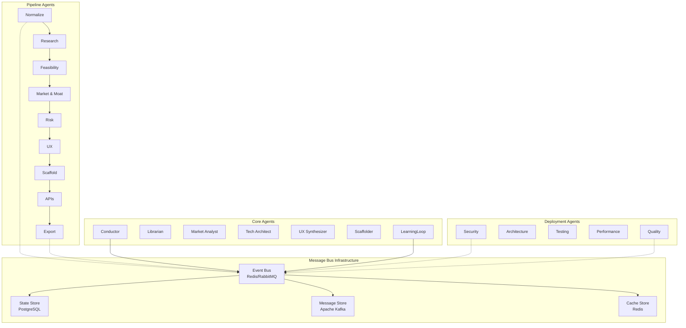

# 🔄 Inter-Agent Communication System

**Version**: 2.0.0  
**Last Updated**: December 2024  
**Status**: 🟢 Production Ready

## 📋 Overview

The Launchloom multi-agent system relies on a sophisticated communication infrastructure that enables seamless coordination between Pipeline Agents, Core Agents, and Deployment Agents through standardized message formats, event-driven architecture, and reliable delivery mechanisms.

## 🏗️ Communication Architecture

### Message Bus Topology


## 📨 Message Format Standards

### Base Message Schema
```typescript
interface AgentMessage {
  // Message metadata
  id: string;                    // Unique message ID (UUID v4)
  timestamp: string;             // ISO 8601 timestamp
  version: string;               // Message schema version
  
  // Routing information
  from: AgentIdentifier;         // Source agent
  to: AgentIdentifier | AgentIdentifier[]; // Target agent(s)
  type: MessageType;             // Message classification
  priority: MessagePriority;     // Processing priority
  
  // Message content
  payload: Record<string, any>;  // Typed payload data
  metadata: MessageMetadata;     // Additional context
  
  // Delivery guarantees
  deliveryMode: 'at_most_once' | 'at_least_once' | 'exactly_once';
  ttl?: number;                  // Time-to-live in seconds
  retryPolicy?: RetryPolicy;     // Retry configuration
}

interface AgentIdentifier {
  type: 'pipeline' | 'core' | 'deployment';
  name: string;                  // Agent name (e.g., 'normalize', 'conductor')
  instance?: string;             // Instance ID for scaled agents
  version: string;               // Agent version
}

type MessageType = 
  | 'command'                    // Direct action request
  | 'event'                      // State change notification
  | 'query'                      // Information request
  | 'response'                   // Response to query/command
  | 'heartbeat'                  // Health check
  | 'error'                      // Error notification
  | 'metrics';                   // Performance data

type MessagePriority = 'low' | 'normal' | 'high' | 'critical';
```

### Pipeline Stage Messages
```typescript
// Pipeline progression messages
interface PipelineProgressMessage extends AgentMessage {
  type: 'event';
  payload: {
    executionId: string;
    stage: string;               // Current stage name
    status: 'started' | 'completed' | 'failed' | 'skipped';
    progress: number;            // 0-100 completion percentage
    data?: any;                  // Stage output data
    metrics: {
      duration: number;          // Processing time in ms
      tokensUsed?: number;       // AI tokens consumed
      costUSD?: number;          // Processing cost
    };
    nextStage?: string;          // Next stage in pipeline
  };
}

// Agent handoff messages
interface AgentHandoffMessage extends AgentMessage {
  type: 'command';
  payload: {
    executionId: string;
    inputData: any;              // Data from previous agent
    context: {
      budget: ResourceBudget;    // Remaining resource limits
      constraints: string[];     // Processing constraints
      flags: ProcessingFlag[];   // Warnings or special handling
    };
  };
}
```

### Resource Management Messages
```typescript
interface ResourceRequestMessage extends AgentMessage {
  type: 'query';
  payload: {
    resourceType: 'tokens' | 'memory' | 'cpu' | 'storage';
    amount: number;
    duration?: number;           // Estimated usage duration
    priority: 'low' | 'normal' | 'high';
    justification: string;       // Why resource is needed
  };
}

interface ResourceAllocationMessage extends AgentMessage {
  type: 'response';
  payload: {
    requestId: string;
    approved: boolean;
    allocation?: {
      amount: number;
      expiresAt: string;
      conditions: string[];
    };
    denial?: {
      reason: string;
      alternatives: string[];
    };
  };
}
```

## 🚦 Event Bus Implementation

### Redis Pub/Sub Configuration
```yaml
# redis-pubsub.yml
redis:
  host: redis-cluster.i2s.internal
  port: 6379
  cluster: true
  
channels:
  pipeline:
    pattern: "pipeline.*"
    retention: 24h
    
  core:
    pattern: "core.*"
    retention: 7d
    
  deployment:
    pattern: "deployment.*"
    retention: 30d
    
  metrics:
    pattern: "metrics.*"
    retention: 90d
    
  alerts:
    pattern: "alerts.*"
    retention: 365d

# Message routing rules
routing:
  pipeline_progression:
    pattern: "pipeline.stage.*"
    subscribers: ["conductor", "learningloop", "metrics-collector"]
    
  resource_requests:
    pattern: "resource.request.*"
    subscribers: ["conductor", "resource-manager"]
    
  security_alerts:
    pattern: "security.alert.*"
    subscribers: ["conductor", "security-ops", "incident-manager"]
    priority: critical
```

### RabbitMQ Queue Configuration
```yaml
# rabbitmq-config.yml
exchanges:
  agent_commands:
    type: direct
    durable: true
    
  agent_events:
    type: topic
    durable: true
    
  agent_metrics:
    type: fanout
    durable: false

queues:
  pipeline_commands:
    exchange: agent_commands
    routing_key: "pipeline.*"
    durability: true
    message_ttl: 3600  # 1 hour
    
  core_events:
    exchange: agent_events
    routing_key: "core.#"
    durability: true
    
  deployment_notifications:
    exchange: agent_events
    routing_key: "deployment.*"
    durability: true

# Dead letter queues for failed messages
dead_letter:
  exchange: agent_dlx
  ttl: 86400  # 24 hours
  max_retries: 3
```

## 🎯 Communication Patterns

### 1. Sequential Pipeline Flow
```typescript
// Agent A completes processing
async function completeStage(executionId: string, stageData: any) {
  // Publish completion event
  await messagebus.publish('pipeline.stage.completed', {
    executionId,
    stage: 'normalize',
    status: 'completed',
    data: stageData,
    nextStage: 'research'
  });
  
  // Send handoff command to next agent
  await messagebus.send('research', 'command', {
    executionId,
    inputData: stageData,
    context: {
      budget: await getBudgetRemaining(executionId),
      constraints: await getConstraints(executionId)
    }
  });
}
```

### 2. Parallel Deployment Coordination
```typescript
// Conductor orchestrates parallel deployment agents
async function startDeploymentValidation(executionId: string, artifacts: any) {
  const deploymentAgents = ['security', 'performance', 'quality', 'testing', 'architecture'];
  
  // Send parallel commands
  const promises = deploymentAgents.map(agent => 
    messagebus.send(agent, 'command', {
      executionId,
      artifacts,
      validationType: 'pre_deployment'
    })
  );
  
  // Wait for all responses with timeout
  const results = await Promise.allSettled(promises);
  
  // Aggregate results
  const validationSummary = await aggregateValidationResults(results);
  
  // Publish aggregated results
  await messagebus.publish('deployment.validation.completed', {
    executionId,
    results: validationSummary
  });
}
```

### 3. Query-Response Pattern
```typescript
// Market Analyst queries Librarian for data
async function queryMarketData(domain: string, geography: string) {
  const queryId = generateUUID();
  
  // Send query
  await messagebus.send('librarian', 'query', {
    queryId,
    type: 'market_research',
    parameters: { domain, geography },
    maxAge: 3600  // Accept data up to 1 hour old
  });
  
  // Wait for response
  const response = await messagebus.waitForResponse(queryId, 30000); // 30s timeout
  
  if (response.type === 'response' && response.payload.success) {
    return response.payload.data;
  } else {
    throw new Error(`Query failed: ${response.payload.error}`);
  }
}
```

## 🔐 Security & Authentication

### Message Authentication
```typescript
interface SecureMessage extends AgentMessage {
  security: {
    signature: string;           // HMAC-SHA256 signature
    publicKeyId: string;         // Key identifier
    encryptedPayload?: string;   // Encrypted sensitive data
    nonce: string;               // Replay attack prevention
  };
}

// Message signing
function signMessage(message: AgentMessage, privateKey: string): SecureMessage {
  const payload = JSON.stringify(message);
  const signature = crypto
    .createHmac('sha256', privateKey)
    .update(payload)
    .digest('hex');
    
  return {
    ...message,
    security: {
      signature,
      publicKeyId: getPublicKeyId(privateKey),
      nonce: generateNonce()
    }
  };
}
```

### Access Control
```yaml
# agent-permissions.yml
permissions:
  pipeline_agents:
    can_send: [conductor, next_pipeline_agent]
    can_receive: [conductor, previous_pipeline_agent]
    can_publish: ["pipeline.stage.*"]
    can_subscribe: ["pipeline.control.*"]
    
  core_agents:
    conductor:
      can_send: ["*"]
      can_receive: ["*"]
      can_publish: ["*"]
      can_subscribe: ["*"]
      
    librarian:
      can_send: [conductor, "*_requesting_agent"]
      can_receive: ["*"]
      can_publish: ["knowledge.*"]
      can_subscribe: ["query.*"]
      
  deployment_agents:
    can_send: [conductor]
    can_receive: [conductor]
    can_publish: ["deployment.*", "security.*", "quality.*"]
    can_subscribe: ["deployment.commands.*"]
```

## 📊 State Synchronization

### Distributed State Management
```typescript
interface ExecutionState {
  id: string;
  status: ExecutionStatus;
  currentStage: string;
  completedStages: string[];
  agentStates: Record<string, AgentState>;
  sharedContext: SharedContext;
  resources: ResourceUsage;
  locks: StateLock[];
}

// State synchronization service
class StateSync {
  async updateState(executionId: string, updates: Partial<ExecutionState>) {
    // Acquire distributed lock
    const lock = await this.acquireLock(executionId);
    
    try {
      // Update state atomically
      const currentState = await this.getState(executionId);
      const newState = { ...currentState, ...updates };
      
      // Validate state transition
      this.validateStateTransition(currentState, newState);
      
      // Persist state
      await this.persistState(executionId, newState);
      
      // Broadcast state change
      await messagebus.publish('state.updated', {
        executionId,
        previousState: currentState.status,
        newState: newState.status,
        changes: updates
      });
      
    } finally {
      await this.releaseLock(lock);
    }
  }
}
```

## 🚨 Error Handling & Recovery

### Error Propagation
```typescript
interface ErrorMessage extends AgentMessage {
  type: 'error';
  payload: {
    errorId: string;
    errorType: 'validation' | 'timeout' | 'resource' | 'security' | 'system';
    severity: 'low' | 'medium' | 'high' | 'critical';
    message: string;
    context: {
      executionId?: string;
      stage?: string;
      agent: string;
      stackTrace?: string;
    };
    recovery: {
      retryable: boolean;
      maxRetries?: number;
      backoffMs?: number;
      alternativeActions?: string[];
    };
  };
}

// Error handling service
class ErrorHandler {
  async handleError(error: ErrorMessage) {
    // Log error
    await this.logError(error);
    
    // Determine recovery strategy
    const strategy = await this.getRecoveryStrategy(error);
    
    switch (strategy.type) {
      case 'retry':
        await this.scheduleRetry(error, strategy.delay);
        break;
        
      case 'escalate':
        await this.escalateToHuman(error);
        break;
        
      case 'failover':
        await this.failoverToBackup(error);
        break;
        
      case 'terminate':
        await this.terminateExecution(error.payload.context.executionId);
        break;
    }
  }
}
```

## 🎯 Queue Management & Prioritization

### Priority Queue Implementation
```typescript
interface PriorityQueue {
  critical: AgentMessage[];    // System alerts, security issues
  high: AgentMessage[];        // Time-sensitive operations
  normal: AgentMessage[];      // Standard processing
  low: AgentMessage[];         // Background tasks, metrics
}

class MessageRouter {
  async routeMessage(message: AgentMessage) {
    // Determine routing strategy
    const strategy = await this.getRoutingStrategy(message);
    
    switch (strategy.type) {
      case 'direct':
        await this.sendDirect(message, strategy.target);
        break;
        
      case 'broadcast':
        await this.broadcast(message, strategy.targets);
        break;
        
      case 'round_robin':
        await this.roundRobin(message, strategy.targetPool);
        break;
        
      case 'load_balanced':
        await this.loadBalance(message, strategy.targetPool);
        break;
    }
  }
  
  async processQueue(priority: MessagePriority) {
    const queue = this.queues[priority];
    const batchSize = this.getBatchSize(priority);
    
    while (queue.length > 0 && this.hasCapacity(priority)) {
      const batch = queue.splice(0, batchSize);
      await Promise.all(batch.map(msg => this.processMessage(msg)));
    }
  }
}
```

## 📈 Performance Monitoring

### Message Metrics
```typescript
interface MessageMetrics {
  messageId: string;
  type: MessageType;
  priority: MessagePriority;
  
  timing: {
    created: number;
    queued: number;
    processed: number;
    completed: number;
  };
  
  routing: {
    hops: number;
    retries: number;
    finalDestination: string;
  };
  
  size: {
    payloadBytes: number;
    totalBytes: number;
  };
  
  performance: {
    queueTimeMs: number;
    processingTimeMs: number;
    totalLatencyMs: number;
  };
}

// Metrics collection
class MetricsCollector {
  async collectMessageMetrics(message: AgentMessage, metrics: MessageMetrics) {
    // Store in time-series database
    await this.influxdb.writePoint({
      measurement: 'message_metrics',
      tags: {
        type: message.type,
        priority: message.priority,
        from: message.from.name,
        to: Array.isArray(message.to) ? 'broadcast' : message.to.name
      },
      fields: {
        queue_time: metrics.performance.queueTimeMs,
        processing_time: metrics.performance.processingTimeMs,
        total_latency: metrics.performance.totalLatencyMs,
        payload_size: metrics.size.payloadBytes,
        retry_count: metrics.routing.retries
      },
      timestamp: metrics.timing.completed
    });
  }
}
```

## 🔧 Development & Testing

### Local Message Bus
```bash
# Start local message infrastructure
docker-compose -f docker/messaging-stack.yml up -d

# Components started:
# - Redis (pub/sub + caching)
# - RabbitMQ (reliable queuing)
# - PostgreSQL (state persistence)
# - InfluxDB (metrics storage)
```

### Message Testing Framework
```typescript
// Message testing utilities
class MessageTestHarness {
  async mockAgent(agentId: AgentIdentifier): Promise<MockAgent> {
    const mock = new MockAgent(agentId);
    await this.messagebus.registerAgent(mock);
    return mock;
  }
  
  async sendTestMessage(
    from: string, 
    to: string, 
    payload: any
  ): Promise<AgentMessage> {
    const message = this.createTestMessage(from, to, payload);
    await this.messagebus.send(message);
    return message;
  }
  
  async expectMessage(
    agent: string,
    timeout: number = 5000
  ): Promise<AgentMessage> {
    return new Promise((resolve, reject) => {
      const timer = setTimeout(() => {
        reject(new Error(`No message received within ${timeout}ms`));
      }, timeout);
      
      this.messagebus.subscribe(agent, (message) => {
        clearTimeout(timer);
        resolve(message);
      });
    });
  }
}
```

## 📚 Related Documentation

- [Conductor Agent](../agents/core/conductor.md) - Master orchestration
- [Security Model](../security/SECURITY_MODEL.md) - Authentication & encryption
- [Performance Monitoring](../monitoring/OBSERVABILITY.md) - Metrics and alerting
- [Error Recovery](../troubleshooting/ERROR_RECOVERY.md) - Failure handling

---

**Maintainer**: Launchloom Platform Team  
**Contact**: platform@i2s.studio  
**Documentation**: Updated December 2024
