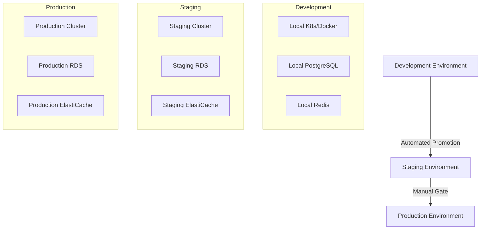

# ⚙️ Configuration & Deployment Guide

**Version**: 2.0.0  
**Last Updated**: December 2024  
**Status**: 🟢 Production Ready  
**Stack**: Kubernetes, Docker, Terraform, GitOps

## 📋 Overview

This guide covers comprehensive configuration and deployment procedures for the I2S multi-agent system across development, staging, and production environments using modern DevOps practices and container orchestration.

## 🌍 Environment Strategy

### Environment Hierarchy


### Environment Configuration Matrix
```yaml
environments:
  development:
    purpose: "Local development and testing"
    isolation: "Developer workstation"
    data: "Mock/synthetic data"
    monitoring: "Basic logging"
    scaling: "Manual, minimal resources"
    
  staging:
    purpose: "Integration testing and validation"
    isolation: "Shared staging cluster"
    data: "Sanitized production data"
    monitoring: "Full monitoring stack"
    scaling: "Automatic, moderate resources"
    
  production:
    purpose: "Live customer traffic"
    isolation: "Dedicated production cluster"
    data: "Live customer data"
    monitoring: "Full monitoring + alerting"
    scaling: "Automatic, high availability"
```

## 🔧 Development Environment Setup

### Local Development Stack
```bash
# Prerequisites installation
brew install docker kubectl helm terraform

# Start local development environment
docker-compose -f docker/dev-stack.yml up -d

# Initialize local Kubernetes cluster
kind create cluster --config k8s/dev-cluster-config.yml

# Deploy I2S development stack
kubectl apply -f k8s/dev/
```

### Docker Compose Configuration
```yaml
# docker/dev-stack.yml
version: '3.8'

services:
  # Core Infrastructure
  postgres:
    image: postgres:15-alpine
    environment:
      POSTGRES_DB: i2s_dev
      POSTGRES_USER: postgres
      POSTGRES_PASSWORD: postgres
    ports:
      - "5432:5432"
    volumes:
      - postgres_data:/var/lib/postgresql/data
      
  redis:
    image: redis:7-alpine
    ports:
      - "6379:6379"
    command: redis-server --appendonly yes
    volumes:
      - redis_data:/data
      
  rabbitmq:
    image: rabbitmq:3-management-alpine
    environment:
      RABBITMQ_DEFAULT_USER: rabbitmq
      RABBITMQ_DEFAULT_PASS: rabbitmq
    ports:
      - "5672:5672"
      - "15672:15672"
      
  # Monitoring Stack
  prometheus:
    image: prom/prometheus:latest
    ports:
      - "9090:9090"
    volumes:
      - ./monitoring/prometheus.yml:/etc/prometheus/prometheus.yml
      
  grafana:
    image: grafana/grafana:latest
    environment:
      GF_SECURITY_ADMIN_PASSWORD: admin
    ports:
      - "3001:3000"
    volumes:
      - grafana_data:/var/lib/grafana
      
  jaeger:
    image: jaegertracing/all-in-one:latest
    ports:
      - "16686:16686"
      - "14268:14268"
      
  # Application Services
  i2s-frontend:
    build: 
      context: .
      dockerfile: Dockerfile.dev
    ports:
      - "3000:3000"
    environment:
      - NODE_ENV=development
      - NEXT_PUBLIC_API_BASE=http://localhost:8000
    volumes:
      - .:/app
      - /app/node_modules
      
volumes:
  postgres_data:
  redis_data:
  grafana_data:
```

### Development Configuration
```typescript
// config/development.ts
export const developmentConfig = {
  app: {
    name: 'I2S Studio Dev',
    version: process.env.APP_VERSION || 'dev',
    environment: 'development',
    debug: true,
    logLevel: 'debug'
  },
  
  database: {
    host: 'localhost',
    port: 5432,
    database: 'i2s_dev',
    username: 'postgres',
    password: 'postgres',
    ssl: false,
    logging: true
  },
  
  redis: {
    host: 'localhost',
    port: 6379,
    password: null,
    db: 0,
    retryDelayOnFailover: 100,
    maxRetriesPerRequest: 3
  },
  
  agents: {
    conductor: {
      enabled: true,
      maxConcurrentPipelines: 3,
      timeout: '30m',
      budgets: {
        tokensPerPipeline: 100000,
        maxCostUSD: 25.00
      }
    },
    
    security: {
      enabled: true,
      scanners: ['basic'],
      compliance: ['development'],
      failOnCritical: false
    }
  },
  
  monitoring: {
    prometheus: {
      enabled: true,
      endpoint: 'http://localhost:9090'
    },
    jaeger: {
      enabled: true,
      endpoint: 'http://localhost:14268'
    }
  }
};
```

## 🚀 Staging Environment

### Staging Infrastructure (Terraform)
```hcl
# infrastructure/staging/main.tf
terraform {
  required_version = ">= 1.0"
  backend "s3" {
    bucket = "i2s-terraform-state"
    key    = "staging/terraform.tfstate"
    region = "us-east-1"
  }
}

# VPC and Networking
module "vpc" {
  source = "terraform-aws-modules/vpc/aws"
  
  name = "i2s-staging-vpc"
  cidr = "10.1.0.0/16"
  
  azs             = ["us-east-1a", "us-east-1b", "us-east-1c"]
  private_subnets = ["10.1.1.0/24", "10.1.2.0/24", "10.1.3.0/24"]
  public_subnets  = ["10.1.101.0/24", "10.1.102.0/24", "10.1.103.0/24"]
  
  enable_nat_gateway = true
  enable_vpn_gateway = false
  enable_dns_hostnames = true
  enable_dns_support = true
  
  tags = local.common_tags
}

# EKS Cluster
module "eks" {
  source = "terraform-aws-modules/eks/aws"
  
  cluster_name    = "i2s-staging-cluster"
  cluster_version = "1.28"
  
  vpc_id     = module.vpc.vpc_id
  subnet_ids = module.vpc.private_subnets
  
  # Managed Node Groups
  eks_managed_node_groups = {
    agents = {
      min_size       = 2
      max_size       = 10
      desired_size   = 3
      instance_types = ["t3.large"]
      
      k8s_labels = {
        Environment = "staging"
        NodeGroup   = "agents"
      }
      
      taints = [
        {
          key    = "i2s.studio/node-type"
          value  = "agents"
          effect = "NO_SCHEDULE"
        }
      ]
    }
    
    infrastructure = {
      min_size       = 1
      max_size       = 5
      desired_size   = 2
      instance_types = ["t3.medium"]
      
      k8s_labels = {
        Environment = "staging"
        NodeGroup   = "infrastructure"
      }
    }
  }
  
  tags = local.common_tags
}

# RDS Database
module "rds" {
  source = "terraform-aws-modules/rds/aws"
  
  identifier = "i2s-staging-db"
  
  engine            = "postgres"
  engine_version    = "15.4"
  instance_class    = "db.t3.medium"
  allocated_storage = 100
  storage_type      = "gp3"
  
  db_name  = "i2s_staging"
  username = "postgres"
  port     = "5432"
  
  vpc_security_group_ids = [aws_security_group.rds.id]
  db_subnet_group_name   = aws_db_subnet_group.main.name
  
  backup_retention_period = 7
  backup_window          = "03:00-04:00"
  maintenance_window     = "sun:04:00-sun:05:00"
  
  deletion_protection = true
  skip_final_snapshot = false
  
  performance_insights_enabled = true
  monitoring_interval         = 60
  
  tags = local.common_tags
}

# ElastiCache Redis
module "elasticache" {
  source = "terraform-aws-modules/elasticache/aws"
  
  cluster_id           = "i2s-staging-redis"
  engine              = "redis"
  node_type           = "cache.t3.micro"
  num_cache_nodes     = 1
  parameter_group_name = "default.redis7"
  port                = 6379
  subnet_group_name   = aws_elasticache_subnet_group.main.name
  security_group_ids  = [aws_security_group.elasticache.id]
  
  tags = local.common_tags
}

locals {
  common_tags = {
    Environment = "staging"
    Project     = "i2s-studio"
    ManagedBy   = "terraform"
    Owner       = "platform-team"
  }
}
```

### Kubernetes Deployment Manifests
```yaml
# k8s/staging/namespace.yml
apiVersion: v1
kind: Namespace
metadata:
  name: i2s-staging
  labels:
    name: i2s-staging
    environment: staging

---
# k8s/staging/conductor-deployment.yml
apiVersion: apps/v1
kind: Deployment
metadata:
  name: conductor
  namespace: i2s-staging
  labels:
    app: conductor
    tier: core-agent
    version: v2.1.0
spec:
  replicas: 2
  selector:
    matchLabels:
      app: conductor
  template:
    metadata:
      labels:
        app: conductor
        tier: core-agent
        version: v2.1.0
      annotations:
        prometheus.io/scrape: "true"
        prometheus.io/port: "8080"
        prometheus.io/path: "/metrics"
    spec:
      serviceAccountName: conductor
      tolerations:
      - key: "i2s.studio/node-type"
        value: "agents"
        effect: "NoSchedule"
      affinity:
        nodeAffinity:
          requiredDuringSchedulingIgnoredDuringExecution:
            nodeSelectorTerms:
            - matchExpressions:
              - key: "i2s.studio/node-type"
                operator: In
                values: ["agents"]
      containers:
      - name: conductor
        image: i2s/conductor:v2.1.0
        ports:
        - containerPort: 8080
          name: http
        - containerPort: 9090
          name: metrics
        env:
        - name: ENVIRONMENT
          value: "staging"
        - name: LOG_LEVEL
          value: "info"
        - name: DATABASE_URL
          valueFrom:
            secretKeyRef:
              name: database-credentials
              key: url
        - name: REDIS_URL
          valueFrom:
            secretKeyRef:
              name: redis-credentials
              key: url
        - name: RABBITMQ_URL
          valueFrom:
            secretKeyRef:
              name: rabbitmq-credentials
              key: url
        resources:
          requests:
            memory: "512Mi"
            cpu: "250m"
          limits:
            memory: "1Gi"
            cpu: "1000m"
        livenessProbe:
          httpGet:
            path: /health/live
            port: 8080
          initialDelaySeconds: 30
          periodSeconds: 10
          timeoutSeconds: 5
          failureThreshold: 3
        readinessProbe:
          httpGet:
            path: /health/ready
            port: 8080
          initialDelaySeconds: 5
          periodSeconds: 5
          timeoutSeconds: 3
          successThreshold: 1
          failureThreshold: 2

---
# k8s/staging/conductor-service.yml
apiVersion: v1
kind: Service
metadata:
  name: conductor
  namespace: i2s-staging
  labels:
    app: conductor
    tier: core-agent
spec:
  type: ClusterIP
  ports:
  - port: 8080
    targetPort: 8080
    protocol: TCP
    name: http
  - port: 9090
    targetPort: 9090
    protocol: TCP
    name: metrics
  selector:
    app: conductor

---
# k8s/staging/conductor-hpa.yml
apiVersion: autoscaling/v2
kind: HorizontalPodAutoscaler
metadata:
  name: conductor-hpa
  namespace: i2s-staging
spec:
  scaleTargetRef:
    apiVersion: apps/v1
    kind: Deployment
    name: conductor
  minReplicas: 2
  maxReplicas: 6
  metrics:
  - type: Resource
    resource:
      name: cpu
      target:
        type: Utilization
        averageUtilization: 70
  - type: Resource
    resource:
      name: memory
      target:
        type: Utilization
        averageUtilization: 80
  behavior:
    scaleUp:
      stabilizationWindowSeconds: 60
      policies:
      - type: Percent
        value: 100
        periodSeconds: 60
    scaleDown:
      stabilizationWindowSeconds: 300
      policies:
      - type: Percent
        value: 50
        periodSeconds: 60
```

## 🏭 Production Environment

### Production Infrastructure
```hcl
# infrastructure/production/main.tf
terraform {
  required_version = ">= 1.0"
  backend "s3" {
    bucket = "i2s-terraform-state"
    key    = "production/terraform.tfstate"
    region = "us-east-1"
  }
}

# Multi-AZ Production Setup
module "vpc" {
  source = "terraform-aws-modules/vpc/aws"
  
  name = "i2s-production-vpc"
  cidr = "10.0.0.0/16"
  
  azs             = ["us-east-1a", "us-east-1b", "us-east-1c", "us-east-1d"]
  private_subnets = ["10.0.1.0/24", "10.0.2.0/24", "10.0.3.0/24", "10.0.4.0/24"]
  public_subnets  = ["10.0.101.0/24", "10.0.102.0/24", "10.0.103.0/24", "10.0.104.0/24"]
  database_subnets = ["10.0.201.0/24", "10.0.202.0/24", "10.0.203.0/24", "10.0.204.0/24"]
  
  enable_nat_gateway = true
  single_nat_gateway = false  # Multi-AZ NAT gateways for HA
  enable_vpn_gateway = false
  enable_dns_hostnames = true
  enable_dns_support = true
  
  tags = local.common_tags
}

# Production EKS with Multiple Node Groups
module "eks" {
  source = "terraform-aws-modules/eks/aws"
  
  cluster_name    = "i2s-production-cluster"
  cluster_version = "1.28"
  
  vpc_id                         = module.vpc.vpc_id
  subnet_ids                     = module.vpc.private_subnets
  cluster_endpoint_private_access = true
  cluster_endpoint_public_access  = true
  cluster_endpoint_public_access_cidrs = ["0.0.0.0/0"]
  
  # OIDC Identity provider
  enable_irsa = true
  
  # Managed Node Groups
  eks_managed_node_groups = {
    # Critical agents (always available)
    critical_agents = {
      min_size       = 3
      max_size       = 15
      desired_size   = 5
      instance_types = ["m5.xlarge"]
      capacity_type  = "ON_DEMAND"
      
      k8s_labels = {
        Environment = "production"
        NodeGroup   = "critical-agents"
        Tier        = "critical"
      }
      
      taints = [
        {
          key    = "i2s.studio/tier"
          value  = "critical"
          effect = "NO_SCHEDULE"
        }
      ]
    }
    
    # Standard agents (scalable)
    standard_agents = {
      min_size       = 2
      max_size       = 20
      desired_size   = 4
      instance_types = ["m5.large", "m5.xlarge"]
      capacity_type  = "MIXED"  # Mix of On-Demand and Spot
      
      k8s_labels = {
        Environment = "production"
        NodeGroup   = "standard-agents"
        Tier        = "standard"
      }
    }
    
    # Infrastructure services
    infrastructure = {
      min_size       = 2
      max_size       = 6
      desired_size   = 3
      instance_types = ["c5.large"]
      capacity_type  = "ON_DEMAND"
      
      k8s_labels = {
        Environment = "production"
        NodeGroup   = "infrastructure"
        Tier        = "infrastructure"
      }
    }
  }
  
  tags = local.common_tags
}

# Production RDS with Multi-AZ
module "rds" {
  source = "terraform-aws-modules/rds/aws"
  
  identifier = "i2s-production-db"
  
  engine            = "postgres"
  engine_version    = "15.4"
  instance_class    = "db.r5.xlarge"  # Memory optimized
  allocated_storage = 500
  max_allocated_storage = 1000
  storage_type      = "gp3"
  storage_encrypted = true
  
  db_name  = "i2s_production"
  username = "postgres"
  port     = "5432"
  
  multi_az = true  # High availability
  vpc_security_group_ids = [aws_security_group.rds.id]
  db_subnet_group_name   = aws_db_subnet_group.main.name
  
  backup_retention_period = 30  # Extended backup retention
  backup_window          = "03:00-04:00"
  maintenance_window     = "sun:04:00-sun:05:00"
  
  deletion_protection = true
  skip_final_snapshot = false
  final_snapshot_identifier = "i2s-production-final-snapshot"
  
  performance_insights_enabled = true
  performance_insights_retention_period = 7
  monitoring_interval = 60
  monitoring_role_arn = aws_iam_role.rds_enhanced_monitoring.arn
  
  # Read replica for analytics/reporting
  create_db_parameter_group = true
  parameter_group_name     = "i2s-production-postgres15"
  
  tags = local.common_tags
}

# ElastiCache Redis Cluster
module "elasticache" {
  source = "terraform-aws-modules/elasticache/aws"
  
  replication_group_id       = "i2s-production-redis"
  engine                    = "redis"
  node_type                 = "cache.r5.large"
  port                      = 6379
  parameter_group_name      = "default.redis7.cluster.on"
  
  num_cache_clusters        = 3
  automatic_failover_enabled = true
  multi_az_enabled          = true
  
  subnet_group_name = aws_elasticache_subnet_group.main.name
  security_group_ids = [aws_security_group.elasticache.id]
  
  at_rest_encryption_enabled = true
  transit_encryption_enabled = true
  auth_token                = random_password.redis_auth_token.result
  
  tags = local.common_tags
}
```

## 🔐 Secret Management

### AWS Secrets Manager Integration
```typescript
// lib/secrets-manager.ts
import { SecretsManagerClient, GetSecretValueCommand } from "@aws-sdk/client-secrets-manager";

class SecretsManager {
  private client: SecretsManagerClient;
  private cache: Map<string, { value: any; expires: number }> = new Map();
  
  constructor(region: string = 'us-east-1') {
    this.client = new SecretsManagerClient({ region });
  }
  
  async getSecret(secretName: string, useCache: boolean = true): Promise<any> {
    if (useCache && this.cache.has(secretName)) {
      const cached = this.cache.get(secretName)!;
      if (Date.now() < cached.expires) {
        return cached.value;
      }
    }
    
    try {
      const command = new GetSecretValueCommand({ SecretId: secretName });
      const response = await this.client.send(command);
      
      let secretValue;
      if (response.SecretString) {
        secretValue = JSON.parse(response.SecretString);
      } else {
        throw new Error(`Secret ${secretName} is not a string`);
      }
      
      // Cache for 5 minutes
      if (useCache) {
        this.cache.set(secretName, {
          value: secretValue,
          expires: Date.now() + 5 * 60 * 1000
        });
      }
      
      return secretValue;
    } catch (error) {
      console.error(`Failed to retrieve secret ${secretName}:`, error);
      throw error;
    }
  }
  
  async getDatabaseCredentials(): Promise<DatabaseCredentials> {
    return await this.getSecret('i2s/database/credentials');
  }
  
  async getAPIKeys(): Promise<APIKeys> {
    return await this.getSecret('i2s/api/keys');
  }
}

interface DatabaseCredentials {
  username: string;
  password: string;
  host: string;
  port: number;
  database: string;
}

interface APIKeys {
  openai: string;
  anthropic: string;
  github: string;
  [key: string]: string;
}
```

### Kubernetes Secret Management
```yaml
# k8s/base/external-secrets.yml
apiVersion: external-secrets.io/v1beta1
kind: SecretStore
metadata:
  name: aws-secrets-manager
  namespace: i2s-production
spec:
  provider:
    aws:
      service: SecretsManager
      region: us-east-1
      auth:
        jwt:
          serviceAccountRef:
            name: external-secrets-sa

---
apiVersion: external-secrets.io/v1beta1
kind: ExternalSecret
metadata:
  name: database-credentials
  namespace: i2s-production
spec:
  refreshInterval: 1h
  secretStoreRef:
    name: aws-secrets-manager
    kind: SecretStore
  target:
    name: database-credentials
    creationPolicy: Owner
  data:
  - secretKey: url
    remoteRef:
      key: i2s/database/credentials
      property: connection_url
  - secretKey: username
    remoteRef:
      key: i2s/database/credentials
      property: username
  - secretKey: password
    remoteRef:
      key: i2s/database/credentials
      property: password

---
apiVersion: external-secrets.io/v1beta1
kind: ExternalSecret
metadata:
  name: api-keys
  namespace: i2s-production
spec:
  refreshInterval: 1h
  secretStoreRef:
    name: aws-secrets-manager
    kind: SecretStore
  target:
    name: api-keys
    creationPolicy: Owner
  data:
  - secretKey: openai-api-key
    remoteRef:
      key: i2s/api/keys
      property: openai
  - secretKey: anthropic-api-key
    remoteRef:
      key: i2s/api/keys
      property: anthropic
```

## 🌐 Network Topology & Service Mesh

### Istio Service Mesh Configuration
```yaml
# k8s/istio/gateway.yml
apiVersion: networking.istio.io/v1beta1
kind: Gateway
metadata:
  name: i2s-gateway
  namespace: i2s-production
spec:
  selector:
    istio: ingressgateway
  servers:
  - port:
      number: 443
      name: https
      protocol: HTTPS
    tls:
      mode: SIMPLE
      credentialName: i2s-tls-cert
    hosts:
    - api.i2s.studio
    - app.i2s.studio

---
# Virtual Service for API routing
apiVersion: networking.istio.io/v1beta1
kind: VirtualService
metadata:
  name: i2s-api-routing
  namespace: i2s-production
spec:
  hosts:
  - api.i2s.studio
  gateways:
  - i2s-gateway
  http:
  - match:
    - uri:
        prefix: /api/v1/pipeline
    route:
    - destination:
        host: conductor
        port:
          number: 8080
    fault:
      delay:
        percentage:
          value: 0.1
        fixedDelay: 100ms
    retries:
      attempts: 3
      perTryTimeout: 30s
      
  - match:
    - uri:
        prefix: /api/v1/health
    route:
    - destination:
        host: health-service
        port:
          number: 8080

---
# Destination Rules for load balancing
apiVersion: networking.istio.io/v1beta1
kind: DestinationRule
metadata:
  name: conductor-destination
  namespace: i2s-production
spec:
  host: conductor
  trafficPolicy:
    loadBalancer:
      simple: LEAST_CONN
    connectionPool:
      tcp:
        maxConnections: 100
      http:
        http1MaxPendingRequests: 50
        http2MaxRequests: 100
        maxRequestsPerConnection: 10
    circuitBreaker:
      consecutiveGatewayErrors: 5
      interval: 30s
      baseEjectionTime: 30s
      maxEjectionPercent: 50
  subsets:
  - name: v2-1-0
    labels:
      version: v2.1.0
    trafficPolicy:
      portLevelSettings:
      - port:
          number: 8080
        loadBalancer:
          simple: ROUND_ROBIN

---
# Security policies
apiVersion: security.istio.io/v1beta1
kind: PeerAuthentication
metadata:
  name: default
  namespace: i2s-production
spec:
  mtls:
    mode: STRICT

---
apiVersion: security.istio.io/v1beta1
kind: AuthorizationPolicy
metadata:
  name: conductor-authz
  namespace: i2s-production
spec:
  selector:
    matchLabels:
      app: conductor
  rules:
  - from:
    - source:
        principals: ["cluster.local/ns/i2s-production/sa/api-gateway"]
    to:
    - operation:
        methods: ["POST", "GET"]
        paths: ["/api/*"]
  - from:
    - source:
        namespaces: ["istio-system"]
    to:
    - operation:
        methods: ["GET"]
        paths: ["/health/*", "/metrics"]
```

## 📈 Auto-Scaling & Load Balancing

### Cluster Autoscaler Configuration
```yaml
# k8s/autoscaling/cluster-autoscaler.yml
apiVersion: apps/v1
kind: Deployment
metadata:
  name: cluster-autoscaler
  namespace: kube-system
  labels:
    app: cluster-autoscaler
spec:
  selector:
    matchLabels:
      app: cluster-autoscaler
  template:
    metadata:
      labels:
        app: cluster-autoscaler
      annotations:
        prometheus.io/scrape: 'true'
        prometheus.io/port: '8085'
    spec:
      serviceAccountName: cluster-autoscaler
      containers:
      - image: k8s.gcr.io/autoscaling/cluster-autoscaler:v1.21.0
        name: cluster-autoscaler
        resources:
          limits:
            cpu: 100m
            memory: 300Mi
          requests:
            cpu: 100m
            memory: 300Mi
        command:
        - ./cluster-autoscaler
        - --v=4
        - --stderrthreshold=info
        - --cloud-provider=aws
        - --skip-nodes-with-local-storage=false
        - --expander=least-waste
        - --node-group-auto-discovery=asg:tag=k8s.io/cluster-autoscaler/enabled,k8s.io/cluster-autoscaler/i2s-production-cluster
        - --balance-similar-node-groups
        - --scale-down-enabled=true
        - --scale-down-delay-after-add=2m
        - --scale-down-unneeded-time=2m
        - --skip-nodes-with-system-pods=false
        env:
        - name: AWS_REGION
          value: us-east-1
        volumeMounts:
        - name: ssl-certs
          mountPath: /etc/ssl/certs/ca-certificates.crt
          readOnly: true
        imagePullPolicy: "Always"
      volumes:
      - name: ssl-certs
        hostPath:
          path: "/etc/ssl/certs/ca-bundle.crt"

---
# Vertical Pod Autoscaler for right-sizing
apiVersion: autoscaling.k8s.io/v1
kind: VerticalPodAutoscaler
metadata:
  name: conductor-vpa
  namespace: i2s-production
spec:
  targetRef:
    apiVersion: apps/v1
    kind: Deployment
    name: conductor
  updatePolicy:
    updateMode: "Auto"
  resourcePolicy:
    containerPolicies:
    - containerName: conductor
      minAllowed:
        cpu: 100m
        memory: 256Mi
      maxAllowed:
        cpu: 2
        memory: 2Gi
      controlledResources: ["cpu", "memory"]
```

### Custom Metrics Autoscaling
```yaml
# k8s/autoscaling/custom-metrics-hpa.yml
apiVersion: autoscaling/v2
kind: HorizontalPodAutoscaler
metadata:
  name: conductor-custom-hpa
  namespace: i2s-production
spec:
  scaleTargetRef:
    apiVersion: apps/v1
    kind: Deployment
    name: conductor
  minReplicas: 3
  maxReplicas: 20
  metrics:
  # CPU utilization
  - type: Resource
    resource:
      name: cpu
      target:
        type: Utilization
        averageUtilization: 70
  
  # Memory utilization  
  - type: Resource
    resource:
      name: memory
      target:
        type: Utilization
        averageUtilization: 80
        
  # Custom metric: Active pipeline executions
  - type: Object
    object:
      metric:
        name: active_pipeline_executions
      describedObject:
        apiVersion: v1
        kind: Service
        name: conductor
      target:
        type: Value
        value: "100"
        
  # Custom metric: Queue depth
  - type: External
    external:
      metric:
        name: rabbitmq_queue_messages
        selector:
          matchLabels:
            queue: pipeline_commands
      target:
        type: AverageValue
        averageValue: "50"
        
  behavior:
    scaleUp:
      stabilizationWindowSeconds: 60
      policies:
      - type: Percent
        value: 100
        periodSeconds: 60
      - type: Pods
        value: 2
        periodSeconds: 60
      selectPolicy: Max
    scaleDown:
      stabilizationWindowSeconds: 300
      policies:
      - type: Percent
        value: 25
        periodSeconds: 60
      selectPolicy: Min
```

## 🔄 Backup & Disaster Recovery

### Database Backup Strategy
```bash
#!/bin/bash
# scripts/backup-database.sh

set -e

BACKUP_BUCKET="s3://i2s-backups/database"
TIMESTAMP=$(date +%Y%m%d_%H%M%S)
BACKUP_FILE="i2s_production_backup_${TIMESTAMP}.sql"

# Create database backup
pg_dump \
  --host=$DB_HOST \
  --port=$DB_PORT \
  --username=$DB_USER \
  --dbname=$DB_NAME \
  --verbose \
  --clean \
  --no-owner \
  --no-privileges \
  --compress=9 \
  --format=custom \
  --file=/tmp/$BACKUP_FILE

# Encrypt backup
gpg --cipher-algo AES256 --compress-algo 1 --symmetric --output /tmp/${BACKUP_FILE}.gpg /tmp/$BACKUP_FILE

# Upload to S3
aws s3 cp /tmp/${BACKUP_FILE}.gpg ${BACKUP_BUCKET}/${BACKUP_FILE}.gpg

# Cleanup local files
rm -f /tmp/$BACKUP_FILE /tmp/${BACKUP_FILE}.gpg

# Verify backup
aws s3 ls ${BACKUP_BUCKET}/${BACKUP_FILE}.gpg

echo "Database backup completed: ${BACKUP_FILE}.gpg"

# Retain only last 30 days of backups
aws s3 ls ${BACKUP_BUCKET}/ | while read -r line; do
    backup_date=$(echo $line | awk '{print $1}')
    if [ $(date -d "$backup_date + 30 days" +%s) -lt $(date +%s) ]; then
        backup_file=$(echo $line | awk '{print $4}')
        aws s3 rm ${BACKUP_BUCKET}/${backup_file}
        echo "Deleted old backup: ${backup_file}"
    fi
done
```

### Kubernetes Backup (Velero)
```yaml
# k8s/backup/velero-schedule.yml
apiVersion: velero.io/v1
kind: Schedule
metadata:
  name: i2s-daily-backup
  namespace: velero
spec:
  schedule: "0 3 * * *"  # Daily at 3 AM UTC
  template:
    includedNamespaces:
    - i2s-production
    - i2s-staging
    excludedResources:
    - events
    - events.events.k8s.io
    includeClusterResources: true
    storageLocation: aws-backup-location
    volumeSnapshotLocations:
    - aws-snapshot-location
    ttl: 720h  # 30 days retention

---
apiVersion: velero.io/v1
kind: BackupStorageLocation
metadata:
  name: aws-backup-location
  namespace: velero
spec:
  provider: aws
  objectStorage:
    bucket: i2s-velero-backups
    prefix: k8s-backups
  config:
    region: us-east-1
    s3ForcePathStyle: "false"

---
apiVersion: velero.io/v1
kind: VolumeSnapshotLocation
metadata:
  name: aws-snapshot-location
  namespace: velero
spec:
  provider: aws
  config:
    region: us-east-1
```

### Disaster Recovery Plan
```yaml
# Disaster Recovery Runbook
disaster_recovery:
  rto: "15 minutes"  # Recovery Time Objective
  rpo: "1 hour"      # Recovery Point Objective
  
  scenarios:
    - name: "Single AZ Failure"
      impact: "Degraded performance"
      recovery: "Automatic via multi-AZ setup"
      action: "Monitor and verify automatic failover"
      
    - name: "Database Failure"
      impact: "Service unavailable"
      recovery: "RDS automatic failover to standby"
      action: "Manual verification and DNS update if needed"
      
    - name: "EKS Cluster Failure"
      impact: "Complete service outage"
      recovery: "Deploy to secondary region"
      action: "Execute disaster recovery playbook"
      
    - name: "Region-wide Outage"
      impact: "Complete service outage"
      recovery: "Failover to secondary region (us-west-2)"
      action: "Manual disaster recovery procedure"
      
  recovery_procedures:
    secondary_region_deployment:
      steps:
        1: "Activate secondary region infrastructure"
        2: "Restore database from latest backup"
        3: "Deploy application stack"
        4: "Update DNS to point to secondary region"
        5: "Validate service functionality"
        6: "Monitor and adjust capacity as needed"
```

## 🚀 CI/CD Pipeline Integration

### GitOps with ArgoCD
```yaml
# k8s/argocd/application.yml
apiVersion: argoproj.io/v1alpha1
kind: Application
metadata:
  name: i2s-production
  namespace: argocd
spec:
  project: default
  source:
    repoURL: https://github.com/i2s-studio/k8s-manifests
    targetRevision: main
    path: production
  destination:
    server: https://kubernetes.default.svc
    namespace: i2s-production
  syncPolicy:
    automated:
      prune: true
      selfHeal: true
    syncOptions:
    - CreateNamespace=true
    retry:
      limit: 5
      backoff:
        duration: 5s
        factor: 2
        maxDuration: 3m
  revisionHistoryLimit: 10

---
apiVersion: argoproj.io/v1alpha1
kind: AppProject
metadata:
  name: i2s-platform
  namespace: argocd
spec:
  description: I2S Platform Applications
  sourceRepos:
  - https://github.com/i2s-studio/k8s-manifests
  - https://helm.i2s.studio
  destinations:
  - namespace: i2s-*
    server: https://kubernetes.default.svc
  clusterResourceWhitelist:
  - group: ''
    kind: Namespace
  - group: rbac.authorization.k8s.io
    kind: ClusterRole
  - group: rbac.authorization.k8s.io
    kind: ClusterRoleBinding
  namespaceResourceWhitelist:
  - group: ''
    kind: '*'
  - group: apps
    kind: '*'
  - group: autoscaling
    kind: '*'
  - group: networking.k8s.io
    kind: '*'
```

### Deployment Pipeline
```yaml
# .github/workflows/deploy-production.yml
name: Deploy to Production

on:
  push:
    branches: [main]
    paths: ['k8s/**', 'charts/**']
  workflow_dispatch:

jobs:
  deploy:
    runs-on: ubuntu-latest
    environment: production
    steps:
    - uses: actions/checkout@v3
    
    - name: Configure AWS credentials
      uses: aws-actions/configure-aws-credentials@v2
      with:
        aws-access-key-id: ${{ secrets.AWS_ACCESS_KEY_ID }}
        aws-secret-access-key: ${{ secrets.AWS_SECRET_ACCESS_KEY }}
        aws-region: us-east-1
    
    - name: Configure kubectl
      run: |
        aws eks update-kubeconfig --name i2s-production-cluster
        
    - name: Validate Kubernetes manifests
      run: |
        kubectl apply --dry-run=client -f k8s/production/
        
    - name: Deploy with ArgoCD
      run: |
        # Trigger ArgoCD sync
        kubectl patch application i2s-production -n argocd \
          -p '{"operation":{"initiatedBy":{"username":"github-actions"},"sync":{"revision":"${{ github.sha }}"}}}' \
          --type merge
          
    - name: Wait for deployment
      run: |
        kubectl wait --for=condition=Synced application/i2s-production -n argocd --timeout=600s
        kubectl wait --for=condition=Healthy application/i2s-production -n argocd --timeout=600s
        
    - name: Run smoke tests
      run: |
        kubectl run smoke-test --image=i2s/smoke-tests:latest \
          --env="TARGET_URL=https://api.i2s.studio" \
          --restart=Never --rm -i --tty
```

## 📚 Configuration Reference

### Environment Variables Reference
```typescript
// Configuration schema
interface Configuration {
  app: {
    name: string;           // Application name
    version: string;        // Version from package.json
    environment: 'development' | 'staging' | 'production';
    logLevel: 'error' | 'warn' | 'info' | 'debug' | 'trace';
    port: number;          // Application port
  };
  
  database: {
    host: string;
    port: number;
    database: string;
    username: string;
    password: string;
    ssl: boolean;
    maxConnections: number;
    idleTimeoutMs: number;
    connectionTimeoutMs: number;
  };
  
  redis: {
    host: string;
    port: number;
    password?: string;
    db: number;
    ttl: number;
    maxRetries: number;
    retryDelay: number;
  };
  
  messageQueue: {
    host: string;
    port: number;
    username: string;
    password: string;
    vhost: string;
    heartbeat: number;
    prefetchCount: number;
  };
  
  agents: {
    [agentName: string]: {
      enabled: boolean;
      replicas: number;
      resources: {
        cpu: string;
        memory: string;
      };
      config: Record<string, any>;
    };
  };
  
  monitoring: {
    prometheus: {
      enabled: boolean;
      endpoint: string;
      scrapeInterval: string;
    };
    jaeger: {
      enabled: boolean;
      endpoint: string;
      samplingRate: number;
    };
    logging: {
      level: string;
      format: 'json' | 'text';
      elasticsearch?: {
        host: string;
        index: string;
      };
    };
  };
}
```

---

**Owner**: I2S Platform Team  
**Contact**: platform@i2s.studio  
**Emergency**: oncall@i2s.studio  
**Documentation**: Updated December 2024
