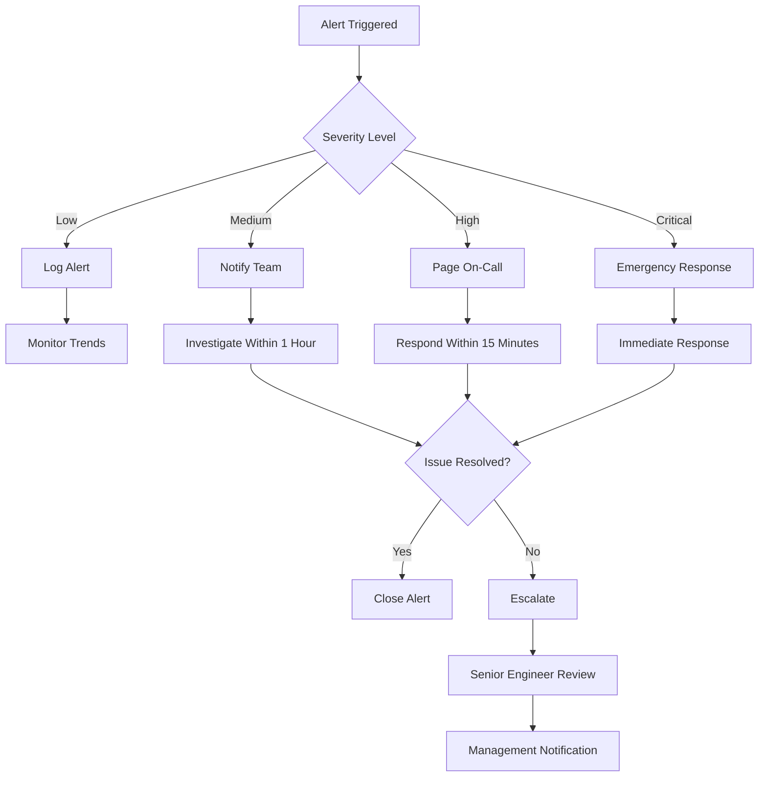
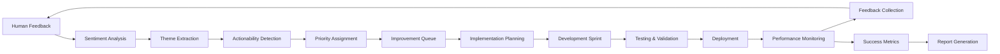

# 🔄 Human-in-the-Loop (HITL) Controls

**Version**: 1.0.0  
**Last Updated**: December 2024  
**Status**: 🟢 Active  
**Compliance**: SOC2, GDPR, ISO 27001

## 📋 Overview

The Human-in-the-Loop (HITL) system provides critical oversight and control mechanisms for the I2S multi-agent platform, ensuring human supervision over automated processes, maintaining quality standards, and providing intervention capabilities when needed.

## 🎯 HITL Philosophy

### Core Principles
- **Human Oversight**: Critical decisions require human approval
- **Transparency**: All automated actions are visible and auditable
- **Intervention**: Humans can override or stop automated processes
- **Learning**: Human feedback improves system performance
- **Safety**: Multiple safety nets prevent harmful automated actions

### Trust Levels
```typescript
enum TrustLevel {
  FULL_AUTOMATION = 'full_automation',      // No human intervention needed
  HUMAN_IN_LOOP = 'human_in_loop',          // Human monitoring with intervention capability
  HUMAN_ON_LOOP = 'human_on_loop',          // Human approval required for key decisions
  HUMAN_IN_CONTROL = 'human_in_control'     // Human-driven with AI assistance
}
```

## 🚪 Approval Workflows

### Critical Decision Gates

#### 1. Pipeline Execution Gates
```yaml
pipeline_gates:
  pre_execution:
    trigger: "New pipeline request"
    condition: "Always for new users OR high-risk ideas"
    approvers: ["content_moderator", "senior_analyst"]
    timeout: "24h"
    escalation: "team_lead"
    
  risk_assessment:
    trigger: "Risk score > 7.0 OR regulated domain detected"
    condition: "Risk agent flags high-risk content"
    approvers: ["risk_analyst", "compliance_officer"]
    timeout: "4h"
    escalation: "legal_team"
    
  deployment_validation:
    trigger: "Security findings OR architecture issues"
    condition: "Critical/High severity findings"
    approvers: ["security_engineer", "platform_architect"]
    timeout: "2h"
    escalation: "security_team_lead"
    
  export_approval:
    trigger: "Export request with sensitive data"
    condition: "PII detected OR enterprise account"
    approvers: ["data_protection_officer"]
    timeout: "1h"
    escalation: "privacy_team"
```

#### 2. Content Moderation Gates
```typescript
interface ContentModerationGate {
  id: string;
  trigger: ModerationTrigger;
  severity: 'low' | 'medium' | 'high' | 'critical';
  requiresApproval: boolean;
  approvers: UserRole[];
  autoReject: boolean;
  escalationPath: EscalationRule[];
}

const CONTENT_MODERATION_GATES: ContentModerationGate[] = [
  {
    id: 'inappropriate_content',
    trigger: 'ai_content_filter_flag',
    severity: 'high',
    requiresApproval: true,
    approvers: ['content_moderator', 'community_manager'],
    autoReject: false,
    escalationPath: [
      { level: 1, role: 'senior_moderator', timeout: '2h' },
      { level: 2, role: 'compliance_officer', timeout: '4h' }
    ]
  },
  {
    id: 'regulatory_compliance',
    trigger: 'regulated_industry_detected',
    severity: 'critical',
    requiresApproval: true,
    approvers: ['compliance_officer', 'legal_counsel'],
    autoReject: false,
    escalationPath: [
      { level: 1, role: 'legal_team_lead', timeout: '1h' },
      { level: 2, role: 'general_counsel', timeout: '2h' }
    ]
  }
];
```

### Approval Interface

#### Web-based Approval Dashboard
```typescript
interface ApprovalRequest {
  id: string;
  type: ApprovalType;
  priority: Priority;
  submittedAt: string;
  submittedBy: string;
  context: {
    executionId: string;
    stage: string;
    agent: string;
    reason: string;
    evidence: Evidence[];
  };
  decision?: {
    approved: boolean;
    approver: string;
    approvedAt: string;
    notes: string;
    conditions: string[];
  };
  escalation?: EscalationRecord[];
}

// Approval dashboard component
const ApprovalDashboard: React.FC = () => {
  const [requests, setRequests] = useState<ApprovalRequest[]>([]);
  const [filters, setFilters] = useState<ApprovalFilters>({});
  
  return (
    <div className="approval-dashboard">
      <ApprovalFilters filters={filters} onFiltersChange={setFilters} />
      <ApprovalQueue 
        requests={requests}
        onApprove={handleApprove}
        onReject={handleReject}
        onEscalate={handleEscalate}
      />
      <ApprovalHistory />
    </div>
  );
};
```

## ⚙️ Override Mechanisms

### Emergency Override System
```typescript
interface EmergencyOverride {
  id: string;
  type: OverrideType;
  severity: 'moderate' | 'high' | 'critical' | 'emergency';
  reason: string;
  authorizedBy: string;
  authorizedAt: string;
  affectedSystems: string[];
  duration: number; // minutes
  autoRevert: boolean;
}

enum OverrideType {
  STOP_PIPELINE = 'stop_pipeline',
  SKIP_GATE = 'skip_gate',
  FORCE_APPROVAL = 'force_approval',
  EMERGENCY_SHUTDOWN = 'emergency_shutdown',
  BYPASS_VALIDATION = 'bypass_validation',
  MANUAL_INTERVENTION = 'manual_intervention'
}

class EmergencyOverrideService {
  async executeOverride(
    overrideType: OverrideType,
    reason: string,
    authorizedBy: string,
    duration?: number
  ): Promise<EmergencyOverride> {
    // Verify authorization level
    await this.verifyAuthorization(authorizedBy, overrideType);
    
    // Create override record
    const override: EmergencyOverride = {
      id: generateUUID(),
      type: overrideType,
      severity: this.calculateSeverity(overrideType),
      reason,
      authorizedBy,
      authorizedAt: nowISO(),
      affectedSystems: await this.getAffectedSystems(overrideType),
      duration: duration || this.getDefaultDuration(overrideType),
      autoRevert: this.shouldAutoRevert(overrideType)
    };
    
    // Execute override
    await this.applyOverride(override);
    
    // Schedule auto-revert if enabled
    if (override.autoRevert) {
      await this.scheduleRevert(override);
    }
    
    // Send notifications
    await this.notifyStakeholders(override);
    
    return override;
  }
}
```

### Manual Intervention Capabilities
```typescript
interface ManualIntervention {
  executionId: string;
  stage: string;
  interventionType: InterventionType;
  operator: string;
  timestamp: string;
  actions: InterventionAction[];
  notes: string;
}

enum InterventionType {
  PAUSE_EXECUTION = 'pause_execution',
  RESUME_EXECUTION = 'resume_execution',
  SKIP_STAGE = 'skip_stage',
  RETRY_STAGE = 'retry_stage',
  MODIFY_PARAMETERS = 'modify_parameters',
  INJECT_DATA = 'inject_data',
  ABORT_EXECUTION = 'abort_execution'
}

// Manual intervention interface
const ManualInterventionPanel: React.FC<{ executionId: string }> = ({ executionId }) => {
  const [execution, setExecution] = useState<ExecutionState>();
  const [interventionType, setInterventionType] = useState<InterventionType>();
  
  const handleIntervention = async (type: InterventionType, parameters?: any) => {
    await interventionService.execute({
      executionId,
      type,
      operator: currentUser.id,
      parameters,
      notes: interventionNotes
    });
  };
  
  return (
    <div className="intervention-panel">
      <ExecutionMonitor execution={execution} />
      <InterventionControls 
        availableActions={getAvailableInterventions(execution)}
        onIntervention={handleIntervention}
      />
      <InterventionHistory executionId={executionId} />
    </div>
  );
};
```

## 📊 Monitoring Dashboards

### Real-time System Dashboard
```typescript
interface SystemHealthDashboard {
  components: {
    pipelineStatus: PipelineHealthMetrics;
    agentStatus: AgentHealthMetrics;
    approvalQueue: ApprovalQueueMetrics;
    interventionHistory: InterventionMetrics;
    alertStatus: AlertMetrics;
  };
}

const SystemHealthDashboard: React.FC = () => {
  const [metrics, setMetrics] = useState<SystemHealthDashboard>();
  const [refreshInterval, setRefreshInterval] = useState(30000); // 30 seconds
  
  useEffect(() => {
    const interval = setInterval(async () => {
      const updatedMetrics = await healthService.getSystemMetrics();
      setMetrics(updatedMetrics);
    }, refreshInterval);
    
    return () => clearInterval(interval);
  }, [refreshInterval]);
  
  return (
    <div className="system-dashboard">
      <MetricCards metrics={metrics} />
      <PipelineStatusGrid pipelines={metrics?.components.pipelineStatus} />
      <ApprovalQueueWidget queue={metrics?.components.approvalQueue} />
      <AlertsPanel alerts={metrics?.components.alertStatus} />
    </div>
  );
};
```

### Agent Performance Monitoring
```yaml
agent_monitoring:
  metrics:
    response_time:
      threshold_warning: 2s
      threshold_critical: 5s
      
    success_rate:
      threshold_warning: 95%
      threshold_critical: 90%
      
    resource_usage:
      cpu_warning: 70%
      cpu_critical: 85%
      memory_warning: 80%
      memory_critical: 90%
      
    error_rate:
      threshold_warning: 5%
      threshold_critical: 10%
      
  alerts:
    notification_channels:
      - slack: "#agent-monitoring"
      - email: "ops@i2s.studio"
      - pagerduty: "agent-team-oncall"
      
  dashboards:
    grafana:
      url: "https://monitoring.i2s.studio/d/agents"
      panels:
        - agent_response_times
        - agent_success_rates
        - resource_utilization
        - error_trends
```

## 🚨 Alert Thresholds

### Automated Alert Configuration
```typescript
interface AlertRule {
  id: string;
  name: string;
  condition: AlertCondition;
  severity: AlertSeverity;
  channels: NotificationChannel[];
  throttle: ThrottleConfig;
  escalation: EscalationRule[];
}

const ALERT_RULES: AlertRule[] = [
  {
    id: 'pipeline_failure_rate_high',
    name: 'Pipeline Failure Rate High',
    condition: {
      metric: 'pipeline.failure_rate',
      operator: '>',
      threshold: 0.1, // 10%
      timeWindow: '5m',
      evaluationFrequency: '1m'
    },
    severity: 'high',
    channels: ['slack', 'email'],
    throttle: { duration: '15m', maxAlerts: 3 },
    escalation: [
      { level: 1, delay: '10m', channels: ['pagerduty'] },
      { level: 2, delay: '30m', channels: ['phone'] }
    ]
  },
  {
    id: 'approval_queue_backlog',
    name: 'Approval Queue Backlog',
    condition: {
      metric: 'approval.queue_size',
      operator: '>',
      threshold: 50,
      timeWindow: '10m'
    },
    severity: 'medium',
    channels: ['slack'],
    throttle: { duration: '30m', maxAlerts: 2 },
    escalation: [
      { level: 1, delay: '1h', channels: ['email'] }
    ]
  },
  {
    id: 'security_incident_detected',
    name: 'Security Incident Detected',
    condition: {
      metric: 'security.incident_count',
      operator: '>',
      threshold: 1,
      timeWindow: '1m'
    },
    severity: 'critical',
    channels: ['pagerduty', 'slack', 'email', 'phone'],
    throttle: { duration: '5m', maxAlerts: 1 },
    escalation: [
      { level: 1, delay: '2m', channels: ['phone'] },
      { level: 2, delay: '5m', channels: ['executive_notification'] }
    ]
  }
];
```

### Alert Response Procedures


## 📝 Audit Trails

### Comprehensive Audit Logging
```typescript
interface AuditEvent {
  id: string;
  timestamp: string;
  eventType: AuditEventType;
  actor: {
    type: 'user' | 'system' | 'agent';
    id: string;
    role?: string;
  };
  target: {
    type: string;
    id: string;
    metadata?: Record<string, any>;
  };
  action: string;
  result: 'success' | 'failure' | 'partial';
  details: {
    ipAddress?: string;
    userAgent?: string;
    location?: string;
    duration?: number;
    errorMessage?: string;
  };
  impact: 'low' | 'medium' | 'high' | 'critical';
  compliance: ComplianceTag[];
}

enum AuditEventType {
  AUTHENTICATION = 'authentication',
  AUTHORIZATION = 'authorization',
  APPROVAL = 'approval',
  OVERRIDE = 'override',
  INTERVENTION = 'intervention',
  DATA_ACCESS = 'data_access',
  DATA_MODIFICATION = 'data_modification',
  SYSTEM_CONFIGURATION = 'system_configuration',
  SECURITY_EVENT = 'security_event'
}

// Audit service implementation
class AuditService {
  async logEvent(event: Omit<AuditEvent, 'id' | 'timestamp'>): Promise<void> {
    const auditEvent: AuditEvent = {
      ...event,
      id: generateUUID(),
      timestamp: nowISO()
    };
    
    // Store in audit database
    await this.auditStore.save(auditEvent);
    
    // Send to SIEM if high impact
    if (auditEvent.impact === 'high' || auditEvent.impact === 'critical') {
      await this.siemIntegration.send(auditEvent);
    }
    
    // Real-time monitoring
    await this.monitoringService.trackEvent(auditEvent);
  }
}
```

### Compliance Reporting
```typescript
interface ComplianceReport {
  reportId: string;
  reportType: ComplianceFramework;
  period: {
    startDate: string;
    endDate: string;
  };
  summary: ComplianceSummary;
  findings: ComplianceFinding[];
  recommendations: ComplianceRecommendation[];
}

enum ComplianceFramework {
  SOC2 = 'soc2',
  GDPR = 'gdpr',
  HIPAA = 'hipaa',
  ISO27001 = 'iso27001',
  PCI_DSS = 'pci_dss'
}

// Generate compliance reports
class ComplianceReportGenerator {
  async generateReport(
    framework: ComplianceFramework,
    startDate: string,
    endDate: string
  ): Promise<ComplianceReport> {
    const auditEvents = await this.getAuditEvents(startDate, endDate);
    const controlsAssessment = await this.assessControls(framework, auditEvents);
    
    return {
      reportId: generateUUID(),
      reportType: framework,
      period: { startDate, endDate },
      summary: await this.generateSummary(controlsAssessment),
      findings: await this.identifyFindings(controlsAssessment),
      recommendations: await this.generateRecommendations(controlsAssessment)
    };
  }
}
```

## 🔄 Feedback Loops

### Human Feedback Integration
```typescript
interface HumanFeedback {
  id: string;
  executionId: string;
  stage: string;
  feedbackType: FeedbackType;
  provider: string;
  timestamp: string;
  rating: number; // 1-5 scale
  comments: string;
  suggestions: string[];
  categories: FeedbackCategory[];
}

enum FeedbackType {
  QUALITY_ASSESSMENT = 'quality_assessment',
  ACCURACY_REVIEW = 'accuracy_review',
  IMPROVEMENT_SUGGESTION = 'improvement_suggestion',
  BUG_REPORT = 'bug_report',
  FEATURE_REQUEST = 'feature_request'
}

// Feedback processing service
class FeedbackProcessor {
  async processFeedback(feedback: HumanFeedback): Promise<void> {
    // Store feedback
    await this.feedbackStore.save(feedback);
    
    // Analyze sentiment and themes
    const analysis = await this.analyzeFeedback(feedback);
    
    // Update agent performance metrics
    await this.updateAgentMetrics(feedback.stage, analysis);
    
    // Generate improvement recommendations
    const improvements = await this.generateImprovements(analysis);
    
    // Queue improvements for implementation
    if (improvements.length > 0) {
      await this.queueImprovements(improvements);
    }
    
    // Notify relevant teams
    await this.notifyTeams(feedback, analysis);
  }
  
  private async analyzeFeedback(feedback: HumanFeedback): Promise<FeedbackAnalysis> {
    return {
      sentiment: await this.sentimentAnalysis.analyze(feedback.comments),
      themes: await this.themeExtraction.extract(feedback.comments),
      actionable: await this.actionabilityDetector.detect(feedback.suggestions),
      priority: this.calculatePriority(feedback)
    };
  }
}
```

### Continuous Improvement Pipeline


## 🎛️ Configuration Management

### HITL Configuration Schema
```yaml
hitl_configuration:
  approval_workflows:
    enabled: true
    default_timeout: "24h"
    escalation_enabled: true
    auto_approve_threshold: 0.95
    
  override_controls:
    emergency_override_enabled: true
    authorized_roles: ["admin", "ops_manager", "security_lead"]
    max_override_duration: "4h"
    auto_revert: true
    
  monitoring:
    dashboard_refresh_interval: "30s"
    alert_evaluation_frequency: "1m"
    metric_retention_days: 90
    
  audit:
    log_all_events: true
    encrypt_audit_logs: true
    retention_years: 7
    compliance_frameworks: ["soc2", "gdpr"]
    
  feedback:
    collection_enabled: true
    sentiment_analysis_enabled: true
    improvement_queue_enabled: true
    notification_channels: ["slack", "email"]
```

### Environment-Specific Settings
```typescript
interface HITLEnvironmentConfig {
  environment: 'development' | 'staging' | 'production';
  approvalRequired: boolean;
  overrideEnabled: boolean;
  auditLevel: 'basic' | 'detailed' | 'comprehensive';
  alertSeverityThreshold: AlertSeverity;
}

const HITL_CONFIGS: Record<string, HITLEnvironmentConfig> = {
  development: {
    environment: 'development',
    approvalRequired: false,
    overrideEnabled: true,
    auditLevel: 'basic',
    alertSeverityThreshold: 'medium'
  },
  staging: {
    environment: 'staging',
    approvalRequired: true,
    overrideEnabled: true,
    auditLevel: 'detailed',
    alertSeverityThreshold: 'medium'
  },
  production: {
    environment: 'production',
    approvalRequired: true,
    overrideEnabled: false, // Requires special authorization
    auditLevel: 'comprehensive',
    alertSeverityThreshold: 'low'
  }
};
```

## 🔐 Security & Access Control

### Role-Based Access Control
```typescript
interface HITLRole {
  id: string;
  name: string;
  permissions: Permission[];
  restrictions: Restriction[];
}

const HITL_ROLES: HITLRole[] = [
  {
    id: 'content_moderator',
    name: 'Content Moderator',
    permissions: [
      'approve_content_requests',
      'reject_inappropriate_content',
      'escalate_complex_cases'
    ],
    restrictions: [
      'cannot_approve_regulatory_content',
      'cannot_override_security_blocks'
    ]
  },
  {
    id: 'security_engineer',
    name: 'Security Engineer',
    permissions: [
      'approve_security_exceptions',
      'override_security_blocks',
      'emergency_shutdown',
      'view_security_audit_logs'
    ],
    restrictions: [
      'cannot_approve_business_content'
    ]
  },
  {
    id: 'ops_manager',
    name: 'Operations Manager',
    permissions: [
      'emergency_override',
      'system_shutdown',
      'approve_high_priority_requests',
      'view_all_audit_logs'
    ],
    restrictions: []
  }
];
```

## 📈 Performance Metrics

### HITL System Metrics
```typescript
interface HITLMetrics {
  approvals: {
    totalRequests: number;
    approvalRate: number;
    averageResponseTime: number;
    escalationRate: number;
  };
  overrides: {
    totalOverrides: number;
    emergencyOverrides: number;
    averageDuration: number;
    successRate: number;
  };
  interventions: {
    totalInterventions: number;
    interventionTypes: Record<InterventionType, number>;
    successRate: number;
    averageResolutionTime: number;
  };
  feedback: {
    totalFeedbackItems: number;
    averageRating: number;
    implementedSuggestions: number;
    responseRate: number;
  };
}

// Metrics dashboard component
const HITLMetricsDashboard: React.FC = () => {
  const [metrics, setMetrics] = useState<HITLMetrics>();
  const [timeRange, setTimeRange] = useState('24h');
  
  return (
    <div className="hitl-metrics">
      <MetricSummary metrics={metrics} />
      <ApprovalMetrics data={metrics?.approvals} />
      <OverrideMetrics data={metrics?.overrides} />
      <InterventionMetrics data={metrics?.interventions} />
      <FeedbackMetrics data={metrics?.feedback} />
    </div>
  );
};
```

## 📚 Training & Documentation

### Operator Training Materials
- **HITL System Overview**: Understanding the role of humans in the system
- **Approval Workflows**: How to review and approve agent requests
- **Emergency Procedures**: Steps for system overrides and interventions
- **Monitoring & Alerting**: Reading dashboards and responding to alerts
- **Compliance Requirements**: Understanding audit and regulatory needs

### Standard Operating Procedures (SOPs)
1. **Daily Operations**: Routine monitoring and approval activities
2. **Incident Response**: Procedures for system failures or security events
3. **Emergency Protocols**: Steps for emergency overrides and shutdowns
4. **Escalation Procedures**: When and how to escalate issues
5. **Compliance Reporting**: Generating and reviewing compliance reports

---

**Owner**: I2S HITL Team  
**Contact**: hitl@i2s.studio  
**Emergency**: emergency@i2s.studio  
**Documentation**: Updated December 2024
