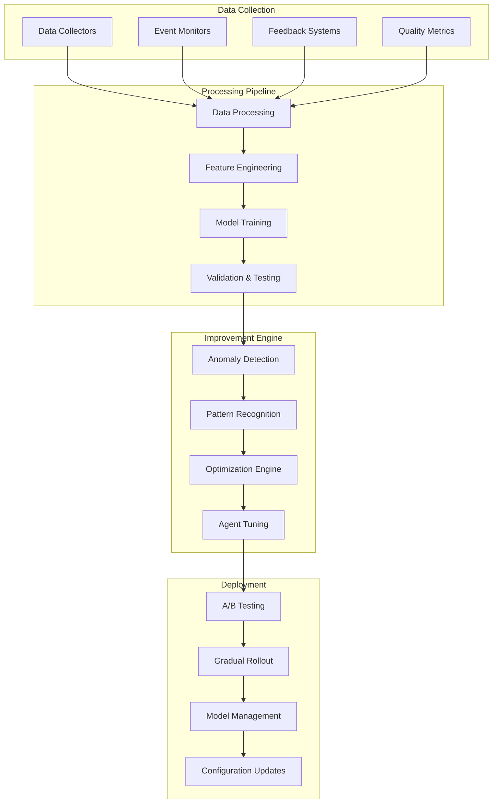

# 🔄 Learning Loop & Continuous Improvement

**Version**: 2.0.0  
**Last Updated**: December 2024  
**Status**: 🟢 Active Learning  
**ML Pipeline**: Production Ready  

## 📋 Overview

The I2S Learning Loop is a comprehensive machine learning and data science pipeline that continuously improves the multi-agent system through feedback analysis, model optimization, and automated enhancement processes. This system learns from every pipeline execution to enhance accuracy, reduce processing time, and improve user satisfaction.

## 🧠 Learning Architecture

### Core Learning Components


### Data Flow Architecture
```typescript
// Learning pipeline data structures
interface LearningData {
  pipelineExecution: {
    id: string;
    startTime: Date;
    endTime: Date;
    stages: StageExecution[];
    userFeedback?: UserFeedback;
    systemMetrics: SystemMetrics;
  };
  
  businessOutcomes: {
    ideaScore: number;
    artifactQuality: QualityMetrics;
    userSatisfaction: number;
    conversionMetrics: ConversionData;
  };
  
  technicalMetrics: {
    processingTime: number;
    resourceUsage: ResourceUsage;
    errorRates: ErrorMetrics;
    performanceBottlenecks: string[];
  };
  
  contextualFactors: {
    ideaCategory: string;
    userTier: string;
    timeOfDay: string;
    systemLoad: number;
    marketConditions?: MarketData;
  };
}

interface StageExecution {
  stageName: string;
  agentId: string;
  startTime: Date;
  endTime: Date;
  inputTokens: number;
  outputTokens: number;
  quality: number;
  retries: number;
  errors?: string[];
  intermediateResults?: any;
}
```

## 📊 Data Collection Framework

### Automated Data Harvesting
```typescript
// Data collection service
class LearningDataCollector {
  private collectors: Map<string, DataCollector> = new Map();
  private buffer: CircularBuffer<LearningData> = new CircularBuffer(10000);
  
  async collectPipelineData(pipeline: PipelineExecution): Promise<void> {
    const data: LearningData = {
      pipelineExecution: {
        id: pipeline.id,
        startTime: pipeline.startTime,
        endTime: pipeline.endTime,
        stages: pipeline.stages.map(stage => ({
          stageName: stage.name,
          agentId: stage.agentId,
          startTime: stage.startTime,
          endTime: stage.endTime,
          inputTokens: stage.tokenUsage.input,
          outputTokens: stage.tokenUsage.output,
          quality: stage.qualityScore,
          retries: stage.retryCount,
          errors: stage.errors,
          intermediateResults: this.sanitizeResults(stage.results)
        })),
        userFeedback: await this.getUserFeedback(pipeline.id),
        systemMetrics: await this.getSystemMetrics(pipeline.timeRange)
      },
      
      businessOutcomes: {
        ideaScore: pipeline.dossier.scores.total,
        artifactQuality: await this.assessArtifactQuality(pipeline.dossier),
        userSatisfaction: await this.calculateSatisfactionScore(pipeline.id),
        conversionMetrics: await this.getConversionData(pipeline.userId)
      },
      
      technicalMetrics: {
        processingTime: pipeline.processingTime,
        resourceUsage: pipeline.resourceUsage,
        errorRates: this.calculateErrorRates(pipeline.stages),
        performanceBottlenecks: this.identifyBottlenecks(pipeline.stages)
      },
      
      contextualFactors: {
        ideaCategory: this.categorizeIdea(pipeline.ideaText),
        userTier: pipeline.user.tier,
        timeOfDay: this.getTimeCategory(pipeline.startTime),
        systemLoad: await this.getSystemLoad(pipeline.startTime),
        marketConditions: await this.getMarketData(pipeline.startTime)
      }
    };
    
    await this.buffer.add(data);
    await this.triggerProcessingIfNeeded();
  }
  
  private async assessArtifactQuality(dossier: Dossier): Promise<QualityMetrics> {
    return {
      prd: {
        completeness: await this.analyzePRDCompleteness(dossier.prd),
        clarity: await this.analyzePRDClarity(dossier.prd),
        actionability: await this.analyzePRDActionability(dossier.prd)
      },
      
      runbook: {
        executability: await this.analyzeRunbookExecutability(dossier.runbook),
        completeness: await this.analyzeRunbookCompleteness(dossier.runbook),
        clarity: await this.analyzeRunbookClarity(dossier.runbook)
      },
      
      codeScaffold: {
        buildability: await this.testCodeBuildability(dossier.repo),
        bestPractices: await this.analyzeCodeQuality(dossier.repo),
        completeness: await this.analyzeCodeCompleteness(dossier.repo)
      }
    };
  }
}
```

### User Feedback Integration
```typescript
// Feedback collection system
class FeedbackCollector {
  async collectImplicitFeedback(pipelineId: string): Promise<ImplicitFeedback> {
    return {
      timeSpentReviewing: await this.getTimeSpentReviewing(pipelineId),
      artifactsDownloaded: await this.getDownloadedArtifacts(pipelineId),
      pagesVisited: await this.getPageNavigation(pipelineId),
      returnVisits: await this.getReturnVisits(pipelineId),
      shareActivity: await this.getShareActivity(pipelineId)
    };
  }
  
  async collectExplicitFeedback(pipelineId: string): Promise<ExplicitFeedback> {
    return {
      overallRating: await this.getOverallRating(pipelineId),
      stageRatings: await this.getStageRatings(pipelineId),
      artifactRatings: await this.getArtifactRatings(pipelineId),
      textualFeedback: await this.getTextualFeedback(pipelineId),
      improvements: await this.getImprovementSuggestions(pipelineId)
    };
  }
  
  // NPS and satisfaction tracking
  async calculateNPS(userId: string): Promise<number> {
    const surveys = await this.getUserSurveys(userId);
    const scores = surveys.map(s => s.npsScore);
    
    const promoters = scores.filter(s => s >= 9).length;
    const detractors = scores.filter(s => s <= 6).length;
    
    return ((promoters - detractors) / scores.length) * 100;
  }
}
```

## 🤖 Machine Learning Pipeline

### Feature Engineering
```python
# Feature engineering for learning pipeline
import pandas as pd
import numpy as np
from sklearn.preprocessing import StandardScaler, LabelEncoder
from sklearn.feature_extraction.text import TfidfVectorizer

class FeatureEngineer:
    def __init__(self):
        self.scaler = StandardScaler()
        self.label_encoders = {}
        self.tfidf = TfidfVectorizer(max_features=1000, stop_words='english')
        
    def engineer_features(self, learning_data: pd.DataFrame) -> pd.DataFrame:
        """Transform raw learning data into ML-ready features"""
        features = pd.DataFrame()
        
        # Temporal features
        features['hour_of_day'] = pd.to_datetime(learning_data['start_time']).dt.hour
        features['day_of_week'] = pd.to_datetime(learning_data['start_time']).dt.dayofweek
        features['is_weekend'] = features['day_of_week'].isin([5, 6])
        
        # Idea characteristics
        features['idea_length'] = learning_data['idea_text'].str.len()
        features['idea_complexity'] = learning_data['idea_text'].apply(self._calculate_complexity)
        features['idea_sentiment'] = learning_data['idea_text'].apply(self._analyze_sentiment)
        
        # User characteristics
        features['user_tier_encoded'] = self._encode_categorical(learning_data['user_tier'])
        features['user_experience'] = learning_data['user_pipeline_count']
        
        # System state
        features['system_load'] = learning_data['system_load']
        features['concurrent_pipelines'] = learning_data['concurrent_count']
        
        # Historical performance
        features = pd.concat([features, self._add_historical_features(learning_data)], axis=1)
        
        # Text features from idea
        idea_features = self.tfidf.fit_transform(learning_data['idea_text'])
        idea_df = pd.DataFrame(idea_features.toarray(), 
                             columns=[f'idea_tfidf_{i}' for i in range(idea_features.shape[1])])
        
        return pd.concat([features, idea_df], axis=1)
    
    def _calculate_complexity(self, text: str) -> float:
        """Calculate idea complexity score"""
        words = len(text.split())
        unique_words = len(set(text.lower().split()))
        sentences = text.count('.') + text.count('!') + text.count('?')
        
        # Complexity based on vocabulary diversity and structure
        return (unique_words / words) * np.log(sentences + 1) if words > 0 else 0
    
    def _add_historical_features(self, data: pd.DataFrame) -> pd.DataFrame:
        """Add features based on historical performance"""
        historical = pd.DataFrame()
        
        # User's historical performance
        historical['user_avg_score'] = data.groupby('user_id')['total_score'].transform('mean')
        historical['user_avg_processing_time'] = data.groupby('user_id')['processing_time'].transform('mean')
        
        # Category performance
        historical['category_avg_score'] = data.groupby('idea_category')['total_score'].transform('mean')
        historical['category_success_rate'] = data.groupby('idea_category')['success'].transform('mean')
        
        return historical
```

### Predictive Models
```python
# Multiple ML models for different prediction tasks
from sklearn.ensemble import RandomForestRegressor, GradientBoostingRegressor
from sklearn.neural_network import MLPRegressor
from sklearn.model_selection import train_test_split, cross_val_score
import xgboost as xgb

class PredictionModels:
    def __init__(self):
        self.models = {
            'processing_time': RandomForestRegressor(n_estimators=100, random_state=42),
            'quality_score': GradientBoostingRegressor(n_estimators=100, random_state=42),
            'user_satisfaction': MLPRegressor(hidden_layer_sizes=(100, 50), random_state=42),
            'resource_usage': xgb.XGBRegressor(n_estimators=100, random_state=42)
        }
        
        self.performance_history = {}
        
    def train_models(self, features: pd.DataFrame, targets: dict):
        """Train all prediction models"""
        results = {}
        
        for model_name, model in self.models.items():
            if model_name not in targets:
                continue
                
            X_train, X_test, y_train, y_test = train_test_split(
                features, targets[model_name], test_size=0.2, random_state=42
            )
            
            # Train model
            model.fit(X_train, y_train)
            
            # Evaluate
            train_score = model.score(X_train, y_train)
            test_score = model.score(X_test, y_test)
            cv_scores = cross_val_score(model, X_train, y_train, cv=5)
            
            results[model_name] = {
                'train_score': train_score,
                'test_score': test_score,
                'cv_mean': cv_scores.mean(),
                'cv_std': cv_scores.std(),
                'feature_importance': self._get_feature_importance(model, features.columns)
            }
            
        return results
    
    def predict_pipeline_outcomes(self, features: pd.DataFrame) -> dict:
        """Predict expected outcomes for new pipeline"""
        predictions = {}
        
        for model_name, model in self.models.items():
            try:
                pred = model.predict(features)
                predictions[model_name] = {
                    'prediction': pred[0] if len(pred) == 1 else pred,
                    'confidence': self._calculate_confidence(model, features, model_name)
                }
            except Exception as e:
                predictions[model_name] = {
                    'prediction': None,
                    'error': str(e)
                }
                
        return predictions
    
    def _calculate_confidence(self, model, features, model_name):
        """Calculate prediction confidence"""
        if hasattr(model, 'predict_proba'):
            # For classification models
            proba = model.predict_proba(features)
            return np.max(proba)
        else:
            # For regression models, use historical performance
            if model_name in self.performance_history:
                return 1 - self.performance_history[model_name].get('cv_std', 0.5)
            return 0.7  # Default confidence
```

### Model Optimization
```python
# Automated hyperparameter optimization
from optuna import create_study, Trial
import joblib

class ModelOptimizer:
    def __init__(self):
        self.optimization_history = {}
        
    def optimize_model(self, model_type: str, X_train, y_train, n_trials=100):
        """Optimize model hyperparameters using Optuna"""
        
        def objective(trial: Trial):
            if model_type == 'random_forest':
                params = {
                    'n_estimators': trial.suggest_int('n_estimators', 50, 300),
                    'max_depth': trial.suggest_int('max_depth', 3, 20),
                    'min_samples_split': trial.suggest_int('min_samples_split', 2, 20),
                    'min_samples_leaf': trial.suggest_int('min_samples_leaf', 1, 10),
                }
                model = RandomForestRegressor(**params, random_state=42)
                
            elif model_type == 'xgboost':
                params = {
                    'n_estimators': trial.suggest_int('n_estimators', 50, 300),
                    'max_depth': trial.suggest_int('max_depth', 3, 10),
                    'learning_rate': trial.suggest_float('learning_rate', 0.01, 0.3),
                    'subsample': trial.suggest_float('subsample', 0.5, 1.0),
                    'colsample_bytree': trial.suggest_float('colsample_bytree', 0.5, 1.0),
                }
                model = xgb.XGBRegressor(**params, random_state=42)
                
            # Cross-validation score
            scores = cross_val_score(model, X_train, y_train, cv=5, scoring='neg_mean_squared_error')
            return -scores.mean()
            
        study = create_study(direction='minimize')
        study.optimize(objective, n_trials=n_trials)
        
        self.optimization_history[model_type] = {
            'best_params': study.best_params,
            'best_score': study.best_value,
            'n_trials': n_trials
        }
        
        return study.best_params
    
    def create_optimized_model(self, model_type: str, best_params: dict):
        """Create model with optimized parameters"""
        if model_type == 'random_forest':
            return RandomForestRegressor(**best_params, random_state=42)
        elif model_type == 'xgboost':
            return xgb.XGBRegressor(**best_params, random_state=42)
        # Add more model types as needed
```

## 📈 Performance Optimization

### Agent Performance Analysis
```typescript
// Agent performance analyzer
class AgentPerformanceAnalyzer {
  private performanceHistory: Map<string, PerformanceMetric[]> = new Map();
  
  async analyzeAgentPerformance(agentId: string, timeRange: TimeRange): Promise<AgentAnalysis> {
    const executions = await this.getAgentExecutions(agentId, timeRange);
    
    return {
      efficiency: {
        averageProcessingTime: this.calculateAverageTime(executions),
        timeVariance: this.calculateTimeVariance(executions),
        speedTrend: this.calculateSpeedTrend(executions)
      },
      
      quality: {
        averageQualityScore: this.calculateAverageQuality(executions),
        qualityConsistency: this.calculateQualityVariance(executions),
        qualityTrend: this.calculateQualityTrend(executions)
      },
      
      reliability: {
        successRate: this.calculateSuccessRate(executions),
        errorTypes: this.analyzeErrorPatterns(executions),
        retryRate: this.calculateRetryRate(executions)
      },
      
      resourceUsage: {
        averageTokenUsage: this.calculateTokenUsage(executions),
        costEfficiency: this.calculateCostEfficiency(executions),
        resourceUtilization: this.calculateResourceUtilization(executions)
      },
      
      recommendations: await this.generateOptimizationRecommendations(agentId, executions)
    };
  }
  
  private async generateOptimizationRecommendations(
    agentId: string, 
    executions: AgentExecution[]
  ): Promise<OptimizationRecommendation[]> {
    const recommendations = [];
    
    // Check for performance bottlenecks
    const avgTime = this.calculateAverageTime(executions);
    const benchmark = await this.getBenchmarkTime(agentId);
    
    if (avgTime > benchmark * 1.2) {
      recommendations.push({
        type: 'performance',
        severity: 'medium',
        description: 'Agent processing time is 20% above benchmark',
        suggestedActions: [
          'Review prompt engineering for efficiency',
          'Consider model size optimization',
          'Analyze common bottlenecks'
        ]
      });
    }
    
    // Check for quality issues
    const qualityTrend = this.calculateQualityTrend(executions);
    if (qualityTrend < -0.05) {
      recommendations.push({
        type: 'quality',
        severity: 'high',
        description: 'Quality scores showing downward trend',
        suggestedActions: [
          'Update training examples',
          'Review prompt effectiveness',
          'Consider model retraining'
        ]
      });
    }
    
    return recommendations;
  }
}
```

### Pipeline Optimization Engine
```typescript
// Pipeline optimization using ML insights
class PipelineOptimizer {
  private mlPredictor: MLPredictor;
  private configManager: ConfigurationManager;
  
  async optimizePipelineConfiguration(
    ideaContext: IdeaContext
  ): Promise<OptimizedConfiguration> {
    // Predict optimal configuration using ML models
    const predictions = await this.mlPredictor.predictOptimalConfig(ideaContext);
    
    return {
      agentSelection: await this.selectOptimalAgents(ideaContext, predictions),
      resourceAllocation: await this.optimizeResourceAllocation(predictions),
      processingOrder: await this.optimizeStageOrder(ideaContext),
      qualityThresholds: await this.setQualityThresholds(ideaContext),
      timeoutSettings: await this.optimizeTimeouts(predictions)
    };
  }
  
  private async selectOptimalAgents(
    context: IdeaContext, 
    predictions: MLPredictions
  ): Promise<AgentConfiguration[]> {
    const availableAgents = await this.getAvailableAgents();
    const selectedAgents = [];
    
    for (const stage of this.pipelineStages) {
      const candidateAgents = availableAgents.filter(a => a.capabilities.includes(stage));
      
      // Score agents based on predicted performance for this context
      const agentScores = await Promise.all(
        candidateAgents.map(async agent => ({
          agent,
          score: await this.predictAgentPerformance(agent, context, stage),
          availability: await this.checkAgentAvailability(agent.id)
        }))
      );
      
      // Select best available agent
      const bestAgent = agentScores
        .filter(s => s.availability)
        .sort((a, b) => b.score - a.score)[0];
        
      if (bestAgent) {
        selectedAgents.push({
          stage,
          agentId: bestAgent.agent.id,
          expectedScore: bestAgent.score,
          backup: agentScores[1]?.agent.id
        });
      }
    }
    
    return selectedAgents;
  }
}
```

## 🔬 A/B Testing & Experimentation

### Experiment Framework
```typescript
// A/B testing framework for learning improvements
class ExperimentFramework {
  private experiments: Map<string, Experiment> = new Map();
  
  async createExperiment(config: ExperimentConfig): Promise<string> {
    const experiment: Experiment = {
      id: generateId(),
      name: config.name,
      description: config.description,
      status: 'active',
      startDate: new Date(),
      endDate: config.endDate,
      
      variants: config.variants.map((variant, index) => ({
        id: `variant_${index}`,
        name: variant.name,
        configuration: variant.configuration,
        trafficAllocation: variant.trafficAllocation,
        metrics: new Map()
      })),
      
      targetMetrics: config.targetMetrics,
      significanceLevel: config.significanceLevel || 0.05,
      minimumSampleSize: config.minimumSampleSize || 1000,
      
      results: null
    };
    
    this.experiments.set(experiment.id, experiment);
    await this.saveExperiment(experiment);
    
    return experiment.id;
  }
  
  async assignVariant(experimentId: string, userId: string): Promise<string> {
    const experiment = this.experiments.get(experimentId);
    if (!experiment || experiment.status !== 'active') {
      return 'control';
    }
    
    // Consistent assignment based on user ID
    const hash = this.hashUserId(userId, experimentId);
    const variants = experiment.variants;
    
    let cumulativeAllocation = 0;
    for (const variant of variants) {
      cumulativeAllocation += variant.trafficAllocation;
      if (hash <= cumulativeAllocation) {
        return variant.id;
      }
    }
    
    return variants[0].id; // Fallback
  }
  
  async recordMetric(
    experimentId: string, 
    variantId: string, 
    metric: string, 
    value: number
  ): Promise<void> {
    const experiment = this.experiments.get(experimentId);
    if (!experiment) return;
    
    const variant = experiment.variants.find(v => v.id === variantId);
    if (!variant) return;
    
    if (!variant.metrics.has(metric)) {
      variant.metrics.set(metric, []);
    }
    
    variant.metrics.get(metric)!.push(value);
    
    // Check if we should analyze results
    if (this.shouldAnalyzeResults(experiment)) {
      await this.analyzeExperiment(experimentId);
    }
  }
  
  private async analyzeExperiment(experimentId: string): Promise<ExperimentResults> {
    const experiment = this.experiments.get(experimentId);
    if (!experiment) throw new Error('Experiment not found');
    
    const results: ExperimentResults = {
      experimentId,
      status: 'analyzing',
      variants: [],
      winner: null,
      confidence: 0,
      recommendedAction: 'continue'
    };
    
    // Statistical analysis for each metric
    for (const targetMetric of experiment.targetMetrics) {
      const variantResults = experiment.variants.map(variant => ({
        variantId: variant.id,
        name: variant.name,
        metrics: this.calculateStatistics(variant.metrics.get(targetMetric) || [])
      }));
      
      // Perform statistical significance testing
      const significance = this.performStatisticalTest(variantResults, experiment.significanceLevel);
      
      results.variants.push({
        metric: targetMetric,
        results: variantResults,
        significance
      });
    }
    
    // Determine overall winner
    results.winner = this.determineWinner(results.variants);
    results.confidence = this.calculateOverallConfidence(results.variants);
    results.recommendedAction = this.recommendAction(results);
    
    experiment.results = results;
    await this.saveExperiment(experiment);
    
    return results;
  }
}
```

### Automated Rollout System
```typescript
// Automated rollout based on experiment results
class AutomatedRollout {
  async processExperimentResults(results: ExperimentResults): Promise<void> {
    if (results.confidence > 0.95 && results.winner) {
      await this.initiateGradualRollout(results);
    } else if (results.confidence < 0.1) {
      await this.stopExperiment(results.experimentId);
    }
  }
  
  private async initiateGradualRollout(results: ExperimentResults): Promise<void> {
    const rolloutPlan: RolloutPlan = {
      experimentId: results.experimentId,
      winningVariant: results.winner!,
      phases: [
        { percentage: 10, duration: '2 days', successCriteria: this.getSuccessCriteria() },
        { percentage: 25, duration: '3 days', successCriteria: this.getSuccessCriteria() },
        { percentage: 50, duration: '3 days', successCriteria: this.getSuccessCriteria() },
        { percentage: 100, duration: '1 week', successCriteria: this.getSuccessCriteria() }
      ],
      rollbackCriteria: this.getRollbackCriteria()
    };
    
    await this.executeRolloutPlan(rolloutPlan);
  }
  
  private async executeRolloutPlan(plan: RolloutPlan): Promise<void> {
    for (const phase of plan.phases) {
      // Update configuration to include more users
      await this.updateTrafficAllocation(plan.experimentId, phase.percentage);
      
      // Monitor metrics during phase
      await this.monitorPhase(phase);
      
      // Check success criteria
      const phaseResults = await this.evaluatePhase(phase);
      
      if (phaseResults.success) {
        console.log(`Phase ${phase.percentage}% completed successfully`);
      } else {
        console.log(`Phase ${phase.percentage}% failed, initiating rollback`);
        await this.rollback(plan.experimentId);
        break;
      }
    }
  }
}
```

## 📊 Continuous Monitoring & Alerting

### Model Drift Detection
```python
# Monitor for model performance drift
from scipy import stats
import numpy as np

class ModelDriftDetector:
    def __init__(self, baseline_window=30, alert_threshold=0.05):
        self.baseline_window = baseline_window
        self.alert_threshold = alert_threshold
        self.baseline_metrics = {}
        
    def update_baseline(self, model_name: str, metrics: dict):
        """Update baseline metrics for a model"""
        if model_name not in self.baseline_metrics:
            self.baseline_metrics[model_name] = {}
            
        for metric_name, values in metrics.items():
            if len(values) >= self.baseline_window:
                self.baseline_metrics[model_name][metric_name] = {
                    'mean': np.mean(values[-self.baseline_window:]),
                    'std': np.std(values[-self.baseline_window:]),
                    'values': values[-self.baseline_window:]
                }
    
    def detect_drift(self, model_name: str, current_metrics: dict) -> dict:
        """Detect if current metrics show significant drift from baseline"""
        alerts = {}
        
        if model_name not in self.baseline_metrics:
            return {'error': 'No baseline metrics available'}
            
        baseline = self.baseline_metrics[model_name]
        
        for metric_name, current_value in current_metrics.items():
            if metric_name not in baseline:
                continue
                
            baseline_values = baseline[metric_name]['values']
            
            # Perform statistical test for drift
            statistic, p_value = stats.ttest_1samp(
                baseline_values, current_value
            )
            
            if p_value < self.alert_threshold:
                alerts[metric_name] = {
                    'drift_detected': True,
                    'p_value': p_value,
                    'current_value': current_value,
                    'baseline_mean': baseline[metric_name]['mean'],
                    'baseline_std': baseline[metric_name]['std'],
                    'severity': self._calculate_severity(
                        current_value, 
                        baseline[metric_name]['mean'],
                        baseline[metric_name]['std']
                    )
                }
            else:
                alerts[metric_name] = {
                    'drift_detected': False,
                    'p_value': p_value
                }
                
        return alerts
    
    def _calculate_severity(self, current, baseline_mean, baseline_std):
        """Calculate severity of drift"""
        z_score = abs(current - baseline_mean) / baseline_std
        
        if z_score > 3:
            return 'critical'
        elif z_score > 2:
            return 'high'
        elif z_score > 1:
            return 'medium'
        else:
            return 'low'
```

### Real-time Learning Dashboard
```typescript
// Real-time learning metrics dashboard
class LearningDashboard {
  private metricsCollector: MetricsCollector;
  private websocket: WebSocketConnection;
  
  async initializeDashboard(): Promise<void> {
    await this.setupWebSocketConnection();
    await this.startMetricsCollection();
    await this.loadHistoricalData();
  }
  
  async getRealtimeMetrics(): Promise<DashboardMetrics> {
    return {
      systemHealth: {
        totalPipelines: await this.getTotalPipelines(),
        activeLearningJobs: await this.getActiveLearningJobs(),
        modelAccuracy: await this.getCurrentModelAccuracy(),
        predictionLatency: await this.getAveragePredictionLatency()
      },
      
      learningProgress: {
        modelsTraining: await this.getModelsInTraining(),
        experimentsActive: await this.getActiveExperiments(),
        dataCollectionRate: await this.getDataCollectionRate(),
        improvementRate: await this.getImprovementRate()
      },
      
      qualityMetrics: {
        averageUserSatisfaction: await this.getAverageUserSatisfaction(),
        artifactQualityTrend: await this.getArtifactQualityTrend(),
        errorRate: await this.getSystemErrorRate(),
        processingTimeImprovement: await this.getProcessingTimeImprovement()
      },
      
      alerts: await this.getActiveAlerts()
    };
  }
  
  async broadcastMetrics(): Promise<void> {
    const metrics = await this.getRealtimeMetrics();
    
    this.websocket.broadcast('metrics_update', {
      timestamp: new Date().toISOString(),
      data: metrics
    });
  }
}
```

## 🎯 Success Metrics & KPIs

### Learning Effectiveness KPIs
```typescript
interface LearningKPIs {
  // Accuracy Improvements
  modelAccuracy: {
    processingTimePredicition: number;
    qualityScorePrediction: number;
    userSatisfactionPrediction: number;
    resourceUsagePrediction: number;
  };
  
  // System Performance
  systemImprovements: {
    averageProcessingTimeReduction: number;
    qualityScoreImprovement: number;
    errorRateReduction: number;
    resourceEfficiencyGain: number;
  };
  
  // User Experience
  userExperience: {
    satisfactionScoreImprovement: number;
    npsImprovement: number;
    retentionRateImprovement: number;
    adoptionRateOfSuggestions: number;
  };
  
  // Business Impact
  businessMetrics: {
    costPerPipelineReduction: number;
    revenuePerUserIncrease: number;
    customerLifetimeValueIncrease: number;
    churnRateReduction: number;
  };
}

class LearningMetricsCalculator {
  async calculateKPIs(timeRange: TimeRange): Promise<LearningKPIs> {
    const baseline = await this.getBaselineMetrics(timeRange);
    const current = await this.getCurrentMetrics(timeRange);
    
    return {
      modelAccuracy: {
        processingTimePredicition: this.calculateImprovement(
          baseline.processingTimePredictionError,
          current.processingTimePredictionError
        ),
        qualityScorePrediction: this.calculateImprovement(
          baseline.qualityPredictionError,
          current.qualityPredictionError
        ),
        userSatisfactionPrediction: this.calculateImprovement(
          baseline.satisfactionPredictionError,
          current.satisfactionPredictionError
        ),
        resourceUsagePrediction: this.calculateImprovement(
          baseline.resourcePredictionError,
          current.resourcePredictionError
        )
      },
      
      systemImprovements: {
        averageProcessingTimeReduction: this.calculateImprovement(
          baseline.averageProcessingTime,
          current.averageProcessingTime
        ),
        qualityScoreImprovement: this.calculateImprovement(
          current.averageQualityScore,
          baseline.averageQualityScore,
          true // Higher is better
        ),
        errorRateReduction: this.calculateImprovement(
          baseline.errorRate,
          current.errorRate
        ),
        resourceEfficiencyGain: this.calculateImprovement(
          current.resourceEfficiency,
          baseline.resourceEfficiency,
          true
        )
      },
      
      userExperience: {
        satisfactionScoreImprovement: this.calculateImprovement(
          current.averageSatisfactionScore,
          baseline.averageSatisfactionScore,
          true
        ),
        npsImprovement: this.calculateImprovement(
          current.npsScore,
          baseline.npsScore,
          true
        ),
        retentionRateImprovement: this.calculateImprovement(
          current.retentionRate,
          baseline.retentionRate,
          true
        ),
        adoptionRateOfSuggestions: current.adoptionRateOfSuggestions
      },
      
      businessMetrics: {
        costPerPipelineReduction: this.calculateImprovement(
          baseline.costPerPipeline,
          current.costPerPipeline
        ),
        revenuePerUserIncrease: this.calculateImprovement(
          current.revenuePerUser,
          baseline.revenuePerUser,
          true
        ),
        customerLifetimeValueIncrease: this.calculateImprovement(
          current.customerLifetimeValue,
          baseline.customerLifetimeValue,
          true
        ),
        churnRateReduction: this.calculateImprovement(
          baseline.churnRate,
          current.churnRate
        )
      }
    };
  }
  
  private calculateImprovement(
    baseline: number, 
    current: number, 
    higherIsBetter: boolean = false
  ): number {
    if (baseline === 0) return 0;
    
    const change = higherIsBetter 
      ? ((current - baseline) / baseline) * 100
      : ((baseline - current) / baseline) * 100;
      
    return Math.round(change * 100) / 100;
  }
}
```

## 🔄 Feedback Integration

### Automated Feedback Processing
```typescript
// Process and integrate various types of feedback
class FeedbackProcessor {
  private sentimentAnalyzer: SentimentAnalyzer;
  private topicExtractor: TopicExtractor;
  
  async processFeedback(feedback: UserFeedback): Promise<ProcessedFeedback> {
    const processed: ProcessedFeedback = {
      id: feedback.id,
      pipelineId: feedback.pipelineId,
      userId: feedback.userId,
      timestamp: feedback.timestamp,
      
      sentiment: await this.sentimentAnalyzer.analyze(feedback.textFeedback),
      topics: await this.topicExtractor.extract(feedback.textFeedback),
      
      structuredData: {
        overallRating: feedback.overallRating,
        aspectRatings: feedback.aspectRatings,
        improvementAreas: await this.identifyImprovementAreas(feedback),
        priorityScore: this.calculatePriorityScore(feedback)
      },
      
      actionableInsights: await this.generateActionableInsights(feedback)
    };
    
    await this.integrateFeedbackIntoLearning(processed);
    return processed;
  }
  
  private async identifyImprovementAreas(feedback: UserFeedback): Promise<string[]> {
    const areas = [];
    
    // Analyze low ratings
    for (const [aspect, rating] of Object.entries(feedback.aspectRatings)) {
      if (rating < 3) {
        areas.push(aspect);
      }
    }
    
    // Extract from text feedback
    const textAreas = await this.topicExtractor.extractImprovementTopics(feedback.textFeedback);
    areas.push(...textAreas);
    
    return [...new Set(areas)]; // Remove duplicates
  }
  
  private async generateActionableInsights(feedback: UserFeedback): Promise<ActionableInsight[]> {
    const insights: ActionableInsight[] = [];
    
    // Quality-related insights
    if (feedback.aspectRatings.quality < 3) {
      insights.push({
        type: 'quality_improvement',
        priority: 'high',
        description: 'User reported low quality in generated artifacts',
        suggestedActions: [
          'Review quality assessment algorithms',
          'Update training data for relevant agents',
          'Implement additional quality checks'
        ],
        affectedComponents: ['quality_assessor', 'artifact_generators']
      });
    }
    
    // Speed-related insights
    if (feedback.aspectRatings.speed < 3) {
      insights.push({
        type: 'performance_optimization',
        priority: 'medium',
        description: 'User reported slow processing times',
        suggestedActions: [
          'Optimize pipeline stage execution',
          'Review resource allocation',
          'Consider parallel processing improvements'
        ],
        affectedComponents: ['conductor', 'resource_manager']
      });
    }
    
    return insights;
  }
  
  private async integrateFeedbackIntoLearning(feedback: ProcessedFeedback): Promise<void> {
    // Create training examples from feedback
    if (feedback.sentiment.score < 0.3) {
      await this.createNegativeExample(feedback);
    } else if (feedback.sentiment.score > 0.7) {
      await this.createPositiveExample(feedback);
    }
    
    // Update model training data
    await this.addToTrainingData(feedback);
    
    // Trigger retraining if enough new data
    const newDataCount = await this.getNewDataCount();
    if (newDataCount > 1000) {
      await this.triggerModelRetraining();
    }
  }
}
```

## 🚀 Future Enhancements

### Advanced Learning Capabilities
```typescript
// Roadmap for advanced learning features
interface FutureLearningCapabilities {
  // Deep reinforcement learning
  reinforcementLearning: {
    agentPolicyOptimization: boolean;
    multiAgentCoordination: boolean;
    rewardFunctionLearning: boolean;
    explorationStrategies: boolean;
  };
  
  // Meta-learning
  metaLearning: {
    fewShotLearning: boolean;
    transferLearning: boolean;
    domainAdaptation: boolean;
    continualLearning: boolean;
  };
  
  // Advanced NLP
  advancedNLP: {
    contextualUnderstanding: boolean;
    multimodalLearning: boolean;
    causalReasoning: boolean;
    knowledgeGraphIntegration: boolean;
  };
  
  // Automated ML
  autoML: {
    featureEngineering: boolean;
    modelArchitectureSearch: boolean;
    hyperparameterOptimization: boolean;
    ensembleLearning: boolean;
  };
}

class AdvancedLearningEngine {
  async implementReinforcementLearning(): Promise<void> {
    // Implementation for RL-based agent optimization
  }
  
  async implementMetaLearning(): Promise<void> {
    // Implementation for meta-learning capabilities
  }
  
  async implementAdvancedNLP(): Promise<void> {
    // Implementation for advanced NLP features
  }
  
  async implementAutoML(): Promise<void> {
    // Implementation for automated ML pipeline
  }
}
```

## 📚 Documentation & Resources

### Learning System Documentation
- **Model Cards**: Documentation for each ML model including performance metrics, limitations, and training data
- **Experiment Logs**: Detailed logs of all A/B tests and experiments with results and decisions
- **Performance Benchmarks**: Historical performance baselines and improvement tracking
- **Data Dictionaries**: Comprehensive documentation of all data sources and features
- **Algorithm Documentation**: Detailed explanations of learning algorithms and their implementations

### Training & Onboarding
- **Learning System Overview**: Introduction to the learning loop architecture
- **Model Management Guide**: How to manage and update ML models
- **Experiment Design Guide**: Best practices for designing and running experiments
- **Troubleshooting Guide**: Common issues and solutions in the learning pipeline

---

**Owner**: I2S Learning Team  
**Contact**: learning@i2s.studio  
**ML Engineers**: ml-engineers@i2s.studio  
**Documentation**: Updated December 2024
